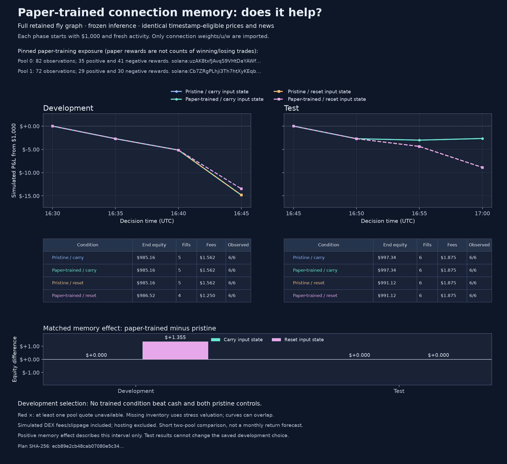
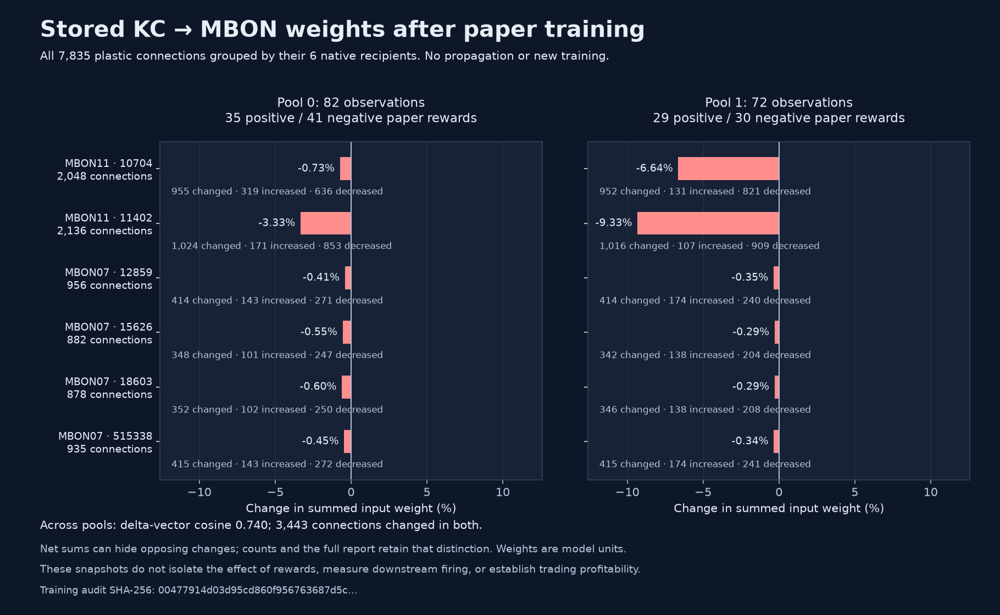
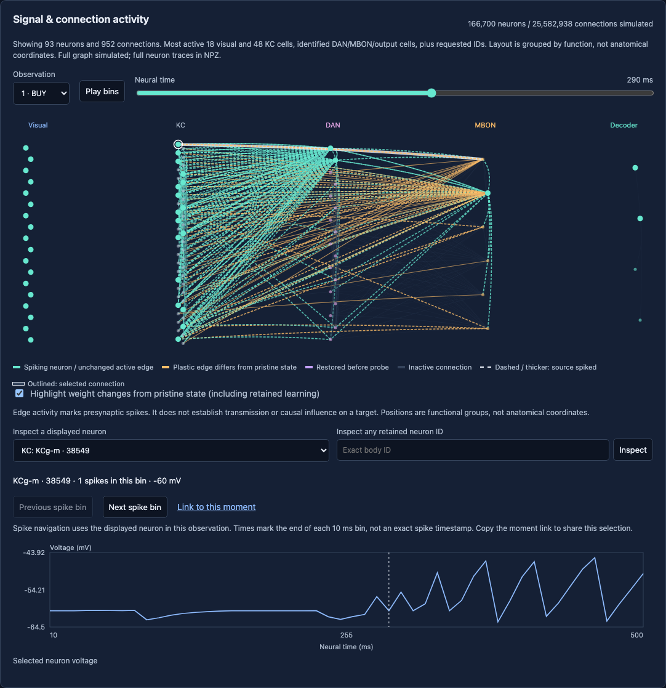
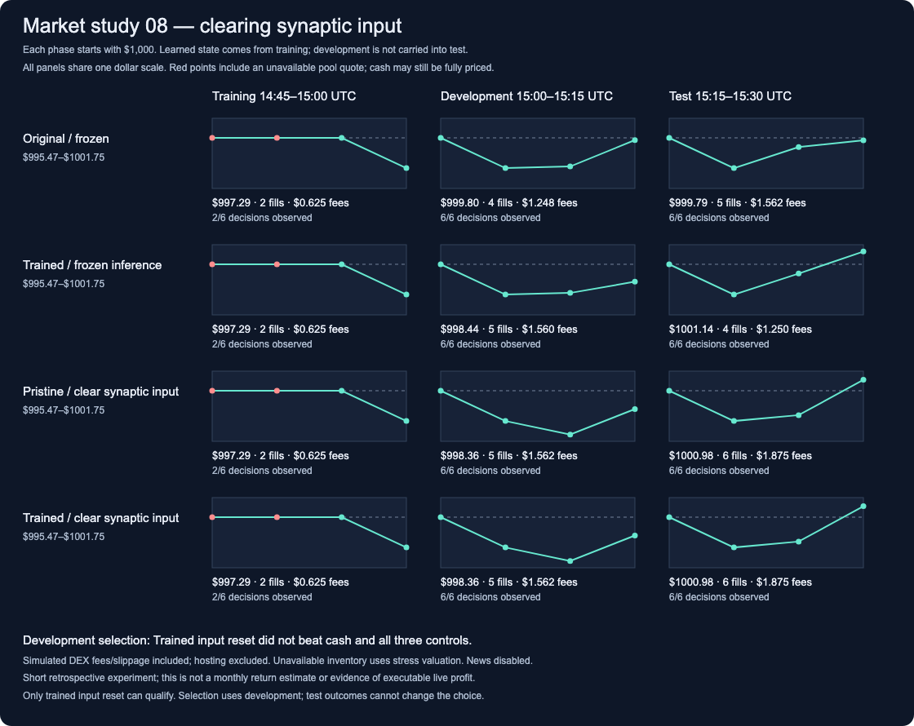

# Stonkfly Trading

A paper-only research lab comparing the full Stonkfly spiking fly network with a **247,780-parameter PPO policy**, using market data and timestamped news. No real-order endpoint, wallet or exchange credentials are used.

The [dynamic memecoin experiment](docs/memecoin-universe.md) adds free live launch
discovery, multi-chain pool sampling, separate $1,000 portfolios, isolated fly
contexts, and pooled PPO training. Coverage is bounded and DEX fills are explicitly
indicative simulations. Use `PAPERLAB_UNIVERSE=1` when deploying this experiment;
the original BTC archive remains available.

The fly is a sparse spiking network, not a transformer. The compact policy is an MLP actor/critic, not an SLM. An optional, separately pinned FinBERT transformer encodes headline sentiment. News features enter the compact policy numerically and the fly through an explicit visual adapter.

The [ninth market comparison](docs/fly-debugger.md#ninth-market-replay-result)
completed with fully audited prices, timestamped news, fills and neural counts.
Trained and pristine models both ended test at **$997.34**, or **$991.12** with
input-state reset, from separate $1,000 accounts. Trained/pristine test spike
counts matched across every neuron. No condition passed development; no policy
was promoted.



The [decision comparison](docs/fly-debugger.md#compare-neural-decisions-with-later-fills)
separates current neural signals from fills executing earlier decisions, with
links to each paired trace.

The [captured training-memory map](docs/fly-debugger.md#map-captured-paper-memory-to-native-recipients)
shows net weaker KC inputs at all six plastic recipients, with the largest
reduction at MBON11 neuron 11402. This locates stored changes; their effect on
trading is being tested separately.



## Inspect the fly

The [interactive circuit debugger](docs/fly-debugger.md) shows recorded spikes,
voltages, connection updates, and fixed decoder outputs. Test synthetic prices,
news, neuron stimulation, and selected connection restoration. The simulation
retains the full graph; the display is a labeled subset with full-neuron lookup
in generated recordings. Paper accounts remain separate from diagnostic assays.



Dashed lines mark source spikes in the current bin. Orange and purple retain the
connection's weight change or restoration status, and an outline marks the
selected connection.

After installing below, open the included recordings without model compute:

```sh
uv run python -m paperlab.debugger serve --out examples/fly-debugger
```

Visit <http://127.0.0.1:8765>. With Modal deployed and authenticated, use
`uv run python -m paperlab.debugger serve --backend modal --out runs/cloud-debugger`
to run new synthetic assays and inspect full cloud traces. See the guide for
[controlled market replays](docs/fly-debugger.md#separate-market-memory-updates-and-reinforcement),
source verification, saved-call recovery, and run steps.
The [registered market runner](docs/fly-debugger.md#evaluate-restoration-on-a-new-market-window)
shares equivalent training checkpoints and audits each separate inference run.

The comparison now overlays the selected neuron’s voltage and spike bins, plus
the same connection’s weight. It matches identities and observation times so
retained memory differences remain visible even when inference is frozen.
[Recorded input-history matching](docs/fly-debugger.md#distinguish-a-matching-image-from-matching-recorded-history)
distinguishes the current image from preceding inputs and excludes ambiguous
timestamp matches.
[Stored connection memory](docs/fly-debugger.md#inspect-stored-connection-memory)
adds the recorded `u` and `w` states behind each weight.


The diagnostics have identified concrete limitations:

The [paper reward audit](docs/fly-debugger.md#audit-what-the-paper-training-reward-contains)
separates inventory revaluation from execution friction and verifies gap resets.
The current fly receives reward sign, with a fixed pulse that discards magnitude.

- The original chart can render small and large percentage moves identically.
  An experimental fixed return encoding preserves the distinction but failed
  the [fourth market comparison](docs/fly-debugger.md#fourth-market-replay-result).
- In that study, original training mode produced an extra BUY that cost $1.35
  relative to frozen on the pool with fresh quotes. The
  [eight-arm replay](docs/fly-debugger.md#market-pulse-factorial-results) reproduced
  both reference controls and isolated the extra BUY to the combination of
  ongoing plasticity and recorded reinforcement. Starting with earlier trained
  memory did not change those three observations' spike counts or actions.
- The [next registered market window](docs/fly-debugger.md#fifth-market-replay-result)
  rejected freezing as a general fix: trained/frozen ended at **$1,005.41** versus
  **$1,008.38** for pristine/frozen and online, from separate $1,000 accounts.
  Saved checkpoints confirmed retained memory; it changed a BUY to HOLD.
  No arm passed the development gate, and no policy was promoted.
- A [controlled restoration replay](docs/fly-debugger.md#market-restoration-results)
  recovered the missing BUY by restoring either MBON11 cell's incoming memory.
  Restoring both reproduced all three pristine spike-count records. These are
  mechanism results. The [sixth market test](docs/fly-debugger.md#sixth-market-replay-result)
  found a test-only benefit from restoring 11402: **$1,000.46** versus **$994.18**
  for the other variants. Every variant failed development, so none was promoted.
  The [seventh comparison](docs/fly-debugger.md#seventh-market-replay-result)
  ended at **$996.86 for all five variants**; none passed development. Four of
  six test slots were observed, and all their full spike-count records matched.
- The [nine-condition memory replay](docs/fly-debugger.md#three-group-restoration-results)
  found that this SELL depends on retaining learned MBON07 and 10704 inputs.
  Resetting more memory can reverse it or introduce an extra gate-driven BUY.
  All reference controls reproduced; blanket restoration is not a demonstrated fix.

The [twelve-condition activity comparison](docs/fly-debugger.md#voltage-and-synaptic-input-results)
found that clearing synaptic input between images recovered **five final gate
spikes** while retaining a trained-versus-pristine firing difference. Resetting
only the two gate cells failed for the trained model; global voltage resets made
all three trained/pristine spike-count records identical. These are mechanism
results, with no fills or P&L; no reset policy has been promoted.

The [eighth market comparison](docs/fly-debugger.md#eighth-market-replay-result)
then rejected input reset: trained/reset failed development and tied pristine/reset
at **$1,000.98** in test, below trained/carry at **$1,001.14**. Clearing input
recovered a gate spike and extra BUY, without an advantage from training. An
earlier collector outage left one training observation per pool and **zero P&L
reinforcement**, so this does not evaluate learning from trading rewards.


The [decoder count view](docs/fly-debugger.md#inspect-accumulated-decoder-counts)
shows how output spikes accumulate. In the examined BUY/SELL reversal, one net
spike equals the fixed 2 Hz threshold; a count-edit audit separates direction
and gate sensitivity without claiming a profitable fix.




[Inspect the restored connections](http://127.0.0.1:8765/?run=marketrestore01-restore_10704&step=1&neuron=10704&compare=marketrestore01-trained_frozen).
These are indicative DEX marks with fees/slippage, not realized or monthly returns.

After starting the included viewer, [jump to the extra gate spike](http://127.0.0.1:8765/?run=pulse01-trained_online_recorded&step=2&bin=37&neuron=10527&compare=pulse01-trained_frozen_recorded).
The link selects neuron 10527 at the 1,380 ms bin boundary. Use previous/next
spike buttons and the moment link to inspect and share any displayed neuron.
The guide retains earlier experiments, all outcomes, and their limitations.
These visualizations diagnose the model; they do not demonstrate profitable trading.

## Run

Python 3.12 and a C++ compiler are required. Run from this source checkout so the preserved upstream files are available.

For a locked install, use `uv sync --locked --python 3.12 --all-extras`. The lockfile selects CPU-only PyTorch on Linux. The pip alternative below uses the system platform's default PyTorch wheel; install PyTorch from its CPU index first on a Linux CPU server.

```sh
python3.12 -m venv .venv
.venv/bin/pip install -e '.[dev,cloud,news,export]'
.venv/bin/python -m pytest -q
.venv/bin/paperlab fetch --product BTC-USD --days 14 --out data/btc.jsonl
.venv/bin/paperlab news --db data/news.db
.venv/bin/paperlab train --data data/btc.jsonl --news-db data/news.db --steps 8192 --out runs/ppo
```

Train the actual retained fly graph (about 1.1 GB of public source downloads; plan for 16 GB RAM):

```sh
.venv/bin/paperlab fly-prepare --fly-data data/fly
.venv/bin/paperlab fly-replay --data data/btc.jsonl --news-db data/news.db --fly-data data/fly --steps 32 --out runs/fly-learning
.venv/bin/paperlab fly-replay --data data/btc.jsonl --news-db data/news.db --fly-data data/fly --steps 32 --frozen --out runs/fly-frozen
```

The fly uses Stonkfly's candidate dopamine-modulated plasticity, not PPO. Its retained graph and fixed spike decoder are unchanged. Changing synaptic weights does not establish profitable learning. See [architecture and evaluation](docs/architecture.md), [cloud operation and budgets](docs/cloud.md), and [verification results](reports/verification.md).

Default paper capital is $1,000, with a 50% maximum target allocation and $100 maximum paper order. Costs are assumptions, not a verified exchange fee tier: 60 bps per side plus 10 bps slippage. Reports value open inventory at bid less estimated exit costs. Current headlines are never retroactively inserted into old price history.

`vendor/stonkfly` preserves [nftechie/stonkfly](https://github.com/nftechie/stonkfly) at commit `78ef3e05ab0fa086032098558d893667068944a0`, including its MIT license and third-party notices. This lab imports only its neural/data/display modules; its live trading implementation is not wired into the lab.

The original BTC mode supports a five-minute paper-data schedule and six-hourly
PPO retraining after 400 observations. The multi-pool mode has separate collection,
eligibility, training gates, and ledgers documented above. Full BTC decision, loss,
gradient and fly-weight diagnostics are described in [observability](docs/observability.md).
Sustained profitability has not been established for either experiment.
