# Stonkfly Trading

A paper-only research lab using the full **166,700-neuron Stonkfly network**.
The current Solana learner combines the fly with an **802-parameter Q head**;
news is disabled in that path. Earlier experiments compared the fly with a
**247,780-parameter PPO policy**, using market data and timestamped news.
There is no real-order endpoint, wallet, or exchange credential in this lab.

See the [goal checklist and roadmap](docs/progress-and-roadmap.md) for completed
work, the current experiment and the remaining evidence needed to establish
better trading. The debugger is implemented; effective learning is still being
tested.

The fly is a sparse spiking network. The compact policy is an MLP actor/critic.
A separately pinned FinBERT transformer can encode headline sentiment; those
features enter the compact policy numerically and the fly through a visual adapter.
The [dynamic memecoin experiment](docs/memecoin-universe.md) discovers current and
new launches and samples DEX pools. Coverage is bounded; it does not trade every
Solana token. An earlier controlled comparison used two fixed pools, RAY and STONK.

The [September 14 system audit](reports/system-audit-20260914.md) found and repaired
incomplete reward credit and quote/entry-filter conflation. Historical results are
preserved; neither weight changes nor previous paper returns establish learning.

The current [hourly training service](docs/solana-online.md) starts each independent
training episode with $1,000 paper cash while preserving learned fly/Q weights.
The full balance is available across tokens, capped at $250 acquisition cost per
token and one percent of observed liquidity per fill. Old account losses remain
archived and every episode's outcome is retained; reset balances are not a
continuous portfolio return. The $100 monthly cloud authorization remains in force.

The [expanded Pump/PumpSwap universe](reports/all-pump-universe-20260914.md)
admits all observed markets without age, popularity, flow-direction, mayhem or
token-count filters. Existing pools are resolved from verified on-chain metadata.
Missing prices and liquidity still prevent simulated fills. Public-feed gaps,
hourly collection windows and shared-fly throughput prevent a claim of complete
coverage or simultaneous trading of every token.

The earlier [single-token Solana live pilot](docs/solana-live.md) subscribes directly to confirmed
Pump.fun launch/trade events and targets five-second observations. It follows canonical PumpSwap migration and trains the
native fly plus a small entry/exit readout using $1,000 paper cash, a $25 order
cap and 2.5% target exposure. This is a bounded cloud training pilot, not a completed performance
comparison or coverage of every Solana token. See the guide for logs, limits and
status commands and bounded checkpoint continuation.

The [first independently checked live prefix](reports/solana-live-13-check.json)
contains 22 verified native observations, 15 readout updates and 10 reconstructed
paper fills. Median published step spacing was 5.001 seconds; median native
compute was 4.36 seconds. This verifies training mechanics, not profitable learning.

The [completed initial pilot](reports/solana-live-13-completed.json) reached 40
verified native observations. Its original feed stopped pricing the token at
curve completion; retained inventory was stress-marked at zero. The next version
follows the canonical PumpSwap pool and restores the same account and checkpoints.
The [live continuation check](reports/solana-live-14-continuation.json) verifies
that opening balances, native weights and readout predictions carried over.

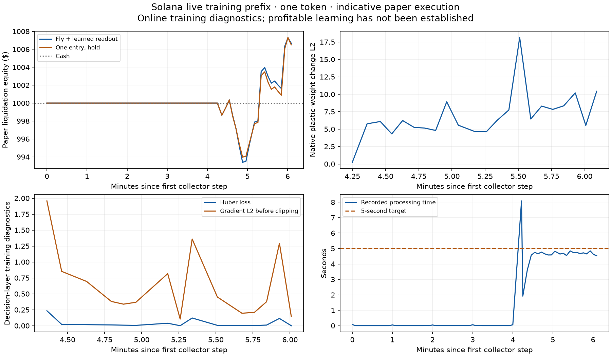

## Latest completed comparison

The separate [GSPO-inspired replay pilot](reports/group-replay-01.md) completed
384 training trajectories and 48 actor updates using frozen full-fly features.
On four later, unseen mints, mean 60-second paper PnL improved from -$0.494 to
-$0.392 per isolated $1,000 episode. Cash returned $0 and beat both actors.
The [independent audit](reports/group-replay-01-audit.json) verified 592 training
and evaluation trajectories, 7,696 account rows and 1,624 fills. This is a small
retrospective mechanics pilot, not evidence of profitable trading. No policy was
promoted and no recurring GSPO job was added.

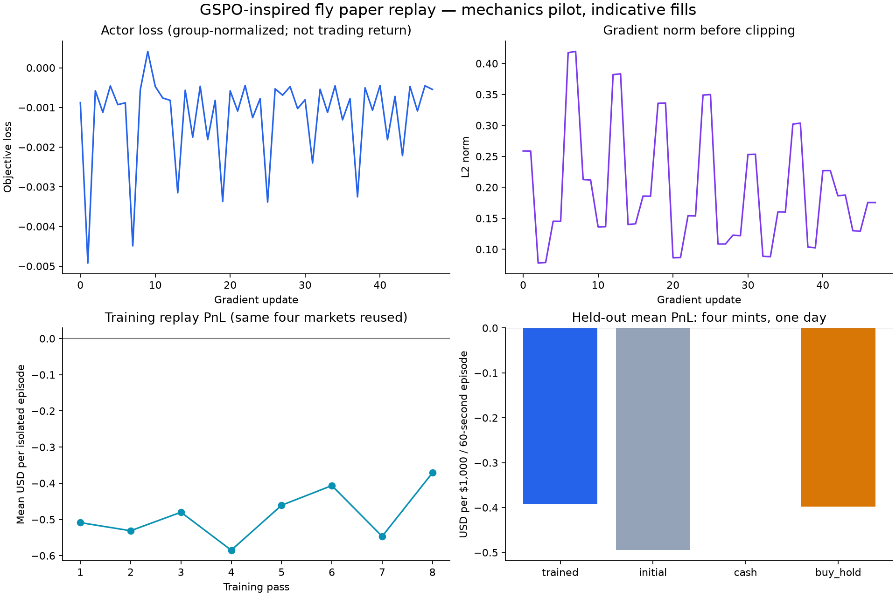

## Previous full-network comparison

[Study 12](docs/fly-rate-result-12.md) completed **16 independently audited
conditions, 372 neural observations and 18,600 recorded bins**. Reducing the
online learning rate from 0.001 to 0.0001 produced smaller updates but did not
pass development selection. Every fly variant lost money in both phases.

| Fly condition | Development equity | Held-out test equity |
| --- | ---: | ---: |
| Pristine frozen | $982.51 | $978.38 |
| Trained frozen | $978.84 | $979.66 |
| Online eta 0.001 | $981.73 | $981.14 |
| Online eta 0.0001 | $979.25 | $980.41 |

Each arm and phase starts with a fresh $1,000. Execution and terminal exit
costs are included; hosting is excluded. Sharp interim dips are missing-quote
stress marks, not observed crashes. No policy was promoted.

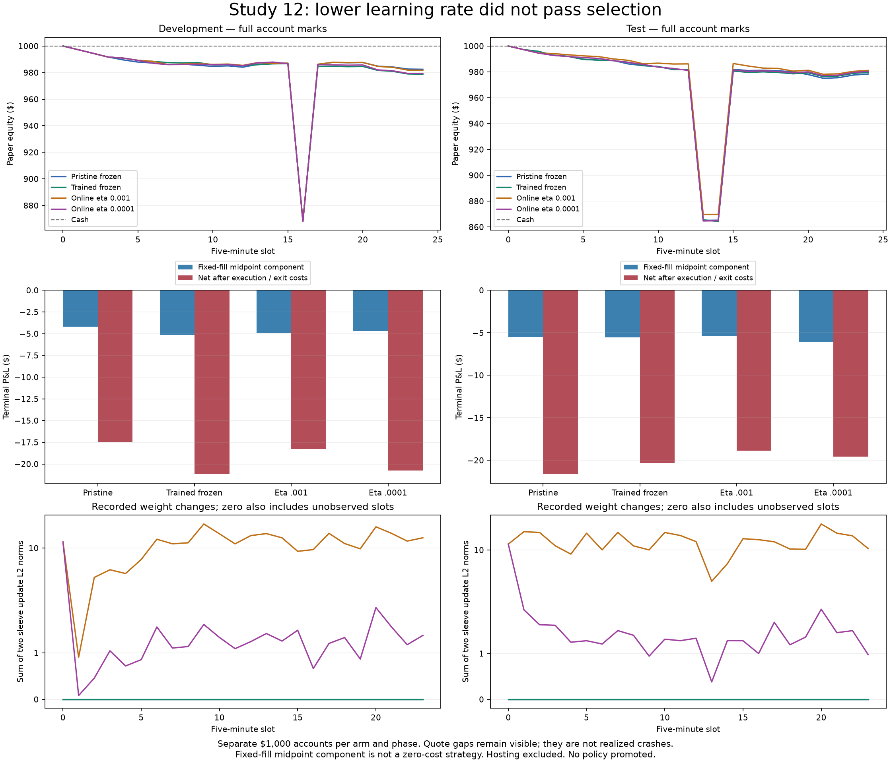

The [first changed action](docs/fly-rate-result-12.md#inspect-the-first-changed-action)
links one recorded gate spike to a SELL, a later BUY and their execution costs.
Its [paired portable recordings and reproduction steps](docs/fly-rate-result-12.md)
are included. The study app is stopped; the separate paper-lab deployment was
retained. The study compute ledger accounted for about $0.91, not a provider invoice.

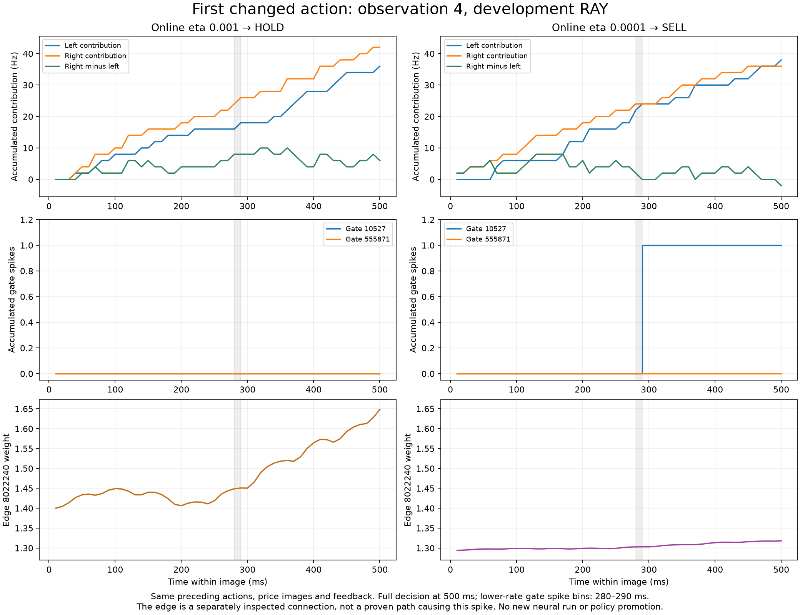

## Previous comparison: study 11

[Study 11](docs/fly-online-comparison.md#final-audited-result) completed all sixteen
conditions with **360 audited neural observations and 18,000 recorded bins**.
Those observations repeat 90 eligible asset/time slots across four variants.
Each variant starts development and held-out test with a fresh $1,000 account:
two $250 pool allocations plus $500 idle cash.

| Fly condition | Development equity | Held-out test equity |
| --- | ---: | ---: |
| Pristine memory, frozen | $946.73 | $986.34 |
| Paper-trained memory, frozen | $942.86 | $976.36 |
| Paper-trained memory, online updates | $964.45 | $972.13 |
| Online updates, reset KC/DAN rate histories | $972.03 | $984.93 |

**No condition passed development, and no policy was promoted.** Reset reduced
losses relative to online carry in both phases, but trailed pristine frozen in
test. All aggregate results lost money. Simulated adverse fees, spread and
slippage are included; hosting is excluded. Two pools and four hours do not
establish monthly profitability.

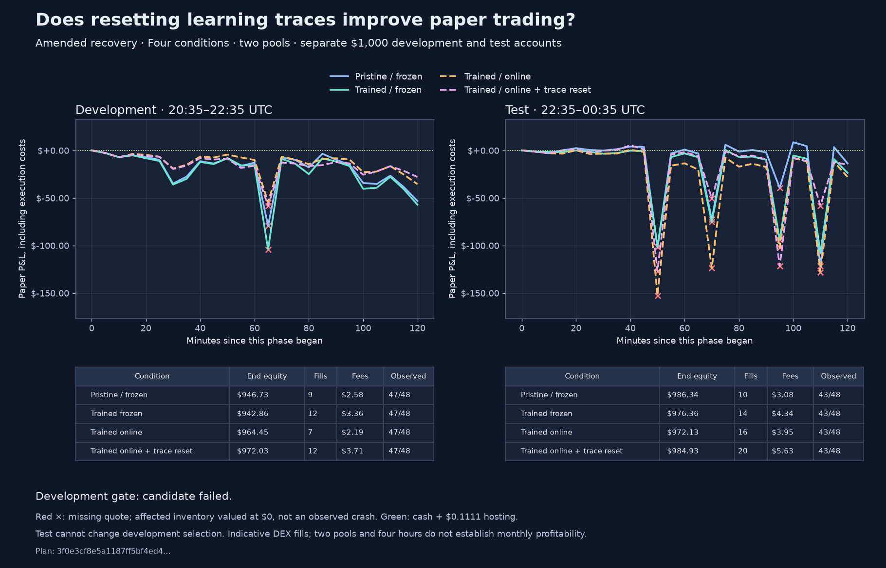

Red crosses mark missing quotes: the affected inventory is valued at $0 as a
stress mark. Those downward spikes are not observed price crashes. Gaps remain
missing in neural plots and do not generate fabricated learning observations.
The [result record](reports/fly-online-result-11.json) preserves the input hashes,
receipts, audits, costs and two disclosed recovery amendments. The original
failed third condition and preempted partial recording remain preserved and
excluded; six completed recordings were reused.

The [loss breakdown](docs/fly-loss-attribution.md) reconciles all 400 account
marks. In test, reset had a **+$2.48 midpoint component**, but **$17.55 of
execution and terminal exit costs**, leaving **−$15.07**. It filled 20 trades,
versus 10 for pristine frozen. This identifies turnover/cost awareness as a
candidate for a fresh experiment; it does not establish a profitable strategy.

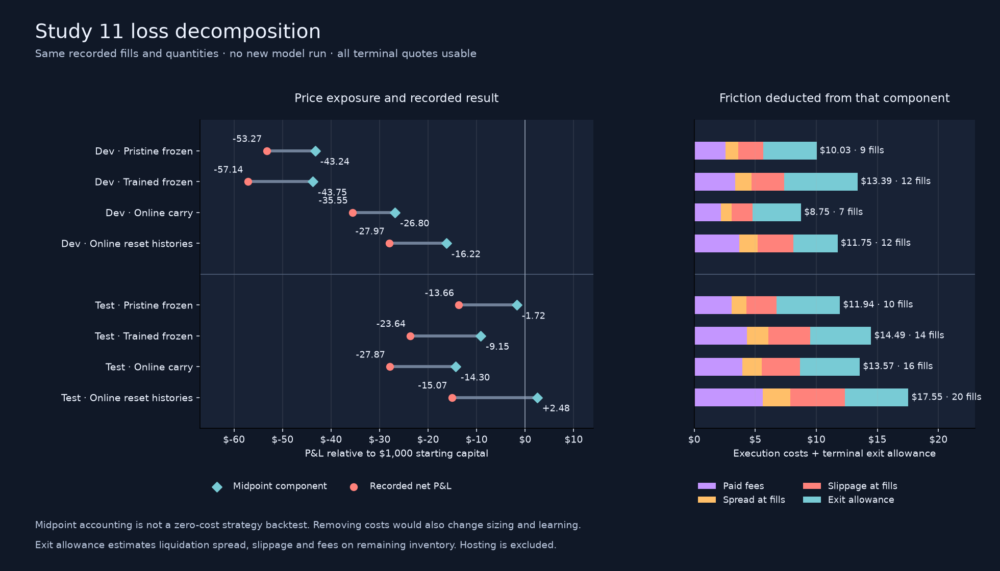

Follow a concrete [gate-spike → BUY → delayed fill → cost example](docs/fly-loss-attribution.md#from-gate-spikes-to-execution-costs),
or inspect the [complete reset decision-to-fill tables](docs/fly-trade-trace-11.md).
BUY denotes an exposure target; some BUY targets generate rebalance sales.

The [simple market references](docs/market-baselines.md) add another check:
one capped purchase per pool finished study 11 test at **$1,002.33**, and a
constant exposure target at **$1,007.61**. Both lost during development. These
descriptive baselines have different exposure and were added after the experiment;
they do not change its selection result or establish a profitable replacement.

## Inspect the fly

The [interactive debugger](docs/fly-debugger.md) connects recorded activity to the
model's fixed BUY/SELL/HOLD decoder. It provides:

- Neuron spikes, membrane voltage, input timing and accumulated decoder counts.
- Connection weights and stored `u/w`, separately from source firing highlights.
- Paired recordings matched by neuron, connection and market timestamp, with
  first/next differences and shareable links to a selected observation and bin.
- Full-neuron lookup from retained arrays, plus controlled tests of synthetic
  prices, news, neuron stimulation and selected connection restoration.

The simulation retains the complete graph; the displayed circuit is a labeled
subset. A highlighted weight update is not proof that its source just fired,
and synchronized plots do not establish a causal pathway.


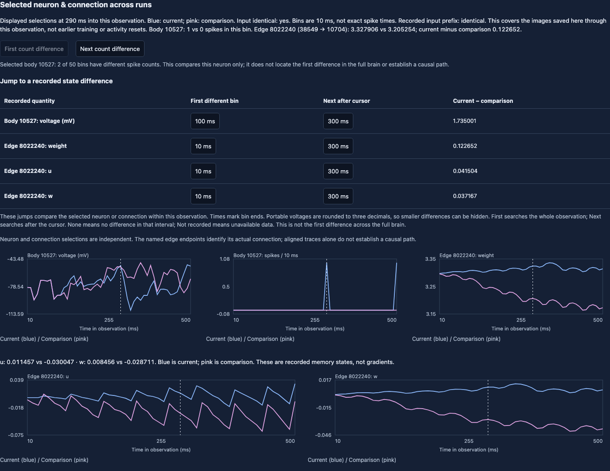

After installing below, open the included recordings without model compute:

```sh
uv run python -m paperlab.debugger serve --out examples/fly-debugger
```

Visit <http://127.0.0.1:8765>. To submit new bounded synthetic assays to an
already deployed and authenticated Modal worker, use:

```sh
uv run python -m paperlab.debugger serve --backend modal --out runs/cloud-debugger
```

The [debugger guide](docs/fly-debugger.md) documents controls, full cloud traces,
saved-call recovery, controlled market replays and all earlier experiments.
Diagnostic assays remain separate from paper accounts and policy promotion.

## Reproduce the financial and learning charts

The loss breakdown, decision-to-fill trace and simple-baseline report generators
[reproduced their published JSON byte for byte from a clean committed snapshot](reports/analysis-reproduction-2026-09-13.json).
All 28 targeted tests passed there using the existing Python environment. This
checks committed inputs and code; it is not a fresh dependency-installation test.

The included [evidence archive](reports/fly-online-evidence-11.zip) contains 51
exact report, plan, summary, audit and receipt files, compressed to about 1.7 MB.
No graph download, credential or new model run is needed to regenerate all five
PNG/SVG figures:

```sh
python3 -m zipfile -e reports/fly-online-evidence-11.zip runs/study-11-evidence
uv run --extra plots python -m paperlab.fly_online_figure \
  --root runs/study-11-evidence --out runs/study-11-figures
```

Use new output directories to preserve earlier evidence. The plotter verifies
all sixteen audit/receipt relationships and the original development selection
before rendering. The archive transports existing audits; repeating the raw
neural audit requires the separately retained full recordings and graph data.

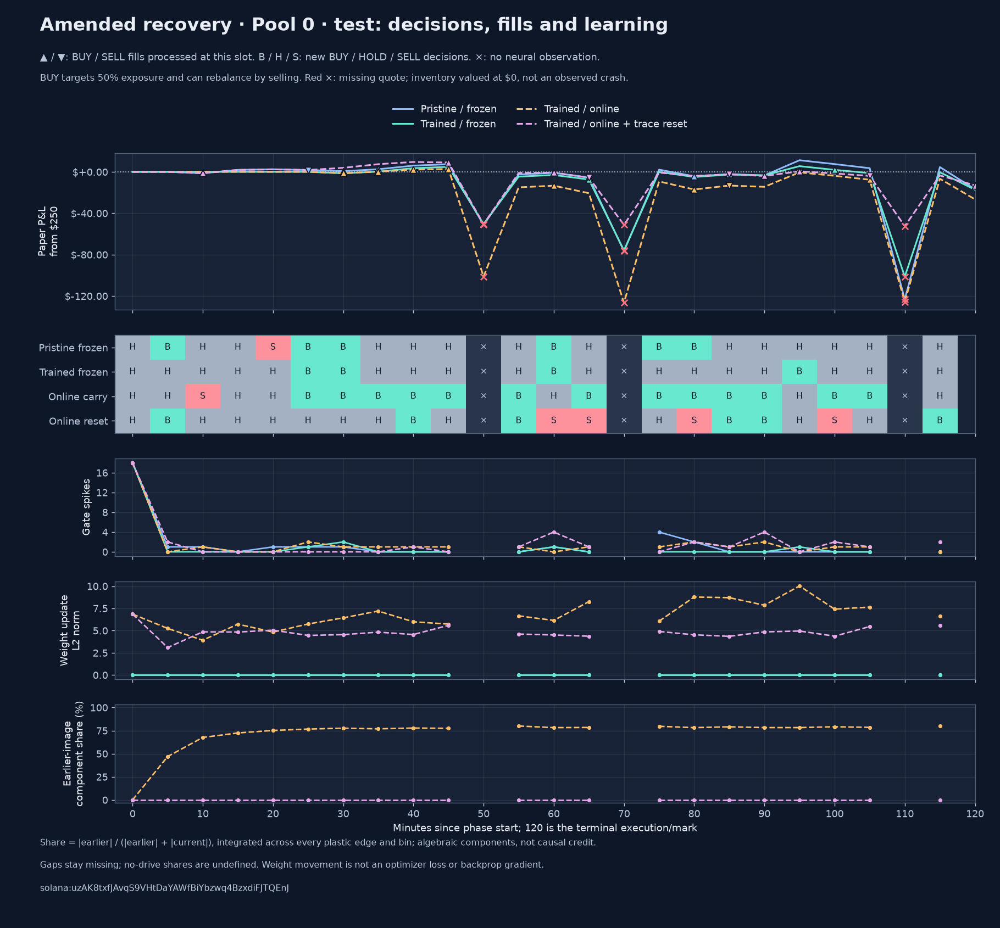

Each panel separates new decisions from fills executing earlier decisions.
Weight movement is a recorded plasticity update, not an optimizer loss or
backprop gradient. The learning-history share is an algebraic decomposition,
not causal credit. [All 90 paired steps](docs/fly-online-paired-steps-11.md) link
back to the complete-recording viewer; its setup requires the retained arrays
as described in the [comparison guide](docs/fly-online-comparison.md).

## What the debugging has established

Stored paper training changed the incoming weights of all six plastic
recipients, but those recipients often remained silent. Controlled stimulation
exposed memory-dependent firing and decisions without demonstrating better
trading. The [recipient activity and stimulation results](docs/fly-debugger.md#inspect-the-quiet-learned-pathway)
retain every control and outcome.

The [learning-drive reconstruction](docs/fly-debugger.md#why-a-quiet-source-connection-can-still-update)
then found that current DAN activity can combine with old KC activity to update
a connection whose source is currently silent. Removing KC history reproduces
the first different weight update in two recorded examples; that one-bin
calculation does not determine later full-network behavior.

The [selective KC/DAN assay](docs/fly-selective-traces.md) is now complete:
**12 conditions, 36 observations and 1,800 bins independently audited**. With
recorded pulses, either single-trace reset removes the third-image BUY, but
produces much larger weight movement than resetting both. KC-only initially
matches the both-reset weights, then diverges after 50 ms of image 2. That
confirms why the earlier one-bin calculation was insufficient. No selective
reset is promoted; changing a decision is not evidence of improving a trade.

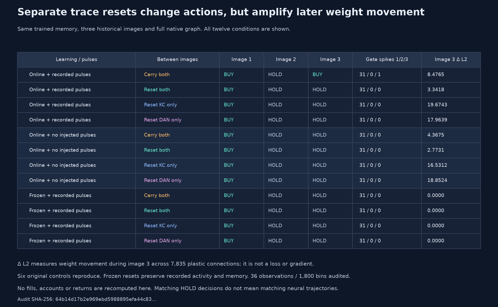

The [memory-filter reconstruction](docs/fly-selective-traces.md#why-the-single-resets-move-weights-more)
now separates stored `u/w` relaxation from new learning drive. On the recorded
KC-only trajectory, retained earlier DAN history dominates the third-image
update; current-image activity partly opposes it. The decomposition holds
recorded firing fixed and does not establish a better trading policy.

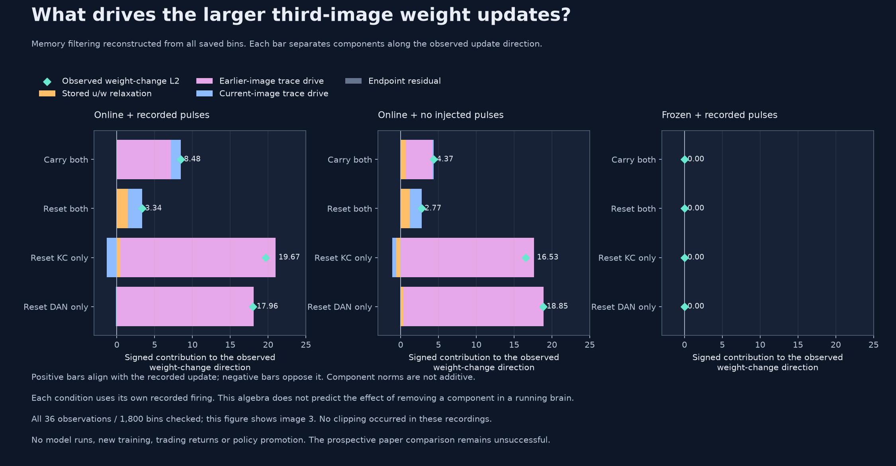

The subsequent [lower-rate experiment](docs/fly-learning-rate.md) is also
complete: **five conditions and 15 observations audited**. Reducing eta from
0.001 to 0.0001 with both histories retained reduced later weight movement, but
changed the recorded-pulse decisions from BUY–HOLD–BUY to BUY–BUY–BUY. A single
added gate spike explains the second-image decoder change. Smaller updates did
not make this fixed decoder less active, and no policy was promoted.

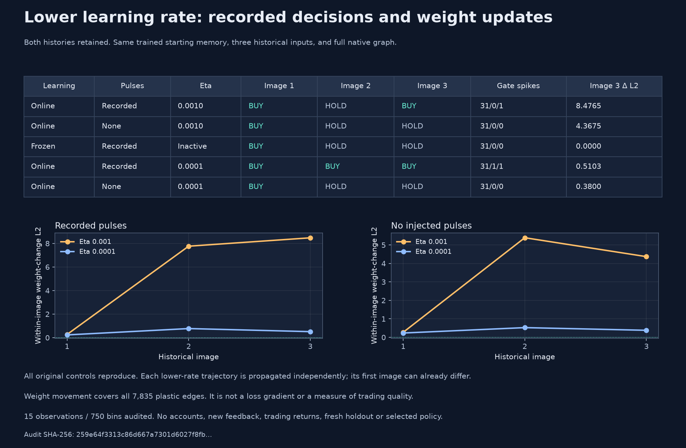

The [fresh market comparison](docs/fly-rate-result-12.md) then tested both rates
against frozen controls using independently checked RAY and STONK paper memories.
Study 12 completed its registered 06:00–10:00 UTC window on September 13 and all
16 full audits. The lower-rate candidate failed selection; no policy was promoted.
Its [registration and execution history](docs/fly-rate-market.md) remain preserved.

Open all twelve paired recordings from the included 3.75 MB archive:

```sh
python3 -m zipfile -e reports/fly-selective-views-01.zip runs/selective-views
uv run python -m paperlab.debugger serve --out runs/selective-views --port 8768
```

Visit <http://127.0.0.1:8768>. The archive contains audited selected-neuron and
connection curves; arbitrary full-neuron lookup requires the separately retained
arrays. The [guide](docs/fly-selective-traces.md#inspect-or-reproduce-the-result)
includes exact comparison links and chart commands. The completed temporary
assay app is stopped; the scheduled paper lab remains separate.

## Run

Python 3.12 and a C++ compiler are required. Run from this source checkout so the preserved upstream files are available.

For a locked install, use `uv sync --locked --python 3.12 --all-extras`. The lockfile selects CPU-only PyTorch on Linux. The pip alternative below uses the system platform's default PyTorch wheel; install PyTorch from its CPU index first on a Linux CPU server.

```sh
python3.12 -m venv .venv
.venv/bin/pip install -e '.[dev,cloud,plots,news,export]'
PYTHONHASHSEED=0 .venv/bin/python -m pytest -q
.venv/bin/paperlab fetch --product BTC-USD --days 14 --out data/btc.jsonl
.venv/bin/paperlab news --db data/news.db
.venv/bin/paperlab train --data data/btc.jsonl --news-db data/news.db --steps 8192 --out runs/ppo
```

Train the actual retained fly graph (about 1.1 GB of public source downloads; plan for 16 GB RAM):

```sh
.venv/bin/paperlab fly-prepare --fly-data data/fly
.venv/bin/paperlab fly-replay --data data/btc.jsonl --news-db data/news.db --fly-data data/fly --steps 32 --out runs/fly-learning
.venv/bin/paperlab fly-replay --data data/btc.jsonl --news-db data/news.db --fly-data data/fly --steps 32 --frozen --out runs/fly-frozen
```

The fly uses Stonkfly's candidate dopamine-modulated plasticity, not PPO. Its retained graph and fixed spike decoder are unchanged. Changing synaptic weights does not establish profitable learning. See [architecture and evaluation](docs/architecture.md), [cloud operation and budgets](docs/cloud.md), and [verification results](reports/verification.md).

The original BTC/PPO mode defaults to $1,000 paper capital, a 50% maximum target allocation and a $100 maximum paper order. Its assumed costs are 60 bps per side plus 10 bps slippage, not a verified exchange fee tier. The current Solana service has the separate limits and costs documented above. Reports value open inventory at bid less estimated exit costs. Current headlines are never retroactively inserted into old price history.

`vendor/stonkfly` preserves [nftechie/stonkfly](https://github.com/nftechie/stonkfly) at commit `78ef3e05ab0fa086032098558d893667068944a0`, including its MIT license and third-party notices. This lab imports only its neural/data/display modules; its live trading implementation is not wired into the lab.

The original BTC mode supports a five-minute paper-data schedule and six-hourly
PPO retraining after 400 observations. The multi-pool mode has separate collection,
eligibility, training gates, and ledgers documented above. Full BTC decision, loss,
gradient and fly-weight diagnostics are described in [observability](docs/observability.md).
Sustained profitability has not been established for either experiment.

The [recurring Solana paper RL service](docs/solana-online.md) extends the bounded
single-token pilot to a shared portfolio and new launch admission. It runs
budget-paced Modal windows with checkpoint continuation; it does not promise
24/7 all-token inference or profitable returns.
