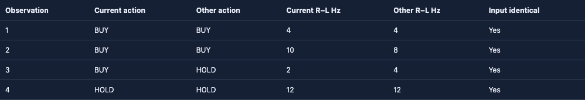
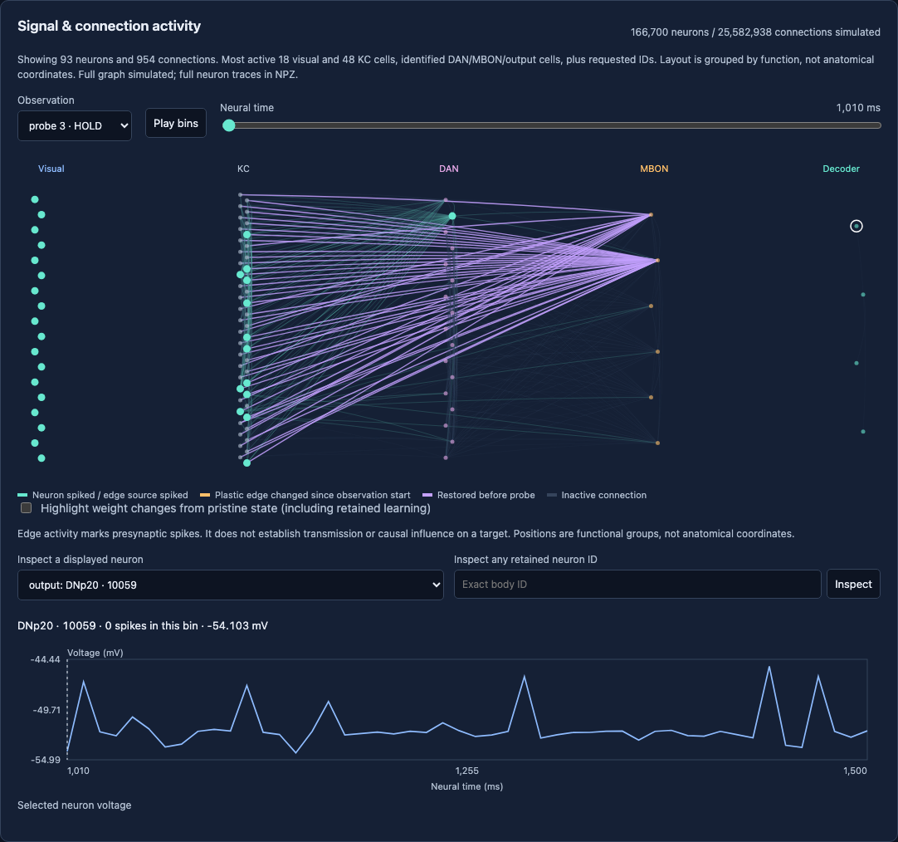

# Stonkfly Trading

A paper-only research lab comparing the full Stonkfly spiking fly network with a **247,780-parameter PPO policy**, using market data and timestamped news. No real-order endpoint, wallet or exchange credentials are used.

The [dynamic memecoin experiment](docs/memecoin-universe.md) adds free live launch
discovery, multi-chain pool sampling, separate $1,000 portfolios, isolated fly
contexts, and pooled PPO training. Coverage is bounded and DEX fills are explicitly
indicative simulations. Use `PAPERLAB_UNIVERSE=1` when deploying this experiment;
the original BTC archive remains available.

The fly is a sparse spiking network, not a transformer. The compact policy is an MLP actor/critic, not an SLM. An optional, separately pinned FinBERT transformer encodes headline sentiment. News features enter the compact policy numerically and the fly through an explicit visual adapter.

## Inspect the fly

The [interactive circuit debugger](docs/fly-debugger.md) shows recorded neuron
spikes, voltages, connection updates, fixed decoder outputs, and paired learning
comparisons. Test synthetic prices, news, reinforcement, and neuron stimulation
without touching a paper account. The simulation retains the full graph; the
display is a labeled subset with full-neuron lookup in generated recordings.


After installing below, open the included real-network synthetic recordings:

```sh
uv run python -m paperlab.debugger serve --out examples/fly-debugger
```

Visit <http://127.0.0.1:8765>. See the debugger guide for input tests, the eight-arm
study, and its limitations. These visualizations are diagnostic evidence, not
evidence of profitable trading.

With Modal already deployed and authenticated, run tests in the cloud with
`uv run python -m paperlab.debugger serve --backend modal --out runs/cloud-debugger`.
The guide also covers sealed, cost-aware market replays and saved call recovery.
The [first sealed market comparison](docs/fly-debugger.md#first-market-replay-result)
rejected all proposed changes under its development gate. The
[reinforcement-gated follow-up](docs/fly-debugger.md#second-market-replay-result)
stopped neutral weight drift but had no development/test fills and showed no
trading advantage. No policy was promoted. The included `market02-*` recordings
show the skipped quote slots, simulated fill outcomes, and neutral weight freeze.


The first paired falling-price assay found one action disagreement in four
observations. Both arms received identical images:



The [memory-output intervention study](docs/fly-debugger.md#memory-output-intervention-study)
confirms that stimulating the plastic-memory output groups can change the fixed
decoder with weights frozen. All five controls and runnable recordings are included;
this demonstrates model sensitivity, not profitable learning.

The [retained-learning experiment](docs/fly-debugger.md#retained-learning-results)
adds frozen probes after resetting neural activity. Reward training changed three
of eight probe actions versus frozen controls; neutral training also changed one.
The debugger separates updates happening now from weights retained from training.
Select `retention01-reward_rise`, compare `retention01-neutral_rise`, and inspect
**probe 4**. Both probes have learning disabled.

The [counterbalanced follow-up](docs/fly-debugger.md#counterbalanced-training-cues)
shows that changing the training cue changes the reward-trained response. Larger
weight changes still do not establish better decisions; both complete studies
and an offline comparison audit are included.

The [third market replay](docs/fly-debugger.md#third-market-replay-result) had five
simulated fills per arm, but every variant ended at $996.36 and failed selection.
The [input audit](docs/fly-debugger.md#price-magnitude-lost-in-the-visual-adapter)
found that automatic scaling can render 1% and 20% rises identically. The debugger
now offers an [experimental fixed return scale](docs/fly-debugger.md#experimental-fixed-return-input)
and price-movement controls. It separates the audited inputs; market effectiveness
is still unproven and the paper trader continues using the original adapter.


The [connection-restoration controls](docs/fly-debugger.md#restore-learned-connections-before-a-probe)
can undo selected learned memory before a frozen probe. In the included falling-cue
experiment, restoring MBON11 inputs recovered pristine outputs; restoring MBON07
inputs did not. This localizes one synthetic effect, without proving better trading.



## Run

Python 3.12 and a C++ compiler are required. Run from this source checkout so the preserved upstream files are available.

For a locked install, use `uv sync --locked --python 3.12 --all-extras`. The lockfile selects CPU-only PyTorch on Linux. The pip alternative below uses the system platform's default PyTorch wheel; install PyTorch from its CPU index first on a Linux CPU server.

```sh
python3.12 -m venv .venv
.venv/bin/pip install -e '.[dev,cloud,news,export]'
.venv/bin/python -m pytest -q
.venv/bin/paperlab fetch --product BTC-USD --days 14 --out data/btc.jsonl
.venv/bin/paperlab news --db data/news.db
.venv/bin/paperlab train --data data/btc.jsonl --news-db data/news.db --steps 8192 --out runs/ppo
```

Train the actual retained fly graph (about 1.1 GB of public source downloads; plan for 16 GB RAM):

```sh
.venv/bin/paperlab fly-prepare --fly-data data/fly
.venv/bin/paperlab fly-replay --data data/btc.jsonl --news-db data/news.db --fly-data data/fly --steps 32 --out runs/fly-learning
.venv/bin/paperlab fly-replay --data data/btc.jsonl --news-db data/news.db --fly-data data/fly --steps 32 --frozen --out runs/fly-frozen
```

The fly uses Stonkfly's candidate dopamine-modulated plasticity, not PPO. Its retained graph and fixed spike decoder are unchanged. Changing synaptic weights does not establish profitable learning. See [architecture and evaluation](docs/architecture.md), [cloud operation and budgets](docs/cloud.md), and [verification results](reports/verification.md).

Default paper capital is $1,000, with a 50% maximum target allocation and $100 maximum paper order. Costs are assumptions, not a verified exchange fee tier: 60 bps per side plus 10 bps slippage. Reports value open inventory at bid less estimated exit costs. Current headlines are never retroactively inserted into old price history.

`vendor/stonkfly` preserves [nftechie/stonkfly](https://github.com/nftechie/stonkfly) at commit `78ef3e05ab0fa086032098558d893667068944a0`, including its MIT license and third-party notices. This lab imports only its neural/data/display modules; its live trading implementation is not wired into the lab.

The original BTC mode supports a five-minute paper-data schedule and six-hourly
PPO retraining after 400 observations. The multi-pool mode has separate collection,
eligibility, training gates, and ledgers documented above. Full BTC decision, loss,
gradient and fly-weight diagnostics are described in [observability](docs/observability.md).
Sustained profitability has not been established for either experiment.
