# Fly circuit debugger

The debugger records the actual full retained network at the controller's 10 ms
integration boundary. It does not replace the native integrator, prune the graph,
or write to a deployed paper account. Inputs can run locally or on Modal;
recorded results remain inspectable without model compute.

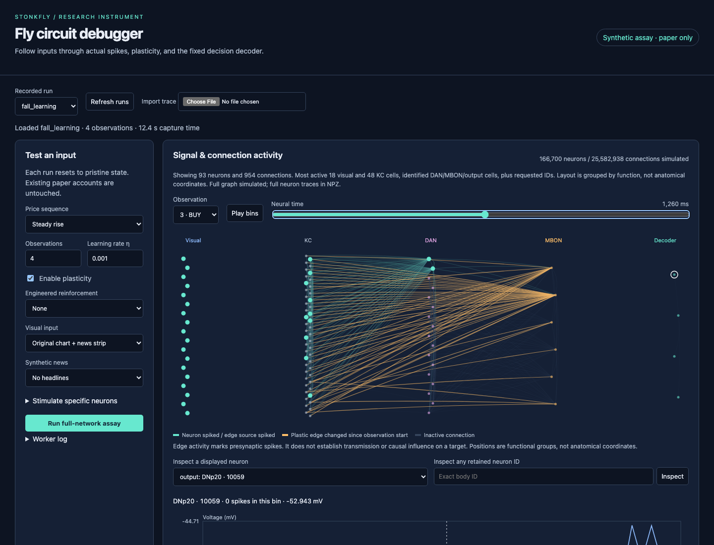

## Open the included recordings

From the repository root after the normal locked install:

```sh
uv run python -m paperlab.debugger serve --out examples/fly-debugger
```

Open <http://127.0.0.1:8765>. No credentials, graph download, or ongoing model
compute are needed to view the included recordings. Choose `fall_learning`,
observation 3, and compare `fall_frozen` to see the action disagreement.
The examples contain real full-network activity driven by synthetic inputs.
The included `market02-online_original` and `market02-reinforcement_gated`
recordings also show a real retrospective market input and its simulated execution
timeline. Their timelines are derived from the immutable second-study ledger;
the source hash is recorded in `timeline_provenance`. This display enrichment does
not rerun or modify the experiment. Neither example contains account data.
Full-neuron lookup requires the larger NPZ files,
which are generated by the commands below and excluded from Git.

## Run and inspect new inputs

With the lab already deployed and the Modal SDK authenticated, use cloud compute:

```sh
uv run python -m paperlab.debugger serve --backend modal --out runs/cloud-debugger
```

The form now says **Run on Modal (cloud)**. The browser and small inspection
server are local; full-network computation runs in Modal and continues if the
laptop sleeps. On reopening the server, its saved `cloud-job.json` receipt resumes
the same call. Credentials remain in the SDK and are never sent to the browser.
An uncertain submission/result blocks duplicate work rather than resubmitting.
Inspect the recorded Modal call if a receipt says `attention`.

The worker uses Modal single-use containers. A diagnostic batch exposed open-file
reload failures when a native-model container handled a second invocation; a fresh
container per call closes those handles before the next call. This adds startup
latency to queued diagnostic batches; scheduled five-minute calls already normally
start cold. The existing ten-second startup reservation remains unchanged.
The recorder also restores class-method lookup on exit instead of retaining a
bound-method reference cycle around the full brain.

Cloud assays share the existing worker lease and budget ledger. No extra paid
endpoint or always-on GPU is created. A long diagnostic can delay a scheduled
paper cycle; collection runs separately. Assays retain the worker's 600-second
timeout, 2 CPU / 8 GiB universe-mode limits, and conservative reservation. Full
traces persist under `/state/fly-debugger`; the browser downloads compact views
first and larger NPZ files only for full-neuron lookup. Storage and provider
billing must still be checked separately from the compute estimate.

For an explicit deployment, preserve the universe and schedule flags:

```sh
PAPERLAB_SCHEDULE=1 PAPERLAB_FLY=1 PAPERLAB_UNIVERSE=1 uv run modal deploy cloud.py
```

For local computation instead:

Prepare the retained graph once (Python 3.12, C++ compiler, about 1.1 GB of source
downloads, and sufficient memory; plan for 16 GB RAM). Then:

```sh
uv run paperlab fly-prepare --fly-data data/fly
uv run python -m paperlab.debugger study --fly-data data/fly --out runs/study-01 --steps 4
uv run python -m paperlab.debugger serve --fly-data data/fly --out runs/study-01
```

The server binds to loopback and runs one submitted assay at a time. The form
starts an isolated subprocess and displays its progress log. Test rising,
falling, flat, reversal, or shock prices; change plasticity and eta; supply
synthetic news; ablate the header/news strip or the entire image; or inject
bounded current into up to 16 exact retained neuron IDs. All assays start from
pristine native state. A new assay never continues or rolls back the deployed
trader's checkpoint. Closing this local server closes access to this debugger,
but does not affect Modal's scheduled traders.

For one CLI capture:

```sh
uv run python -m paperlab.debugger capture --fly-data data/fly --out runs/custom/capture-01 --preset fall --steps 4 --frozen
uv run python -m paperlab.debugger serve --out runs/custom
```

`capture --config config.json` accepts the complete `Assay` configuration:

```json
{
  "preset": "rise", "steps": 4, "probe_steps": 0, "probe_preset": "rise",
  "learning": true, "eta": 0.001,
  "reinforcement": "none", "reinforcement_only": false,
  "view": "original", "news": "none",
  "neurons": [], "current": 0
}
```

Observation count is bounded to 1–8; each observation is 500 ms of neural time.
Extra stimulation lasts the whole observation. Reinforcement stimulates the
identified reward or aversive cells for the unchanged first 200 ms. These are
engineered interventions, not proof that the network recognizes market outcomes.
The `price_only` ablation removes the header and lower strip; it still retains
the original chart grid, scaling, colors, and the same cropped price region.

The **Require reinforcement for updates** checkbox freezes plastic weights and
efficacy memory whenever the observation has no engineered reinforcement. Neural
propagation and KC/DAN rate traces continue. A reward or aversive pulse enables
the original plasticity rule for that observation. This is an experimental credit
assignment gate, not a replacement decoder or a validated biological claim. The
learning panel reports whether plasticity was enabled for each observation.

## Probe retained learning

Expand **Test retained learning** and set 1–4 frozen probe observations. Training
plus probe observations must total at most eight. Choose the probe's price
sequence independently from training. The probe resets voltage, adaptation,
queues, sensory state, and KC/DAN rate traces to the native initial state, while
retaining plastic weights and efficacy memory. It verifies those invariants
before proceeding. Probes have no learning, reinforcement pulses, extra current,
or news, and record exact weight/memory hashes at the boundary.

For example, this config trains on rising synthetic prices with reward pulses,
then probes falling prices with frozen trained weights:

```json
{
  "preset": "rise", "steps": 4, "learning": true, "reinforcement": "reward",
  "probe_steps": 4, "probe_preset": "fall"
}
```

Pass the file to the existing `capture --config` command or enter these settings
in the Modal form. Every run still starts pristine; this does not edit a deployed
trader. Use **Highlight weight changes from pristine state** to see retained
weight deviations during frozen probes. The default shows changes within the
current observation, which should be zero for a frozen probe. Old recordings
without the additional arrays disable the pristine-relative view.

Observation labels distinguish training and probe phases. Comparisons align by
phase and within-phase index, so a shorter training phase cannot shift probe
pairing. Native binary mismatches are highlighted: same RGB inputs across Mac
and Linux builds have produced different fixed-decoder outputs. Control build,
inputs, and reset semantics before attributing differences to learning. The
full-native test verifies that a frozen stimulated training phase followed by a
reset probe reproduces the fresh control, and that trained efficacy memory and
weights survive the reset without further probe updates.

## What the views mean

- **Neuron activity:** actual bin spike counts. The voltage plot shows voltage
  at each bin boundary; it does not resolve individual 0.1 ms spike waveforms.
- **Connection activity:** a recorded presynaptic neuron spiked. A highlight
  does not prove transmission, a postsynaptic spike, or causal influence.
- **Amber connections:** plastic weight differs from its value at the start of
  the selected observation. The edge inspector shows exact endpoints and weight.
- **Learning:** L2 weight displacement, changed-edge count, KC/DAN rate traces,
  memory states, and clipping. Optimizer loss and backprop gradients are `null`
  because this rule has neither; the UI never invents them.
- **Decoder:** whole-observation mean DNp20 firing rates, DNpe017 gate spikes,
  and the fixed BUY/SELL/HOLD mapping. A positive rate difference still produces
  HOLD if the gate does not spike.
- **Market timeline:** every decision slot, including skipped quotes and terminal
  marks, with simulated fill status and sleeve equity. A neural BUY is not a fill.
  Market comparisons align by decision timestamp rather than compressed recording
  index, so missing observations cannot silently shift the pairing.
- **Graph:** the native computation uses all 166,700 neurons and 25,582,938
  directed connections. The view selects the most active 18 visual and 48 KC
  cells, identified DAN/MBON/output cells, and requested stimulation IDs.
  Connections are actual graph edges between displayed endpoints. Missing
  intermediate neurons can make visual or decoder groups appear disconnected.
  Functional column positions are not anatomical coordinates.

Every observation produces `step-NN.npz` with **all** neuron IDs, counts, voltages,
all 7,835 plastic edges, bin weights, KC/DAN traces, and memory states; an exact
input PNG; and a report with native/source hashes. `view.json` is a bounded
rendering export. The input hashes allow checking identical sensory input across
arms. Use the exact-ID lookup against full recordings to inspect cells outside
the default view. Native checkpoints remain platform/build dependent.

## First controlled study

The [predeclared protocol](../reports/fly-debugger-protocol-01.json) has eight
arms, four observations each, identical pristine initial state per arm, and no
selection by profitability. The [complete results](../reports/fly-debugger-study-01.json)
include every arm, all decoder values, spike hashes, and learning diagnostics.

| Comparison | Different actions / 4 | Observed implication |
| --- | ---: | --- |
| Rising prices: learning vs frozen | 0 | Activity changed; action sequence did not |
| Falling prices: learning vs frozen | 1 | Plasticity affected a downstream action |
| Rising vs falling prices, learning | 2 | Sensory input affects later decisions |
| Reward vs aversive pulses | 0 | Distinct reinforcement changed spikes, not these actions |
| Default vs 10× lower eta | 0 | Lower eta alone did not change these actions |
| Original vs header/news-strip removal | 1 | Non-price display regions can change a decision |

In the falling-price arm, observation 3 was BUY with learning and HOLD frozen.
The learned gate spiked once; the frozen gate did not spike. A rising chart and
a falling chart both began with BUY. These observations identify decoder gating,
input encoding, and credit assignment as subjects for further tests. They do not
show that every falling market should produce SELL or establish an improved
trading strategy. The assays execute **no trades** and measure no financial return.

Four observations cover only two seconds of neural time. This is a deterministic
mechanics study on fixed synthetic inputs, without a statistical performance
claim. The native verification checks that instrumentation preserves the
unrecorded spike/memory result, reset reproduces it, and frozen weights do not
change. Run it explicitly with a prepared graph:

```sh
FLY_TRACE_DATA=data/fly uv run python -m pytest tests/test_fly_trace.py -q
```

Further improvement work must compare frozen and learning policies on the same
chronological market observations, with next-observation fills and fees, slippage,
spread, unavailable inventory, and untouched validation windows. Do not deploy an
assay winner or reverse a live account merely because a visualization looks better.

## Sealed market replay

`fly_market_study` separates training, development selection, and subsequent test
windows on an immutable discovery snapshot. The predeclared arms are pristine
frozen, trained frozen, ongoing plasticity, 10× lower training eta, and header/news
strip ablation. The full retained graph and fixed decoder stay unchanged.

```sh
mkdir -p runs/market
uv run modal volume get fly-paper-lab-universe universe-snapshot.db runs/market/universe.db
uv run python -m paperlab.fly_market_study seal --archive runs/market/universe.db --out runs/market/plan.json
# Local replay of exactly that sealed plan:
uv run python -m paperlab.fly_market_study run --plan runs/market/plan.json --fly-data data/fly --out runs/market/result
```

For cloud execution, submit the sealed envelope through the existing worker and
save the returned call ID before waiting; do not run this snippet again to poll:

```python
import json
from pathlib import Path
import uuid
import modal

root = Path("runs/market")
receipt = root / "cloud-call.json"
if receipt.exists():
    raise RuntimeError("Inspect the existing call; do not duplicate it")
request = {"run_id": "assay-market-" + uuid.uuid4().hex,
           "market_plan": json.loads((root / "plan.json").read_text())}
receipt.write_text(json.dumps({"status": "submitting", "run_id": request["run_id"]}))
call = modal.Function.from_name("fly-paper-lab", "worker", environment_name="main").spawn(debug=request)
receipt.write_text(json.dumps({"status": "running", "call_id": call.object_id, "run_id": request["run_id"]}))
print(call.object_id)
```

Poll that same call with `modal.FunctionCall.from_id(saved_id).get(timeout=0)`;
`TimeoutError` means it is still pending. Results live under its isolated
`/state/fly-debugger/<run_id>` directory. `protocol.json`, `development.json`,
`selection.json`, `results.json`, and `summary.json` preserve the audit trail.
The frozen and ongoing-plasticity test arms also emit full traces and `view.json`
files for the debugger.

Cohort formation uses the earliest historical eligibility and a fixed 15-minute
formation period, never future returns or survival. At most two of four $250
sleeves are used; the other sleeves stay in cash. The default is three decisions
per 15-minute phase. Each phase has fresh paper cash and reset neural dynamics;
post-training weights are restored for development and test. The online arm can
update during each evaluation phase, but development updates do not carry into
test. Frozen evaluation receives no P&L pulses. This separates weight transfer
from live continuous-state trading and is not a replay of the deployed account.

Orders execute only at a subsequent observed receipt, with the existing spread,
fees, slippage, expiry, and missing-inventory stress valuation. News is disabled
for every arm. Terminal fills are marked without inventing another model decision
or a final reinforcement update. Selection is written before any test simulation
and requires beating both cash and pristine frozen on development. All test arms
are reported; none is automatically promoted. Prorated $20/$40 hosting scenarios
are applied once to the total $1,000 comparison portfolio.

This short replay is exploratory. A phase's tiny sample cannot establish an edge
or a monthly return. Once inspected, its test interval must not be used for another
variant selection; further iterations need a later untouched interval.

### First market replay result

The [sealed replay inputs](../reports/fly-market-study-01-plan.json) and
[all-arm diagnostics](../reports/fly-market-study-01.json) are checked in. The
training, development, and test phases start at 07:20, 07:35, and 07:50 UTC on
September 12, 2026. Each phase lasts 15 minutes. Two active $250 sleeves and two
cash sleeves comprise each independent $1,000 comparison portfolio.

| Variant | Development equity | Test equity |
| --- | ---: | ---: |
| Pristine frozen | $997.44 | $948.53 |
| Trained frozen | $995.68 | $948.53 |
| Ongoing plasticity | $997.03 | $948.53 |
| 10× lower training eta, then frozen | $997.44 | $973.85 |
| Header/news-strip removal, then frozen | $991.11 | $973.85 |
| Cash reference | $1,000.00 | $1,000.00 |

**No variant passed selection.** The lower-eta test result was better than the
original, but its development result tied pristine frozen and remained below
cash. Selecting it after seeing the test would invalidate this evaluation.
Prorated $20/$40 monthly hosting reduces the test figures by approximately
$0.0069/$0.0139; these figures cannot be extrapolated into monthly returns.

The largest test loss was a conservative missing-market mark: the second pool
became unavailable at the terminal observation. Inventory remained held, with
zero recovery value assigned for that mark; it was not a realized sale loss.
Lower eta and display ablation happened to permit one purchase rather than two
before the gap, reducing exposure to that stress mark. This is not evidence they
predicted the gap or found profitable trades.

The traces exposed a separate training issue. The original and lower-eta arms
had **no fills and no P&L reinforcement** in training, yet their weights changed
under endogenous dopamine activity. They therefore did not optimize a measured
profit signal in this window. Frozen controls showed zero weight movement.
The subsequent ongoing-plasticity trace changed an action from BUY to HOLD,
but the portfolio was already exposed before the unavailable quote.

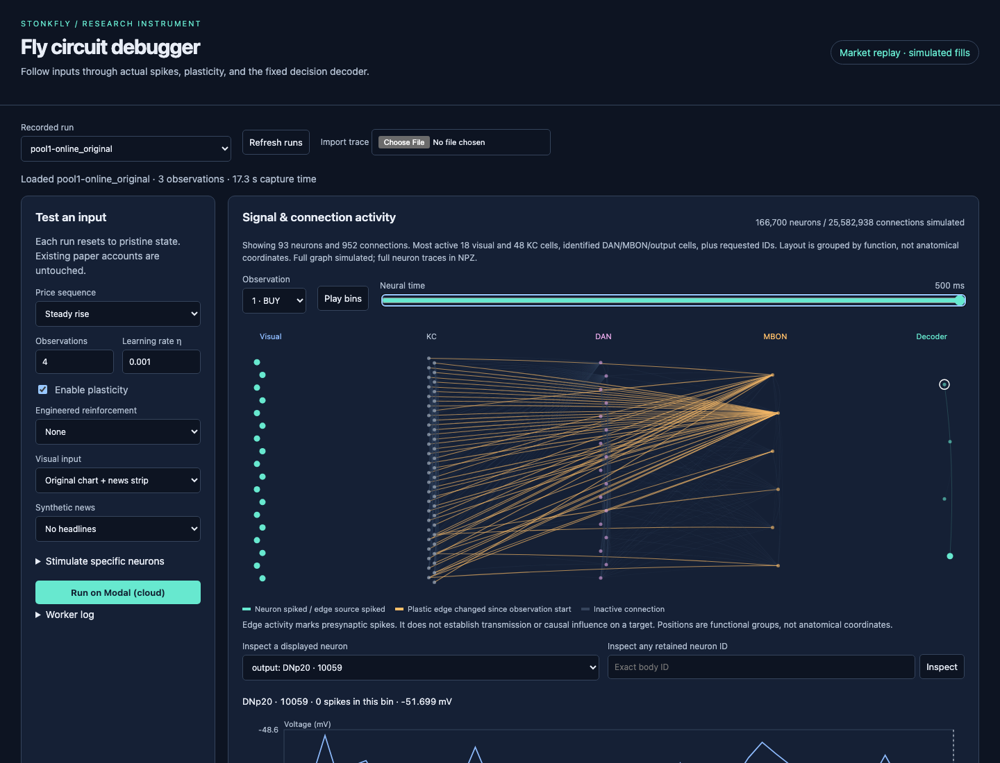

### Reinforcement-gated follow-up

The follow-up compares pristine frozen, original ongoing plasticity, and ongoing
plasticity gated by nonzero equity reinforcement. It keeps the first study's
cohort, including unavailable pools, and starts at that study's test endpoint.
It uses two decisions per phase. Register the hypothesis and arms before reading
new outcomes; preserve both plans and use a new output directory:

```sh
mkdir -p runs/market-02
uv run modal volume get fly-paper-lab-universe universe-snapshot.db runs/market-02/universe.db
uv run python -m paperlab.fly_market_study followup --archive runs/market-02/universe.db --previous runs/market/plan.json --out runs/market-02/plan.json --phase-steps 2
```

Run the sealed envelope using the same local command or cloud submission above,
with the new directory. The runner records source hashes and per-observation
`plasticity_enabled`, equity reward, and weight displacement. All three test arms
emit traces. A neutral observation must retain zero weight displacement in the
gated arm; a nonzero reinforcement can enable updates without changing the fixed
BUY/SELL/HOLD decoder. Keep the original training and test intervals immutable.


#### Second market replay result

The [registered hypothesis](../reports/fly-market-study-02-preregistration.json),
[sealed inputs](../reports/fly-market-study-02-plan.json), and
[all-arm diagnostics](../reports/fly-market-study-02.json) preserve the follow-up.
Training, development, and test start at 08:05, 08:15, and 08:25 UTC on September
12, 2026, with ten minutes per phase. The cohort is unchanged.

| Variant | Training equity | Development equity | Test equity |
| --- | ---: | ---: | ---: |
| Pristine frozen | $996.17 | $1,000.00 | $1,000.00 |
| Original ongoing plasticity | $996.17 | $1,000.00 | $1,000.00 |
| Reinforcement-gated plasticity | $996.17 | $1,000.00 | $1,000.00 |

**No variant passed selection.** Development and test produced no fills; stale quotes and insufficient
two-sided activity prevented execution. All arms emitted BUY whenever an observation
was usable. Each pool had only one usable neural observation during test, so the
$1,000 endpoints reflect cash remaining unspent, not a learned profitable policy.
Hosting still subtracts about $0.0046/$0.0093 at the prorated $20/$40 rates.

The gate's mechanics did work. For the first pool, original training changed
weights by L2 0.19146 on its neutral observation; the gated version changed zero.
After a filled purchase generated aversive reinforcement, the gated version
updated by L2 0.21449. All later neutral gated observations stayed at zero weight
displacement. Native synthetic tests also verified identical neutral spike hashes
between gated and frozen controls, plus resumed updates under a reward pulse.
This prevents unreinforced drift; it has not demonstrated better decisions.

The next diagnostic priority is observation coverage and execution availability.
Collecting a broader universe alone does not provide continuous usable quotes for
each held pool. Keep unavailable pools in evaluation and report decision coverage
alongside P&L before attributing a cash tie to model quality. Do not tune another
variant on either published test interval. The deployed paper policy is unchanged.

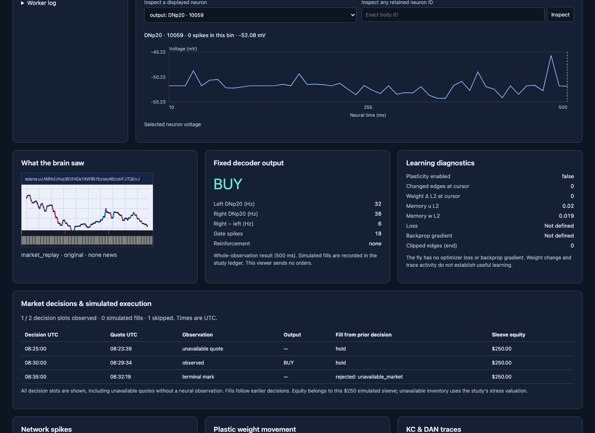

The [snapshot coverage audit](../reports/fly-market-study-02-coverage.json) separates
these causes: some latest receipts were 261–398 seconds old, exceeding the
180-second freshness limit; other fresh receipts fell below the declared activity
threshold. Provider health also logged HTTP 429 responses. These observations
make collection continuity and activity eligibility distinct debugging targets;
loosening the trading filter would change the experiment rather than repair data.

## Memory-output intervention study

The [preregistered five-arm protocol](../reports/fly-mbon-protocol-01.json) and
[complete native results](../reports/fly-mbon-study-01.json) test whether the two
plastic-memory output groups can influence the fixed decoder. Every arm begins
pristine, receives the same four flat-price images, and has learning and weights
frozen. Signed current is delivered to all four MBON07 cells or both MBON11 cells
throughout each 500 ms observation. These are deliberately strong interventions,
not learned weight changes or proposed trading controls.

| Intervention | Actions across four observations | Different from baseline | Target spikes across all four observations |
| --- | --- | ---: | ---: |
| None | BUY, HOLD, BUY, HOLD | 0 | MBON07: 12; MBON11: 83 |
| MBON07, −20 current | BUY, HOLD, HOLD, HOLD | 1 | MBON07: 1 |
| MBON07, +20 current | HOLD, BUY, BUY, BUY | 3 | MBON07: 729 |
| MBON11, −20 current | HOLD, HOLD, HOLD, BUY | 3 | MBON11: 36 |
| MBON11, +20 current | HOLD, HOLD, BUY, BUY | 2 | MBON11: 217 |

All 20 observations had zero plastic-weight displacement. Matching input hashes
were verified for every arm. MBON07 negative current removed the third
observation's gate spike: baseline BUY became HOLD despite a positive right-minus-
left rate difference in both. MBON07 positive current increased gate activity,
but its first output was HOLD because the left/right rate difference was zero.
Neither rate difference nor gate activity alone determines the action.

This is causal sensitivity within the implemented network: changing the current
changes outputs while images, initial state, and weights are controlled. It is
not a learned association, a calibrated biological intervention, or evidence of
profit. The +20 MBON07 arm fires far more than baseline and also suppresses
MBON11 activity; it should not be interpreted as a small physiological weight
adjustment. The next test should compare reinforcement-trained memory states
using frozen, pulse-free probes to separate retained associations from immediate
stimulation and transient neural dynamics.

To inspect the included recording, use the read-only server at the start of this
guide, select `mbon01-mbon07_inhibit`, and compare `mbon01-baseline`. Observation 3
shows the action disagreement. The comparison table now includes gate counts.
To reproduce an arm, copy its complete configuration from the protocol into a
JSON file and pass it to `capture --config`, or enter the same values in the cloud
form. MBON07 IDs are `12855,15626,18603,515338`; MBON11 IDs are listed in the
protocol. The full recordings remain available in their isolated cloud runs.

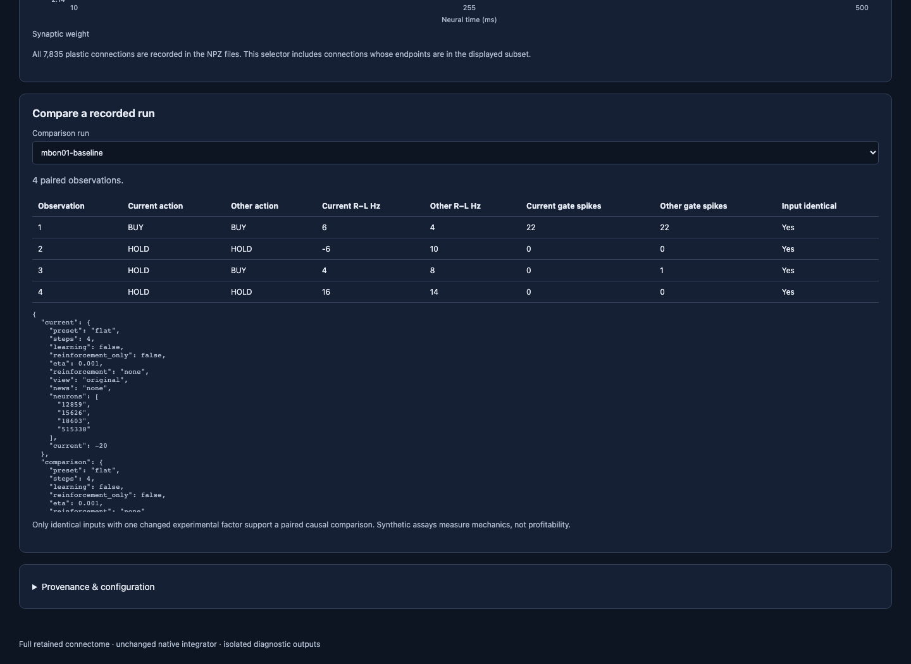

Four initial follow-on cloud calls failed before simulation because a reused
container could not reload the volume. Their outcomes were verified before the
same four inputs were retried with single-use containers; all four retries
succeeded in distinct containers. No failed scientific outcome was discarded or
replaced. The baseline from the first successful call was retained.

## Retained-learning results

The [registered retention protocol](../reports/fly-retention-protocol-01.json)
and [all eight native reports](../reports/fly-retention-study-01.json) separate
retained memory from immediate stimulation. Every arm receives four rising-chart
observations. The neural dynamics, sensory adaptation, and rate traces then reset;
plastic weights and efficacy memory remain. Four rise or fall probes follow with
learning disabled, no reinforcement, no extra current, and no news. The graph and
fixed decoder remain unchanged.

| Training | Probe | Retained weight L2 | Probe actions | Different from frozen / neutral |
| --- | --- | ---: | --- | ---: |
| Frozen | Rise | 0 | BUY, HOLD, HOLD, HOLD | 0 / 1 |
| Frozen | Fall | 0 | BUY, SELL, BUY, HOLD | 0 / 0 |
| Neutral plasticity | Rise | 10.662 | BUY, HOLD, BUY, HOLD | 1 / 0 |
| Neutral plasticity | Fall | 10.662 | BUY, SELL, BUY, HOLD | 0 / 0 |
| Reward | Rise | 13.107 | BUY, HOLD, BUY, BUY | 2 / 1 |
| Reward | Fall | 13.107 | BUY, SELL, SELL, HOLD | 1 / 1 |
| Aversive | Rise | 17.174 | BUY, HOLD, HOLD, HOLD | 0 / 1 |
| Aversive | Fall | 17.174 | BUY, SELL, BUY, HOLD | 0 / 0 |

All 32 probes had zero weight updates. Within each training group, the rise/fall
arms produced identical training spike hashes and identical retained weight and
efficacy-memory hashes. All arms used the same native binary and graph, with
identical images for each probe cue. The frozen rising probe reproduced all four
pristine training spike hashes. Float32 norm reductions differed by about
0.000002 between the two aversive hosts despite identical array hashes; the audit
compares hashes for exact memory identity.

The fourth rising probe illustrates the gate's role: reward training produces
BUY with R−L = 6 Hz and four gate spikes; neutral training produces HOLD with
R−L = 8 Hz and zero gate spikes. A larger rate difference alone is not a stronger
buy decision. Aversive training changes the most weights but leaves all eight
probe actions equal to frozen controls. It still changes neural activity, so
unchanged actions do not mean unchanged internal dynamics.

These are lasting effects in the implemented model, not evidence that reward
learned profitable trading. Neutral training already changes behavior; the probe
sequences are short and deterministic, and their synthetic chart scaling yields
repeated images within each cue. No trades, fees, unseen market predictions, or
statistical generalization are tested. The next [counterbalanced protocol](../reports/fly-retention-protocol-02.json)
uses falling-chart training with the same rise/fall probes and controls to test
whether reinforcement effects depend on the training cue. No paper policy was
promoted from this experiment.

In the included viewer, select `retention01-reward_rise` and compare
`retention01-neutral_rise`. Select **probe 4**, then enable **Highlight weight
changes from pristine state**. Amber connections and the nonzero L2 show retained
weights; disable the checkbox to see that updates within the probe are zero.
The comparison pairs training and probe phases separately. Its configuration
disclosure identifies the changed experimental factor.

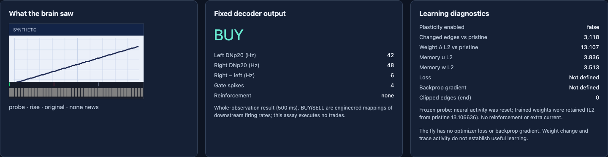

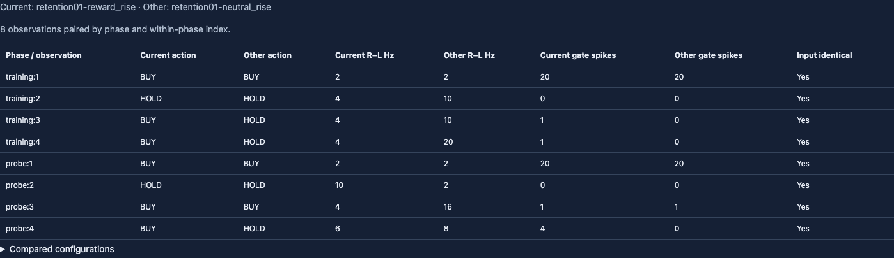

Re-audit downloaded cloud results without running more compute:

```sh
uv run python -m paperlab.fly_retention_study runs/retention-01 --out reports/fly-retention-study-01.json
```

The input directory contains the registered `protocol.json`, executed
`source-hashes.json`, and each `<arm>-result.json` returned by Modal. The audit
rejects missing arms, altered configs, mismatched builds/images, unreproduced
training memory, or updates during probing. The test suite also re-audits the
committed reports without private downloads or cloud access. To reproduce new
recordings, use the complete configs in the protocol with `capture --config` or
the Modal form described above; keep all paired controls on the same native build.

## Counterbalanced training cues

The [second registered protocol](../reports/fly-retention-protocol-02.json) repeats
all eight arms with falling-chart training. [Complete results](../reports/fly-retention-study-02.json)
and the [cross-study audit](../reports/fly-retention-counterbalance.json) retain
every outcome. All other configurations and executed source hashes match the
first batch. Both frozen probe cues reproduce exactly across batches; trained
weights and memory reproduce within each batch; all 64 probes across the two
studies have frozen weights. No failed or unfavorable arm was replaced.

| Falling-chart training | Probe | Retained weight L2 | Probe actions | Different from frozen / neutral |
| --- | --- | ---: | --- | ---: |
| Frozen | Rise | 0 | BUY, HOLD, HOLD, HOLD | 0 / 1 |
| Frozen | Fall | 0 | BUY, SELL, BUY, HOLD | 0 / 1 |
| Neutral plasticity | Rise | 15.877 | BUY, HOLD, HOLD, SELL | 1 / 0 |
| Neutral plasticity | Fall | 15.877 | BUY, SELL, SELL, HOLD | 1 / 0 |
| Reward | Rise | 16.001 | BUY, HOLD, HOLD, HOLD | 0 / 1 |
| Reward | Fall | 16.001 | BUY, SELL, BUY, HOLD | 0 / 1 |
| Aversive | Rise | 30.557 | BUY, HOLD, HOLD, HOLD | 0 / 1 |
| Aversive | Fall | 30.557 | BUY, SELL, BUY, HOLD | 0 / 1 |

Changing the training cue changes three of eight neutral probe actions and three
of eight reward probe actions. Aversive probe actions stay equal to frozen controls
under both training cues, although their underlying spike hashes and weights
differ. Reward after rise training adds late BUY outputs on the rising probe;
reward after fall training leaves that probe at the frozen BUY/HOLD pattern.
Relative to neutral training, both reward and aversive stimulation remove the
fourth rising-probe SELL after fall training. This is not evidence that either
reinforcement signal has learned the meaning of a profitable BUY or SELL.

The audit reports reinforcement-minus-neutral rate and gate differences for each
training/probe combination. It then subtracts the rise/fall probe contrast across
training cues. For example, the fourth-probe reward gate interaction is five
spikes: the rising probe's effect is +4 after rise training and −1 after fall
training, while both falling-probe effects are zero. These are deterministic
model responses, not independent samples or a significance test.

Select `retention02-reward_rise` and compare `retention01-reward_rise` in the
included viewer. Training images correctly show **No** in the identical-input
column; probe images show **Yes**. Probe 4 is HOLD after fall training and BUY
after rise training. The evidence supports persistent input-dependent effects,
but does not select a trading policy. The next market replay retains the
reinforcement gate and unchanged baselines on a fresh chronological interval,
with quote coverage and simulated fills reported alongside equity.

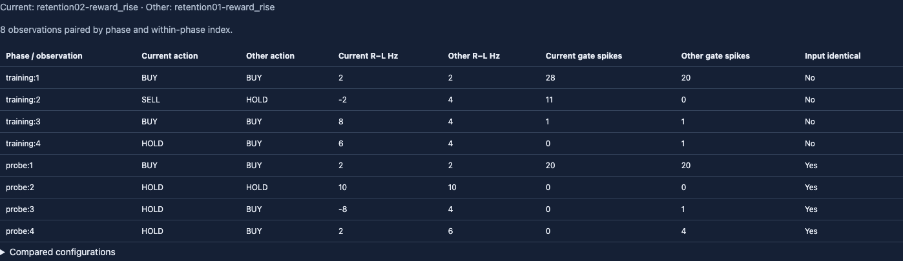

Reproduce the two-batch audit from downloaded cloud results:

```sh
uv run python -m paperlab.fly_retention_study runs/retention-02 --out reports/fly-retention-study-02.json
uv run python -m paperlab.fly_retention_study runs/retention-01 --compare-root runs/retention-02 --out reports/fly-retention-counterbalance.json
```

The comparison rejects changed execution sources, extra configuration changes,
mismatched probe images, and non-reproducing frozen controls. Both committed
studies and the cross-study report are re-audited by the test suite offline.

## Third market replay result

The [preregistration](../reports/fly-market-study-03-preregistration.json),
[sealed plan](../reports/fly-market-study-03-plan.json), and
[complete phase diagnostics](../reports/fly-market-study-03.json) repeat the
unchanged reinforcement-gate hypothesis with four decisions per phase. The prior
two pools remain in the cohort. Training spans 08:35–08:55 UTC, development
08:55–09:15, and test 09:15–09:35 on September 12, 2026. Each phase starts with
$1,000: two $250 sleeves and $500 idle cash. Training overlaps the collector
repair, so this is not an isolated estimate of that repair's effect.

| Arm | Development equity | Test equity | Test fills | Test fees |
| --- | ---: | ---: | ---: | ---: |
| Pristine frozen | $993.35 | $996.36 | 5 | $1.5625 |
| Original online plasticity | $993.35 | $996.36 | 5 | $1.5625 |
| Reinforcement-gated plasticity | $993.35 | $996.36 | 5 | $1.5625 |

There were four observed decision slots out of eight during training, six during
development, and all eight during test, for each arm. Unlike the previous cash
tie, this test includes fills and losses. Test action sequences and input hashes
match the frozen control for both pools. Gating keeps neutral weight updates at
zero, while reward/aversive observations still update memory. These internal
differences produce no test trading advantage here. Every arm fails the declared
development gate against $1,000 cash; none is selected or deployed.

The $3.64 test decline includes simulated execution costs and inventory marking;
it is not necessarily a realized cash loss. One training sleeve also had an
unavailable-inventory stress mark, so its training equity is not a realized loss.
The test has no unavailable marks. Monthly hosting allocations are reported in
the JSON, but this 20-minute test does not estimate monthly returns. News remains
disabled and DEX quotes remain indicative.

Select `market03-reinforcement_gated`, compare `market03-online_original`, and
inspect the timeline and first observation. Both issue BUY; the gated arm has
zero neutral weight change. The included pool-0 view shows three of the five
simulated test fills; the report includes pool 1's remaining two.

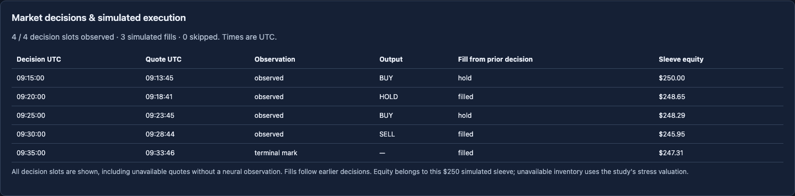

## Price magnitude lost in the visual adapter

The [deterministic input audit](../reports/fly-input-scale-audit.json) found a
specific information loss before the neural simulation. With the same product,
100 evenly spaced observations, and news disabled, a 1% rise and a 20% rise
produce exactly the same 320×180 input bytes. A 0.2% fall and a 20% fall also
match exactly. The audit retains six fixtures and four comparisons, including a
non-matching pair: the 0.2% rising image differs from the 20% rising image by 29
pixels because the upstream renderer enforces a minimum chart span.

The renderer scales prices by each window's range. It draws bid/ask text at
y=165, but our adapter then covers y=140–179 with the news strip. Thus the original
numeric quote text cannot recover magnitude in these fixtures. From the same
neural state, identical RGB inputs cannot identify which of the paired histories
occurred. This is a verified sensory limitation; it does not by itself prove
which trades would improve.

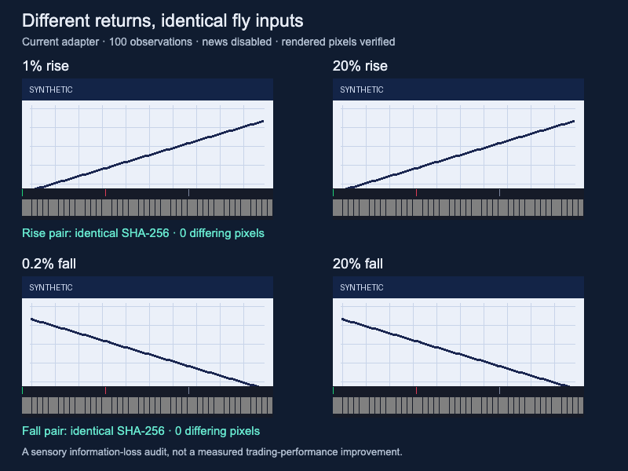

The candidate below provides a fixed return encoding derived only from prices
available at the observation time. It separates these fixtures without introducing
a suggested action. Market effectiveness requires a fresh sealed interval; the
completed market test must not be reused to select it. The full graph, fixed
decoder, execution costs, and original recordings remain controls. Existing paper
traders continue using the original adapter.

The audit JSON records the exact price formula, bid/ask factors, frame index,
render-library versions, source hashes, input hashes, and differing-pixel counts.
The accompanying SVG contains the original rendered PNGs at their native size;
the PNG is a browser-rendered documentation figure.

## Experimental fixed return input

Choose **Fixed return magnitude (experimental)** in the debugger's visual-input
menu. **Price movement multiplier** scales the synthetic preset's changes about
its initial level: 0.05 yields one twentieth of the usual movement. The separate
probe multiplier controls the frozen probe after a training/reset boundary.
Both default to 1, preserving existing presets.

The candidate redraws only the chart region. It leaves the product header and
news strip intact. For each trailing window, it computes `r = log(mid/reference)`,
where the reference is the first of at most 100 observed prices. It maps this to
`y = 85 - 51 * asinh(r / 0.01) / asinh(log(100) / 0.01)` and clips outside the
0.01×–100× reference-price bounds. Amber dots expose clipped observations. The
mapping is fixed across windows, rather than divided by each window's price
range. Its nonlinear scale makes small moves visible while accommodating large
ones; it still has finite pixel resolution and can lose detail at the bounds.

These are declared sensory parameters, not values fitted to trade outcomes.
There is no suggested action, equity, fee threshold, or future price in the
encoding. The original mode remains byte-identical. Tests verify the documented
small/large input collisions separate, header/news pixels remain unchanged,
future and older-than-window prices have no effect, denomination scaling leaves
the tested images unchanged, and clipping is marked. A full-network test verifies
different magnitude inputs produce different spike-count recordings with weights
frozen; that does not establish correct BUY/SELL decisions.

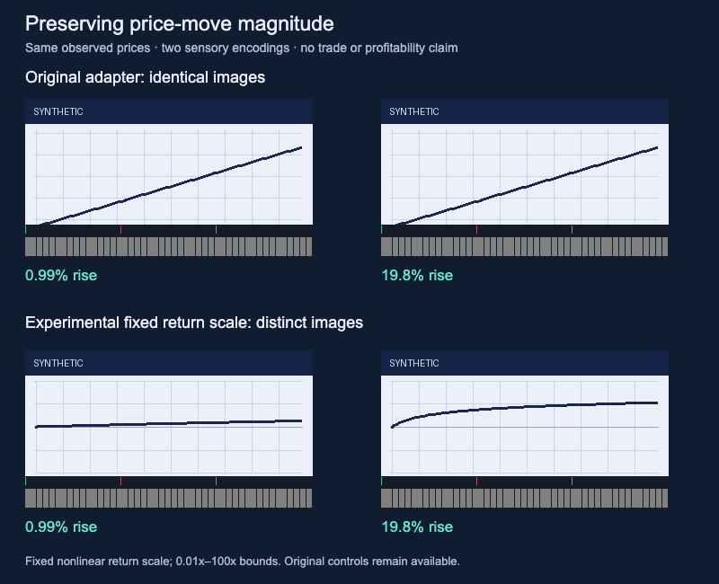

Example synthetic assay configuration:

```json
{
  "preset": "rise", "steps": 4,
  "amplitude": 0.05, "view": "fixed_returns",
  "learning": false, "reinforcement": "none", "news": "none"
}
```

Save it as `scale.json` and use the existing capture command:

```sh
uv run python -m paperlab.debugger capture --fly-data data/fly --config scale.json --out runs/scale-small
uv run python -m paperlab.debugger serve --out runs --fly-data data/fly
```

Alternatively, enter the same settings in the Modal-backed form. The
[eight-arm protocol](../reports/fly-fixed-scale-protocol-01.json) compares two
magnitudes, two directions, and the original/fixed encodings with weights frozen.
Its offline audit consumes saved `<arm>-result.json` files:

```sh
uv run python -m paperlab.fly_visual_study runs/fixed-scale-01 --out reports/fly-fixed-scale-study-01.json
```

The [next market preregistration](../reports/fly-market-study-04-preregistration.json)
crosses original/fixed inputs with frozen/online plasticity. It preserves the
prior cohort, costs, and development gate on new decision windows. After the
collector reaches the endpoint, seal it with:

```sh
uv run python -m paperlab.fly_market_study followup --archive runs/research-market-04/universe.db --previous runs/research-market-03/plan.json --phase-steps 3 --protocol visual --out runs/research-market-04/plan.json
```

The sealed plan pins the transform metadata and rejects changes to its parameters.
This diagnostic option is available in the deployed worker; it does not replace
the paper trader's input mode or automatically promote a policy.

### Frozen-network magnitude results

All eight registered cloud arms completed. The [full report](../reports/fly-fixed-scale-study-01.json)
verifies one native build, graph, and pristine weight state, with zero weight
updates throughout all 32 observations. The small multiplier is 0.05; large is 1.

| Input mode / direction | Different images | Different spike-count observations | Small actions | Large actions |
| --- | ---: | ---: | --- | --- |
| Original / rise | 0/4 | 0/4 | BUY, HOLD, HOLD, HOLD | BUY, HOLD, HOLD, HOLD |
| Original / fall | 0/4 | 0/4 | BUY, SELL, BUY, HOLD | BUY, SELL, BUY, HOLD |
| Fixed returns / rise | 4/4 | 4/4 | SELL, HOLD, HOLD, HOLD | SELL, HOLD, HOLD, SELL |
| Fixed returns / fall | 4/4 | 4/4 | BUY, BUY, BUY, BUY | BUY, BUY, HOLD, HOLD |

The magnitude distinction reaches the full network, rather than only changing
the picture shown by the UI. Three of eight fixed-scale action comparisons also
differ. This is not evidence that those actions are correct: both rising controls
begin with SELL and both falling controls begin with BUY. No future prices,
execution costs, or trading returns were scored in this assay. Keep all outcomes
and evaluate the registered market comparison without retuning the renderer to
produce preferred action labels.

The included `scale01-rise_small` and `scale01-rise_large` recordings show the
fourth-observation disagreement with weights frozen. Load the small run, compare
the large run, and select observation 4. The input panel identifies the movement
multiplier and fixed-scale bounds; the comparison table shows different images.

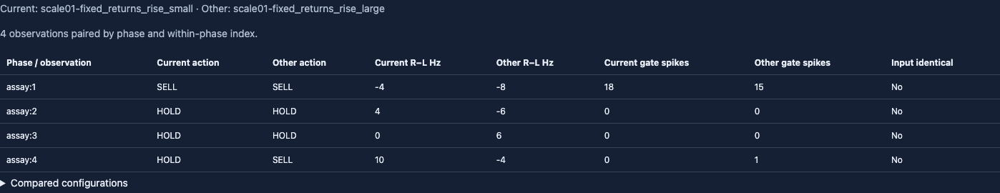

## Restore learned connections before a probe

Under **Test retained learning**, set 1–4 frozen probe observations and choose
**Restore memory before probe**. Keep all memory, restore all 7,835 plastic
connections, restore KC inputs to MBON07 or MBON11, or supply up to 64 exact
plastic edge IDs. The connection inspector's **Add this edge to probe restoration**
button fills the selected-edge control. Arbitrary nonplastic edges are rejected.

Every assay begins pristine. After its training observations, the probe boundary
resets neural activity, sensory state, and rate traces. Restoration then replaces
only the chosen connections' weight and efficacy memory (`u`, `w`) with pristine
values. Other learned memory is retained; the full graph remains present.
All probe observations freeze weights and memory and remove reinforcement, news,
and extra current. Purple connections indicate restoration at the boundary,
not spikes or updates happening during playback. The provenance records exact
restored IDs and weight/memory hashes before and after intervention.

Compare an unmodified retained-memory run against the same training and probe
with restoration enabled. A changed response isolates an effect of that memory
intervention within this model. A return to the pristine response does not prove
that the pristine response is a good trade.

Reproduce the five-arm falling-cue experiment locally with the prepared graph:

```sh
uv run python -m paperlab.fly_restore_study runs/restore-new \
  --fly-data runs/fly-data --out runs/restore-new-summary.json
```

Omit `--fly-data` to audit an existing experiment without rerunning it. This
command registers and reports every arm: frozen training, retained neutral
training, and restoration of all memory, MBON07 inputs, or MBON11 inputs. Each arm
uses four training observations followed by four identical falling-price probes.

### Restoration results

The [registered protocol](../reports/fly-restoration-protocol-01.json) and
[complete five-arm report](../reports/fly-restoration-study-01.json) retain every
result. These controls ran on the same local macOS native build; do not pair their
spike counts with Linux recordings as though the native builds were identical.
A separate two-observation deployed Linux check also recovered the corresponding
previous pristine control exactly after restoring all memory.

| Memory entering the frozen probe | Restored connections | Probe actions | Weight L2 from pristine |
| --- | ---: | --- | ---: |
| Frozen training | 0 | BUY, BUY, HOLD, HOLD | 0 |
| Neutral training retained | 0 | BUY, BUY, BUY, HOLD | 12.005882 |
| Restore all | 7,835 | BUY, BUY, HOLD, HOLD | 0 |
| Restore MBON07 inputs | 3,651 | BUY, BUY, BUY, HOLD | 12.005869 |
| Restore MBON11 inputs | 4,184 | BUY, BUY, HOLD, HOLD | 0.017781 |

Restoring MBON11 inputs recovered all four pristine whole-observation spike-count
hashes even though a small weight difference remained elsewhere. Restoring MBON07
inputs left the trained probe actions unchanged. The intervention therefore
localizes this specific training-induced output difference to MBON11 input memory.
It does not establish that MBON11 learning is always harmful or that HOLD is correct.
The hypothesis remains limited to this cue, learning rule, and frozen probe.

Open `restore01-MBON11`, compare `restore01-retained`, and select **probe 3**.
Purple edges mark the restored subset; the comparison shows HOLD versus BUY with
identical inputs and no learning during the probe. All five recordings ship in
`examples/fly-debugger`; full NPZ traces remain local generated artifacts.

## Fourth market replay result

The [preregistration](../reports/fly-market-study-04-preregistration.json),
[sealed plan](../reports/fly-market-study-04-plan.json), and
[complete results](../reports/fly-market-study-04.json) cover September 12 UTC:
training 09:35–09:50, development 09:50–10:05, and test 10:05–10:20.
The cohort and costs match study 03. The four arms cross original/fixed-return
inputs with frozen/online learning; every phase starts with $1,000 across two
$250 sleeves plus $500 cash. The snapshot extends beyond the registered endpoint;
plan, source hashes, selection receipt, and ledger totals were verified.

| Arm | Development equity | Test equity | Test fills | Test fees |
| --- | ---: | ---: | ---: | ---: |
| Original, frozen | $996.79 | $973.70 | 2 | $0.625 |
| Original, online | $996.79 | $972.35 | 3 | $0.938 |
| Fixed returns, frozen | $998.18 | $969.85 | 4 | $1.250 |
| Fixed returns, online | $998.18 | $969.85 | 4 | $1.250 |

**No arm passed the development gate.** The fixed encoding preserved magnitude
and improved this development result relative to the original encoding, but
remained below cash and performed worse in the subsequent test. Neither the
encoding nor a learning variant was promoted. These short results do not estimate
monthly returns. The cloud replay used about $0.0192 in estimated compute.

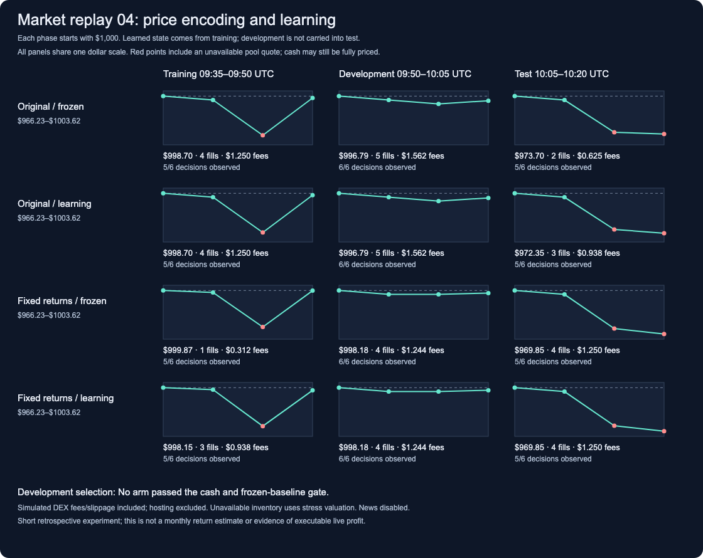

Five of six test decision slots were observed per arm. Pool 1 failed the
two-sided activity filter by 10:15, and its final equity is a conservative
$224.6875 inventory stress mark in every arm. Unavailable inventory is valued at
zero; this is not a realized sale or a confirmed token-price collapse. The fixed
models generated SELL at 10:10, but the next execution quote was unavailable and
the order was rejected. No replacement order or imaginary fill was inserted.

Pool 0 remained priced throughout test and makes the model differences clearer:

- Original frozen: BUY, HOLD, HOLD; one fill; final sleeve equity $249.015263.
- Original online: BUY, HOLD, BUY; two fills; final sleeve equity $247.660619.
- Both fixed-return arms: BUY, BUY, BUY; three fills; final sleeve equity $245.160112.

The extra original-online BUY cost $1.354644 relative to frozen at the final
indicative mark. At 10:15, the decoder gate had one spike instead of zero and
right-minus-left activity was 12 Hz instead of 8 Hz. The online arm received
`none`, `aversive`, and `reward` pulses across the three observations; the frozen
arm received none. Its weight-update L2 values were 0.269950, 7.765848, and 8.476544.
This comparison therefore changes both synaptic learning and immediate
reinforcement stimulation. It does not yet identify weight changes as the cause
of that extra trade. The next diagnostic should hold the recorded images and
pulse schedule fixed while independently toggling retained memory and updates.
The [eight-arm mechanism protocol](../reports/fly-market-pulse-protocol-01.json)
has now been executed; see the factorial results below.

Open `market04-online_original`, compare `market04-pristine_frozen`, and select
observation 3 to inspect the 10:15 disagreement. All four pool-0 recordings are
included; the complete two-pool decision ledger remains in the public report.

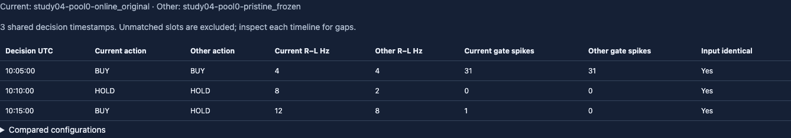

Regenerate the overview directly from that report without model compute:

```sh
uv run python -m paperlab.fly_market_figure reports/fly-market-study-04.json \
  --out runs/market-04.svg --title 'Market replay 04: price encoding and learning'
```

Each chart panel reconciles its last ledger value to the published phase total.
Red points mark an unavailable pool quote, including cases where that sleeve
holds only cash. All panels share the same dollar scale; hosting is excluded.

## Separate market memory, updates, and reinforcement

The registered eight-arm diagnostic uses the exact three test images from study
04's first pool. It crosses pristine versus retained training memory, frozen
versus ongoing plasticity, and no pulses versus the recorded `none`, `aversive`,
`reward` sequence. The pulse sequence is held fixed even when a counterfactual
arm produces a different action. No account, fill, or return is recomputed.

Before comparison, the worker reproduces the original training observations and
verifies their image and spike-count hashes. It resets neural dynamics between
arms. Both original reference controls must reproduce on the same native build:
pristine/frozen/no-pulses matches the market frozen baseline, and
trained/online/recorded-pulses matches the original online trader. Every frozen
arm must preserve weights and efficacy memory throughout its three observations.
The full retained graph and fixed decoder are unchanged.

Pack the registered inputs, then run or resume one cloud call:

```sh
uv run python -m paperlab.fly_market_pulse pack \
  --protocol reports/fly-market-pulse-protocol-01.json \
  --reference reports/fly-market-study-04.json \
  --plan reports/fly-market-study-04-plan.json \
  --out runs/pulse-payload.json
uv run python -m paperlab.fly_market_pulse cloud \
  --payload runs/pulse-payload.json --out runs/pulse-new
```

The second command waits briefly and may report that the call is still pending.
Repeat the same command and output directory to observe that same call; its saved
receipt prevents resubmission. An uncertain submission requires inspection, not
another new output directory. The cloud worker continues if the laptop sleeps.
A different payload cannot reuse an existing receipt. The diagnostic shares the
existing worker budget and may delay a scheduled paper cycle.

After completion, inspect the downloaded views with:

```sh
uv run python -m paperlab.debugger serve --backend modal --out runs/pulse-new
```

The viewer labels them **Historical inputs · neural diagnostic**, shows which
memory, update, and pulse conditions were used, and pairs comparisons by market
decision timestamp. Full neuron lookup downloads the larger NPZ recordings only
when requested. `trained-memory.npz` and each arm's `initial-memory.npz` are also
retained remotely for subsequent connection interventions. This is a post hoc
mechanism study on already examined data, not another held-out trading score.

### Market pulse factorial results

The [complete study](../reports/fly-market-pulse-study-01.json) and
[offline audit](../reports/fly-market-pulse-audit-01.json) include all eight arms
and all twelve comparisons that change exactly one factor. Both original
reference controls and the original training spike counts reproduced on the same
Linux native build. The cloud diagnostic used about $0.0136 in estimated compute.

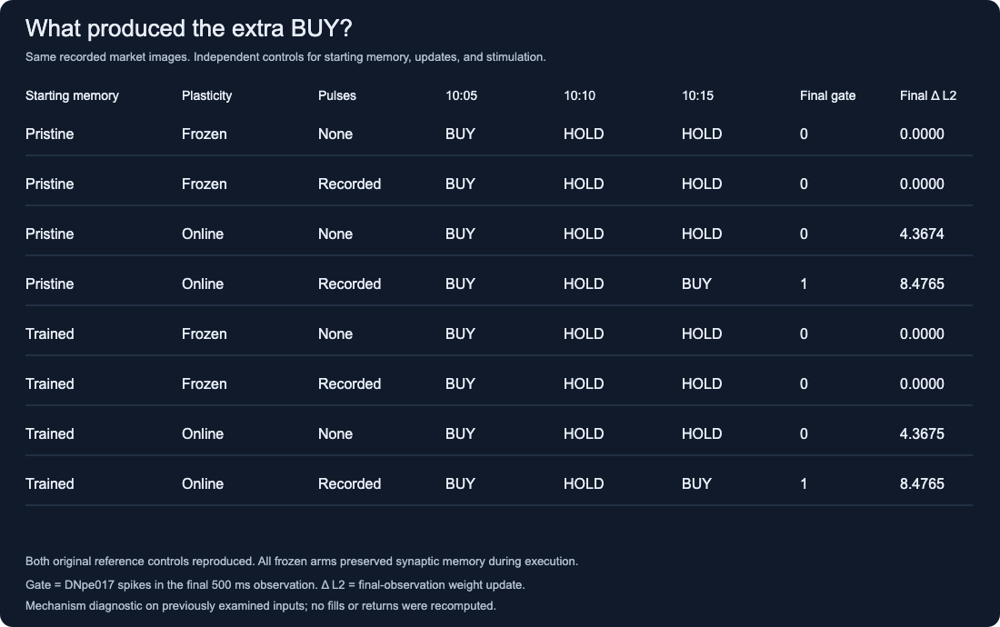

All four conditions with frozen weights emitted BUY, HOLD, HOLD. The two online
conditions without pulses also emitted BUY, HOLD, HOLD. Only the two conditions
with **both ongoing updates and recorded pulses** emitted BUY, HOLD, BUY; their
final gate had one spike instead of zero. Removing either factor eliminated this
extra action under the recorded images and pulse schedule.

Changing pristine to retained training memory changed neither whole-observation
spike counts nor actions in any of the four paired conditions. Pulses alone with
frozen weights did alter whole-network spike counts in two observations, but did
not change the decoder output. Thus this particular extra BUY depends on the
interaction of ongoing plasticity and reinforcement, rather than the prior
training memory or pulse-only action effects. This is not a statement about all
market conditions or all forms of learned memory.

Open `pulse01-trained_online_recorded`, compare
`pulse01-trained_frozen_recorded`, and select **replay 3**. The images, initial
memory, and recorded pulses match; the update condition differs. The viewer can
also compare either diagnostic directly with the original market recording by
its decision timestamps. `run`, `step` and `bin` (zero-based), `neuron` (body ID),
`edge` (plastic edge ID), and `compare` URL parameters open a specific recorded
comparison; invalid selections are ignored. Neuron and edge links select from
the displayed subset. Use the separate lookup for other retained neurons.

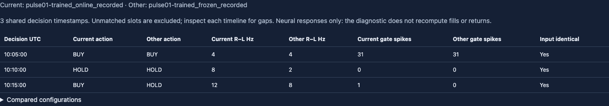

Audit and regenerate the matrix without native model compute:

```sh
uv run python -m paperlab.fly_pulse_audit \
  --study reports/fly-market-pulse-study-01.json \
  --reference reports/fly-market-study-04.json \
  --out runs/pulse-audit.json --figure runs/pulse-matrix.svg
```

A [new market comparison](../reports/fly-market-study-05-preregistration.json)
is registered to test trained-but-frozen inference against pristine frozen and
original online behavior. It retains the prior cohort and costs, uses training
10:20–10:35, development 10:35–10:50, and test 10:50–11:05 UTC on September 12.
The test interval had not begun at registration. The completed result is
documented below; no arm was promoted.

### Locate the extra gate spike

The [timing audit](../reports/fly-market-gate-timing-01.json) reconciles both gate
neurons in all 24 observations of the eight-arm experiment against the decoder
reports. In the final observation, the two online/recorded-pulse arms each show
one spike in DNpe017 body **10527**, in bin **37**: **1,370–1,380 ms** of neural
time (370–380 ms into this observation). The other gate neuron, 555871, does not
spike in that observation. The six other conditions have zero final gate spikes.
These are 10 ms recording bins, not exact spike timestamps. The spike occurs
after the 200 ms reward-current window; its timing alone does not identify the
upstream causal connection or distinguish current effects from accumulated
activity and plasticity.

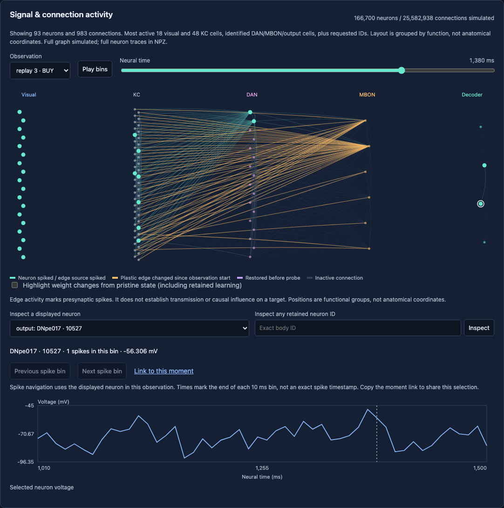

With the included recordings server running, [open that moment](http://127.0.0.1:8765/?run=pulse01-trained_online_recorded&step=2&bin=37&neuron=10527&compare=pulse01-trained_frozen_recorded).
**Previous spike bin** and **Next spike bin** navigate the selected displayed
neuron within the current observation; disabled buttons mean no further spike
in that direction. **Link to this moment** includes the recording, observation,
bin, neuron, displayed plastic edge, and comparison. Import-only recordings have
no server-backed moment link. Changing the selected neuron or connection updates
the link; no model computation is needed.

Rebuild the timing report from the public compact recordings:

```sh
uv run python -m paperlab.fly_pulse_audit \
  --study reports/fly-market-pulse-study-01.json \
  --reference reports/fly-market-study-04.json \
  --out runs/pulse-audit.json --recordings examples/fly-debugger \
  --timing-out runs/gate-timing.json
```

The report stores each source recording's SHA256. Missing gate cells, changed
study metadata, incomplete bins, or counts that disagree with the fixed decoder
are rejected. This extends the post hoc mechanism diagnosis; it adds no fresh
market performance evidence.

### Trained, frozen inference protocol

The follow-up runner supports `--protocol frozen-inference`: pristine frozen,
trained frozen, and original online arms. `trained_frozen` learns during the
training phase and retains that learned memory for development and test. Both
inference phases disable updates and reinforcement; neither inherits the
other's neural activity or cash account. Every frozen observation checks weights
and efficacy memory for unintended changes.

After the registered end time is present in a closed collector snapshot:

```sh
uv run python -m paperlab.fly_market_study followup \
  --archive runs/fresh-universe-snapshot.db \
  --previous reports/fly-market-study-04-plan.json \
  --phase-steps 3 --protocol frozen-inference --out runs/market05-plan.json
```

The sealer rejects an incomplete interval and preserves the prior cohort. It
also removes fixed-encoding metadata when returning to the original adapter.
The worker now saves each arm's training memory and each traced test phase's
initial memory. Phase records contain initial/final memory hashes so a trained,
frozen run can be checked against its training checkpoint. These additions do
not change the regular paper trader's policy.

To verify the saved memory from a completed study, point `--artifacts` at its
output directory containing `poolN-ARM-training-memory.npz` and
`poolN-ARM/initial-memory.npz`. This command reads files; it does not run the model:

```sh
uv run python -m paperlab.fly_market_memory_audit \
  --plan reports/fly-market-study-05-plan.json \
  --report reports/fly-market-study-05.json \
  --artifacts runs/market05-artifacts --out runs/market05-memory-audit.json
```

The audit compares actual saved arrays, checks the training checkpoint against
the training result, checks both inference start hashes against that checkpoint,
and verifies that phases with learning disabled report unchanged memory. It
reports separate L2 changes for synaptic weights and the two efficacy-memory
arrays (`u`, `w`). Public audit results contain hashes and aggregate changes;
private checkpoints stay outside Git. Array equality verifies state transfer,
not that the learned state improves trading.


### Fifth market replay result

The [sealed plan](../reports/fly-market-study-05-plan.json),
[full ledger and decisions](../reports/fly-market-study-05.json), and
[checkpoint audit](../reports/fly-market-study-05-memory-audit.json) cover the
registered September 12 window. All source hashes matched the submitted worker
code, and the selection was saved before test simulation. The initial download
was rejected because its actual database observations ended before 11:05 UTC,
despite a later collector heartbeat. The eventual sealed database covered the
complete window; cohort, costs, and time boundaries were unchanged.

| Arm | Development equity | Test equity | Test fills | Test fees |
| --- | ---: | ---: | ---: | ---: |
| Pristine / frozen | $971.83 | $1,008.38 | 2 | $0.6250 |
| Trained / frozen | $970.48 | $1,005.41 | 1 | $0.3125 |
| Original / online | $971.83 | $1,008.38 | 2 | $0.6250 |

Each phase starts with $1,000, including two idle $250 sleeves. Test gains come
from indicative marks on open pool-0 inventory; no sell realizes those gains.
Pool 1 remains $250 cash: only one of its three test decisions has an available
quote, and its BUY is rejected at the next unavailable receipt. Overall there
are four observed decisions out of six slots. Development includes unavailable
inventory stress marks, which are not realized sales. Hosting is excluded from
the table; the bounded cloud call estimated about **$0.0135** compute.

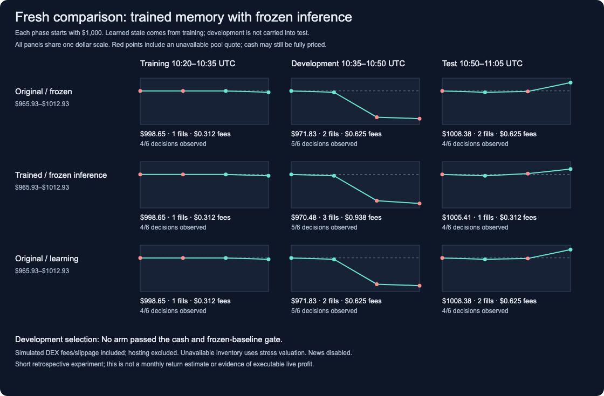

No arm beat cash during development, so none was selected. The positive test
marks do not override that decision. **Trained, frozen inference did not improve
this fresh window:** it trailed both controls by **$2.974657** at the final mark.
It also trailed the controls by $1.354644 during development.

The actual training checkpoints explain why this is a retained-memory test:

- Pool 0 training changed **1,766 weights**, with weight-difference L2 **7.950855**,
  efficacy-memory `u` L2 **1.205815**, and `w` L2 **1.068890** from pristine.
- Trained/frozen and original/online started inference from identical trained
  memory. Their saved test-start arrays match their training checkpoints.
- Frozen inference reports unchanged weights and efficacy memory through both
  development and test; runtime assertions also checked every frozen observation.
- Pool 1 training changed only five weights; its single test observation produced
  the same action and whole-observation spike counts across all three arms.

On pool 0 at **10:55 UTC**, pristine/frozen emitted BUY with right-minus-left
**4 Hz**; trained/frozen emitted HOLD with **0 Hz**. Both had **one gate spike**.
Thus this failure differs from the earlier extra-gate-spike case: retained
memory changed the directional readout while the gate was still open. The
trained and pristine runs saw identical images and had no reinforcement or
online updates during this comparison. At 11:00, the resulting extra BUY in the
pristine account filled; subsequent price appreciation made that added exposure
beneficial in this window. This does not make extra buying generally beneficial.

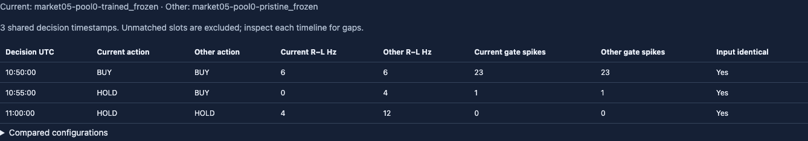

Open `market05-pool0-trained_frozen`, compare `market05-pool0-pristine_frozen`,
and select observation 2, or use [the direct comparison](http://127.0.0.1:8765/?run=market05-pool0-trained_frozen&step=1&compare=market05-pool0-pristine_frozen).
All six pool/arm recordings are included, including the sparse pool's complete
execution timeline. The regular paper policy remains unchanged. The next
mechanism question is which retained plastic connections changed that
directional readout; reversing one observed action would still require a fresh
market evaluation before claiming an improvement.


The full frozen trace localizes all 1,766 changed weights to the two MBON11
postsynaptic cells: [843 inputs to body 10704 and 923 to body 11402](../reports/fly-market-study-05-memory-targets.json).
All weights and efficacy memory on the 3,651 MBON07 inputs match pristine state.
The mapping uses the trace's actual plastic postsynaptic indices and neuron IDs,
with cell annotations from its matching viewer recording. Every captured frozen
memory frame matches the saved training checkpoint. This identifies where
memory changed, not which individual connection caused the output change.

A [five-arm restoration protocol](../reports/fly-market-restoration-protocol-01.json)
has completed: pristine/frozen, trained/frozen, restore inputs
to 10704, restore inputs to 11402, and restore both. All use the same three market
images, frozen inference, and no reinforcement. Both original reference controls
must reproduce before interpreting the intervention. This is a post hoc neural
diagnostic; any proposed trading improvement still needs a subsequent market
evaluation.

### Run the matched market restoration diagnostic

The five-arm runner reconstructs the reference training sequence and restores
incoming plastic memory by exact postsynaptic body ID. Each selected connection
receives its pristine weight, `u`, and `w`; every other learned connection is
retained. It changes neither the graph nor the fixed decoder. All test arms have
frozen plasticity, no reinforcement, and no extra current. The two unmodified
reference controls must match all three recorded spike-count hashes and decoder
outputs before the individual-cell interventions are interpreted.

```sh
uv run python -m paperlab.fly_market_restoration pack \
  --protocol reports/fly-market-restoration-protocol-01.json \
  --reference reports/fly-market-study-05.json \
  --plan reports/fly-market-study-05-plan.json \
  --out runs/market-restoration-payload.json
uv run python -m paperlab.fly_market_restoration cloud \
  --payload runs/market-restoration-payload.json --out runs/market-restoration
```

Deploy the updated worker first using the existing full-fly/universe deployment
instructions. The original reference was captured on Modal; the runner requires
its exact native build. A local `run --fly-data ...` command is also available
for references captured on the same local build. It rejects cross-build
comparisons instead of labeling them controlled experiments.

The cloud observer records the call ID before waiting, resumes that same call
after timeouts, and refuses to reuse an output directory for a different payload.
If a submission response is lost, inspect the existing call before doing any
further work; it never blindly submits again. The model run is bounded to 420
seconds within the existing worker budget and lease. No trading account or fills
are recomputed by this diagnostic.

```sh
uv run python -m paperlab.debugger serve --backend modal --out runs/market-restoration
```

The viewer highlights restored connections in purple before the replay, names
the exact target body IDs and restored connection count, and keeps neuron-spike
and weight-update highlights distinct. Compact recordings contain displayed
connections; full cloud traces remain available through neuron lookup.


### Market restoration results

The [complete five-arm study](../reports/fly-market-restoration-study-01.json) and
[offline audit](../reports/fly-market-restoration-audit-01.json) reproduced the
original training, saved learned memory, native build, and both reference
controls. Each arm preserved its own incoming synaptic memory throughout frozen
inference. The estimated cloud compute was **$0.0106**, under the unchanged
worker cap. No paper account or fills were recomputed.

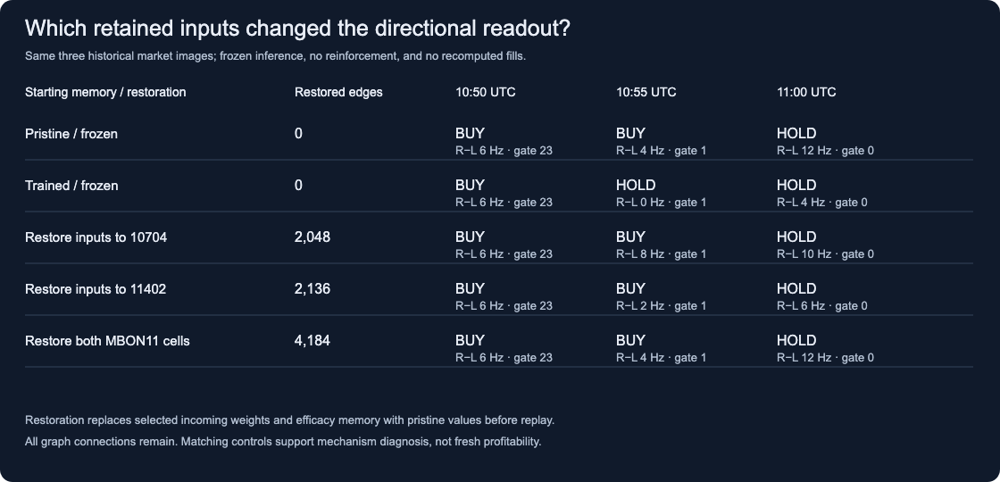

At the previously examined **10:55 UTC** input:

| Memory condition | R−L firing rate | Gate spikes | Output |
| --- | ---: | ---: | --- |
| Pristine | 4 Hz | 1 | BUY |
| Trained | 0 Hz | 1 | HOLD |
| Restore inputs to 10704 | 8 Hz | 1 | BUY |
| Restore inputs to 11402 | 2 Hz | 1 | BUY |
| Restore both | 4 Hz | 1 | BUY |

Restoring either cell's incoming memory was sufficient to recover the BUY on
this input. Both individual restorations recovered the full three-action
sequence, but matched pristine whole-observation spike counts in only one of
three observations. Restoring both matched the pristine initial memory and all
three whole-observation spike-count hashes. Action recovery therefore does not
mean the individual restorations reproduce the original neural activity.

The four memory combinations also expose a joint effect on the directional
readout: trained minus restore-10704 minus restore-11402 plus restore-both is
**−6 Hz** at the second observation (zero at the first and third). The two learned
input sets interact in this replay; neither is uniquely identified as the sole
cause. This contrast describes these recorded inputs, not a population effect
or a trading return.

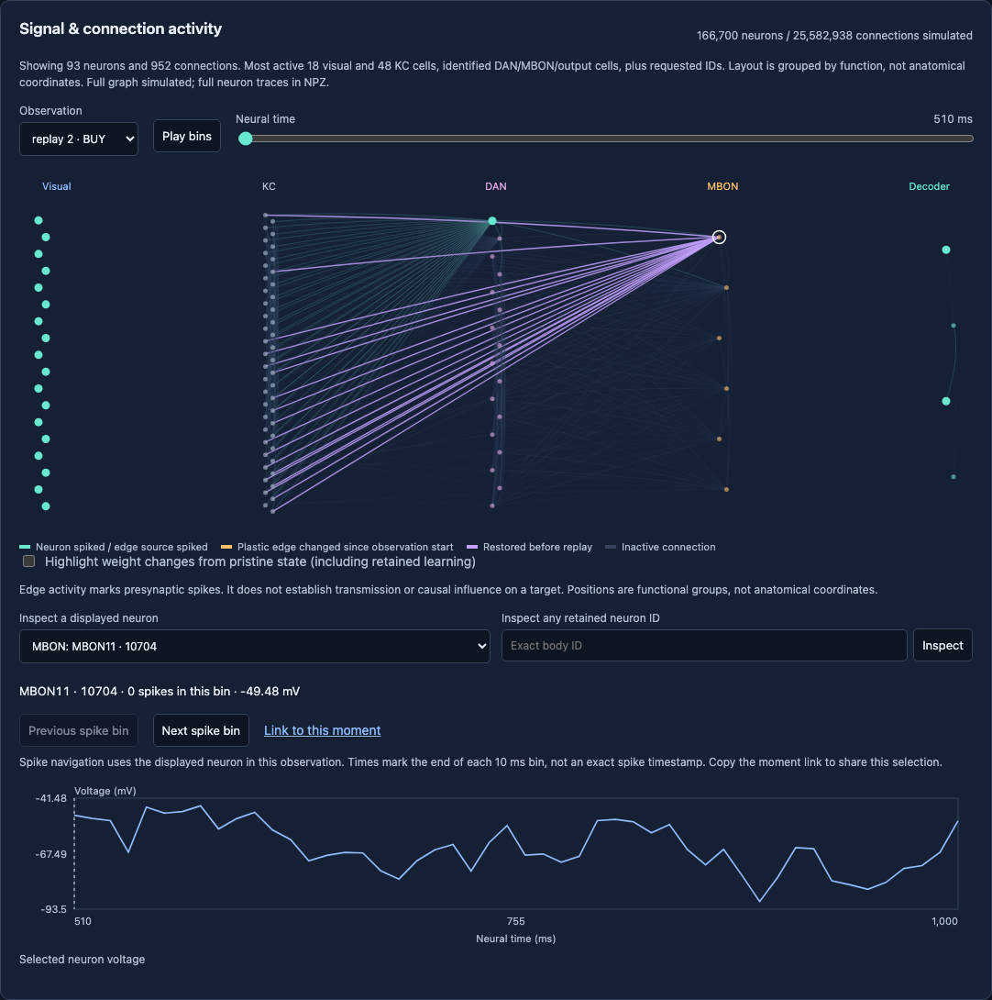

Open `marketrestore01-restore_10704`, compare `marketrestore01-trained_frozen`,
and select **replay 2**, or [open the paired restoration view](http://127.0.0.1:8765/?run=marketrestore01-restore_10704&step=1&neuron=10704&compare=marketrestore01-trained_frozen).
The displayed subset highlights 18 restored edges for that recording; the
underlying intervention restores all **2,048** incoming plastic connections to
10704. The other individual arm restores **2,136** inputs to 11402; together they
restore **4,184**. No edge is removed. All five compact recordings are included.

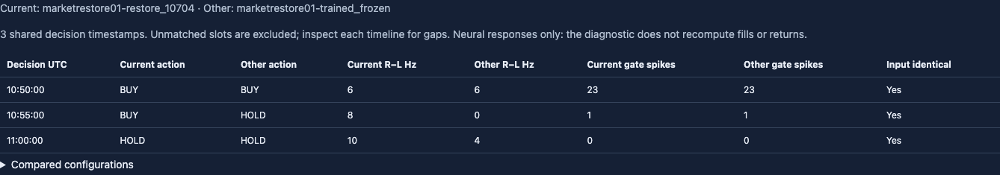

Re-audit the published results and regenerate the comparison without model
compute:

```sh
uv run python -m paperlab.fly_market_restoration_audit \
  --study reports/fly-market-restoration-study-01.json \
  --reference reports/fly-market-study-05.json \
  --plan reports/fly-market-study-05-plan.json \
  --out runs/restoration-audit.json --figure runs/restoration.svg
```

A [new market protocol](../reports/fly-market-study-06-preregistration.json) is
registered for September 12: training **11:05–11:20**, development
**11:20–11:35**, and test **11:35–11:50 UTC**, retaining the same cohort and costs.
It compares pristine, trained/frozen, each individual restoration, and both.
Both inference phases restore their own copy of training memory, apply the
specified reset to incoming connections, and freeze all updates. Selection uses
development only and must beat cash and pristine; test cannot trigger reselection
or automatic deployment. The test had not started when the protocol was
registered. That fresh comparison has not yet run.


### Evaluate restoration on a new market window

The `memory-restoration` market protocol compares pristine/frozen,
trained/frozen, each single-cell restoration, and both restored cells. It applies
restoration only before development and test. Every phase has a separate broker
and reset neural activity; inference begins from the independently prepared
checkpoint rather than development's terminal state.

Within one pool, equivalent training recipes share their computed checkpoint.
The four learned variants have identical training settings, so each pool needs
two training simulations (pristine and learned) instead of five. All development
and test trials still execute separately. Reports record `training_compute_source`
and `training_compute_reused`; these shared results are not independent training
replicates. Pools never share trained memory.

After a closed collector database covers the **actual observation timestamps**
through the registered endpoint, seal and submit the comparison:

```sh
uv run python -m paperlab.fly_market_study followup \
  --archive runs/fresh-universe-snapshot.db \
  --previous reports/fly-market-study-05-plan.json \
  --phase-steps 3 --protocol memory-restoration --out runs/market06-plan.json
uv run python -m paperlab.fly_market_cloud \
  --plan runs/market06-plan.json \
  --registration reports/fly-market-study-06-preregistration.json \
  --out runs/market06
```

Deploy the updated full-fly/universe worker before submission. The cloud command
requires the plan to match its registration and the recorded registration time
to precede test. Repeat the **same command and output directory** to resume a
pending call; it saves the call ID before waiting and refuses a changed request
or an uncertain submission. It verifies executed source hashes and reconciles
the decision timestamps, terminal/aggregate equity, fill counts, fees, and the
development-only selection rule before publishing local results.

Completed output includes `report.json`, `memory-audit.json`, all available test
views, and private `artifacts/` checkpoints. The model saves a `plastic-map.npz`
plus distinct training and prepared-inference memory for each arm. The audit
uses the actual target mapping to check every restored and untargeted value,
then compares both inference start hashes and the saved test-start arrays with
that verified preparation. Intentional restoration is reported explicitly;
it is not mislabeled as retaining the entire trained state unchanged.

```sh
uv run python -m paperlab.debugger serve --backend modal --out runs/market06
uv run python -m paperlab.fly_market_memory_audit \
  --plan runs/market06/plan.json --report runs/market06/report.json \
  --artifacts runs/market06/artifacts --out runs/market06/rechecked-memory.json
```

The model's full graph, fixed decoder, costs, and promotion gate remain in force.
Restoration changes neural memory; it never substitutes a chosen trade for the
network's output. The scheduled paper policy is unchanged while these variants
are evaluated in isolated accounts.


### Compare activity inside an observation

Choose a comparison run, a displayed neuron, and a plastic connection. The
**Selected neuron & connection across runs** plots overlay voltage, spike counts
per 10 ms bin, and synaptic weight. Blue is the current run; pink is the comparison.
Scrubbing time updates both cursors and their numeric differences. Observation
changes, neuron selection, and connection selection update the plots together.

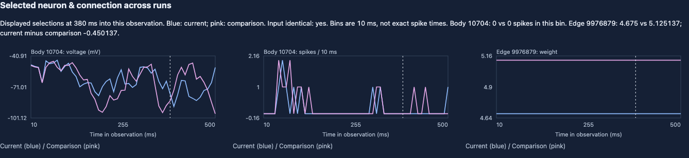

This example compares `marketrestore01-restore_10704` with
`marketrestore01-trained_frozen`, replay 2, body 10704 and edge 9976879. The
restored weight is 4.675 versus 5.125137 in the trained control; both stay frozen
throughout inference, while the neuron's voltage and spike bins diverge. The
intervention restored 2,048 inputs together, so this picture does not isolate
edge 9976879 as the cause of the output change.

Frames pair by market decision timestamp or synthetic phase/observation index.
Neurons pair by body ID; connections require the same ID and both endpoint IDs.
Different displayed subsets may omit a selected cell or connection. Missing
observations and differing bin grids show an explicit message instead of an
interpolated overlay. Time is relative to the start of each 500 ms observation,
not absolute neural time or an exact spike timestamp. The view reports input
equality and missing/different native builds; a visual difference alone does
not establish a controlled causal comparison.

For browser regression checks, install Playwright in your Node environment,
start the included recording server, then run:

```sh
node scripts/check-fly-paired-view.cjs
```

Set `FLY_VIEW_URL` for another local port and `CHROMIUM_PATH` for an existing
Chromium executable. The check verifies identity mapping even when the
comparison's displayed indices are reordered, cursor updates, missing time
matches, incompatible bins, clearing stale plots, and mobile layout. It blocks
`/api/run` and submits no model jobs.


### Sixth market replay result

The [sixth report](../reports/fly-market-study-06.json) used the
[registered five-arm protocol](../reports/fly-market-study-06-preregistration.json)
and a [sealed snapshot](../reports/fly-market-study-06-plan.json). It trained on
11:05–11:20 UTC, developed on 11:20–11:35, and tested on 11:35–11:50 on September
12. All phases start with separate $1,000 accounts, including $500 idle cash.

| Variant | Development equity | Test equity |
| --- | ---: | ---: |
| Pristine / frozen | $997.66 | $994.18 |
| Trained / frozen | $997.66 | $994.18 |
| Restore inputs to 10704 | $996.58 | $994.18 |
| Restore inputs to 11402 | $997.66 | $1,000.46 |
| Restore both MBON11 cells | $996.58 | $994.18 |

**No variant passed the development gate.** The 11402 test result is a lead for
a new experiment; it cannot be selected after seeing the test. The normal paper
policy was not changed.

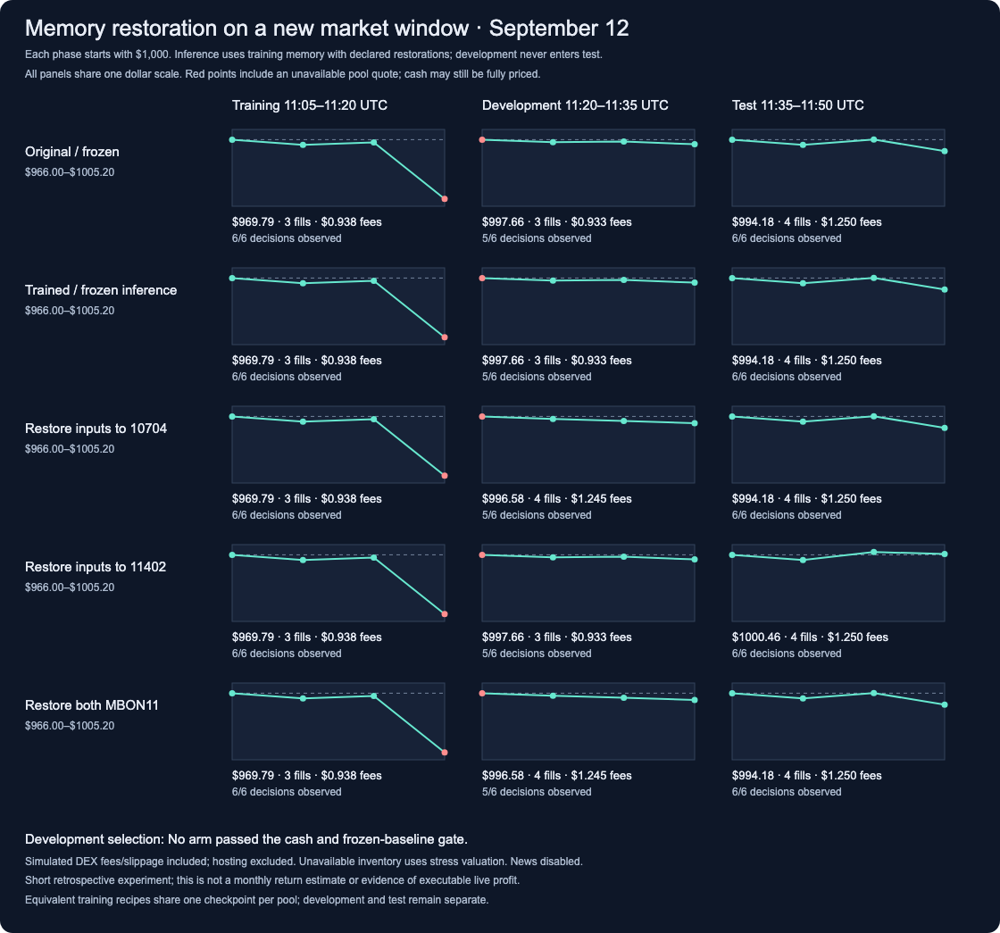

All six test decision slots had usable inputs. Each variant made four fills
with $1.25 in entry/exit fees, plus the declared slippage. The entire difference
came from pool 1 (`baton`): at 11:40, restoring 11402 changed BUY to SELL, which
filled at the next quote. The $25 order cap meant the sale left approximately
364.62 tokens, while the BUY variants ended with approximately 5,868.95. Both
pools still had open inventory at test end. Consequently the $6.2854 difference
is in terminal simulated equity, not a fully realized profit. Hosting is
excluded from the table.

[Open the new comparison](http://127.0.0.1:8765/?run=market06-pool1-restore_11402&step=1&neuron=11402&compare=market06-pool1-trained_frozen)
after starting the included recording server. All ten pool/variant recordings
are included under `market06-pool{0,1}-{variant}`.

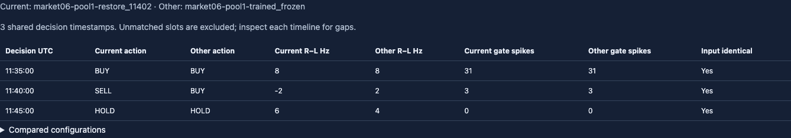

The [recorded trace audit](../reports/fly-market-study-06-trace-audit.json) confirms
identical inputs and native builds. At that decision, the trained control's left
and right decoder neurons fired 17 and 18 spikes; restoration produced 18 and
17. That changes right-minus-left from +2 to −2 Hz. The two gate cells had
identical binned counts (three and zero spikes), so the changed action follows
the directional readout. Body 11402's first differing spike-count bin was
150–160 ms into the observation. This is temporal evidence, not a traced causal
path from one synapse. The intervention changed 2,136 incoming connections
together. Use the paired voltage, spike-bin and connection plots to inspect it.

The [checkpoint audit](../reports/fly-market-study-06-memory-audit.json) verifies
that inference used exactly the declared restorations, retained every other
training value and stayed frozen. Training changed 3,044 weights in pool 0 and
3,066 in pool 1. Unlike the previous experiment,
[training affected MBON07 inputs too](../reports/fly-market-study-06-memory-targets.json):
1,309 and 1,316 changed weights respectively. Restoring both MBON11 cells
therefore did not restore pristine memory. The four trained variants reused one
identical training checkpoint per pool; these are controlled interventions, not
four independent training replications.

The training-end drop to $969.79 includes unavailable inventory valued at zero
in pool 1; it is not a realized liquidation loss. Development began there with
no quote and a fresh cash account. It had five of six observed decisions. All
reported totals, fill counts/fees, source hashes and saved-memory boundaries
were reconciled before marking the cloud call complete. Estimated compute for
this call was $0.0242; the worker ledger then reserved $1.2484 for the month
against its unchanged $25 cap. This ledger is not the provider bill.

The [seventh registration](../reports/fly-market-study-07-preregistration.json)
retains all five variants and both original pools. Its train/development/test
windows are 11:50–12:05, 12:05–12:20 and 12:20–12:35 UTC. It was registered at
11:57 UTC, before development and test. The next comparison will test whether
the restoration effect repeats; it will not choose the 11402 variant from the
sixth test result.

### Cross the three learned input groups

The [second restoration protocol](../reports/fly-market-restoration-protocol-02.json)
uses the sixth study's pool 1 images. It crosses keeping/restoring MBON07 inputs,
10704 inputs and 11402 inputs: eight combinations, plus a separate pristine
control. These three groups cover every plastic connection. Each restoration
replaces weights, u and w together; no graph connections are removed.

Before additional interventions, the run must reproduce training and the five
known market-reference variants. The all-restored condition must reproduce the
pristine memory and whole-neuron spike counts. The offline audit reads saved
checkpoints and the actual edge-to-post map, verifying every selected and
untouched value. It also reports the effect of restoring 11402 under each fixed
combination of the other two choices. These are deterministic contrasts on
previously examined images, not trading performance estimates.

```sh
uv run python -m paperlab.fly_market_restoration pack \
  --protocol reports/fly-market-restoration-protocol-02.json \
  --reference reports/fly-market-study-06.json \
  --plan reports/fly-market-study-06-plan.json \
  --out runs/restoration02-payload.json
uv run python -m paperlab.fly_market_restoration cloud \
  --payload runs/restoration02-payload.json --out runs/restoration02
```

Repeat the cloud command with the same output directory after an observation
timeout. It resumes the saved call, downloads the nine compact recordings and
memory checkpoints, and audits them before marking the call complete. To repeat
the audit and produce a figure after completion:

```sh
uv run python -m paperlab.fly_market_restoration_audit \
  --study runs/restoration02/summary.json \
  --reference reports/fly-market-study-06.json \
  --plan reports/fly-market-study-06-plan.json \
  --artifacts runs/restoration02/artifacts \
  --out runs/restoration02/audit.json --figure runs/restoration02/figure.svg
```

### Three-group restoration results

The [completed nine-condition replay](../reports/fly-market-restoration-study-02.json)
and [checkpoint audit](../reports/fly-market-restoration-audit-02.json) reproduced
all five sixth-study reference variants. Every condition retained the full
166,700-neuron / 25,582,938-edge graph and froze synaptic memory during inference.
Restoring all 7,835 plastic inputs reproduced pristine memory and all three
whole-neuron spike-count records. Restoring only both MBON11 cells did not.

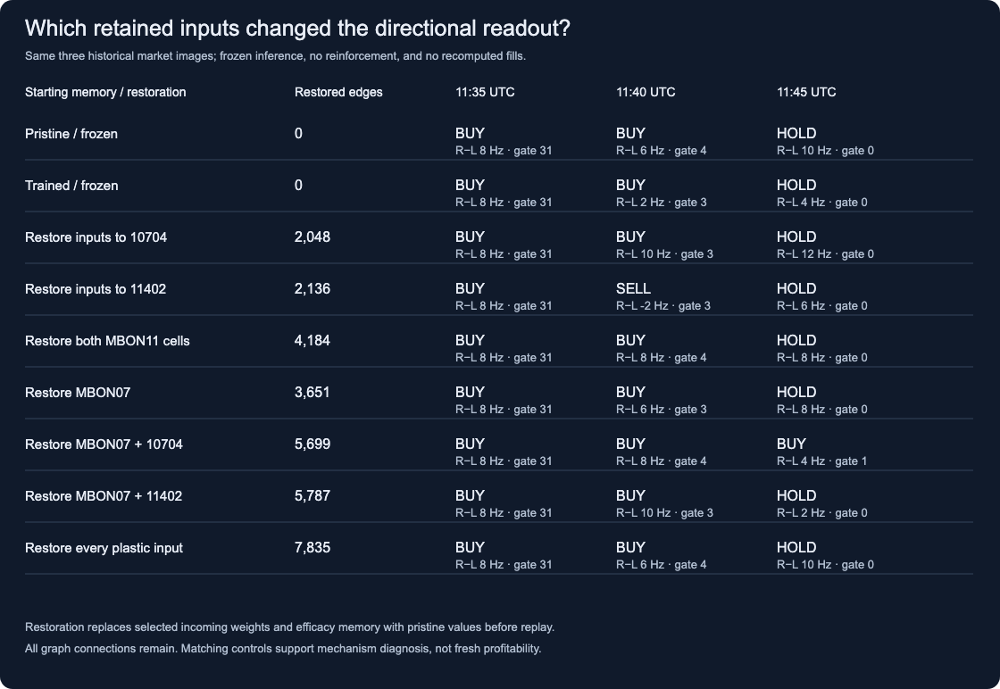

At the 11:40 observation, the effect of restoring 11402 depended on the other
retained memories. The values below are right-minus-left decoder firing rates;
the change is after restoring 11402 minus before, with the other choices fixed.

| MBON07 inputs | 10704 inputs | Before restoring 11402 | After | Change |
| --- | --- | ---: | ---: | ---: |
| Trained | Trained | +2 Hz (BUY) | −2 Hz (SELL) | −4 Hz |
| Trained | Pristine | +10 Hz (BUY) | +8 Hz (BUY) | −2 Hz |
| Pristine | Trained | +6 Hz (BUY) | +10 Hz (BUY) | +4 Hz |
| Pristine | Pristine | +8 Hz (BUY) | +6 Hz (BUY) | −2 Hz |

For this input and these interventions, the SELL required retaining the learned
MBON07 and 10704 inputs while restoring 11402. Resetting MBON07 reversed the sign
of the 11402 restoration's readout effect. Resetting 10704 instead raised the
starting directional readout enough that restoring 11402 still left a BUY.
This supports conditional interactions between learned input groups, rather
than treating one cell's memory as uniformly harmful. It does not identify a
single responsible synapse or show that the same effect generalizes.

[Compare retained versus restored MBON07](http://127.0.0.1:8765/?run=marketrestore02-restore_11402&step=1&neuron=12859&edge=14797499&compare=marketrestore02-restore_MBON07_11402).
Both runs restore 11402; the comparison additionally restores MBON07. The
selected connection is an actual input to body 12859. Its trained weight is
1.541393 versus pristine 1.65; both remain frozen during the replay.

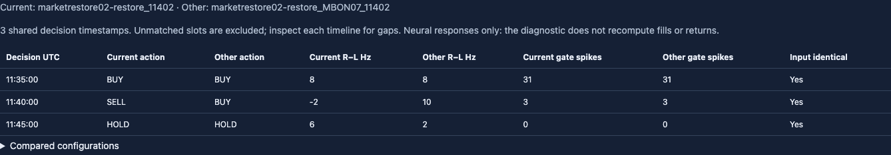

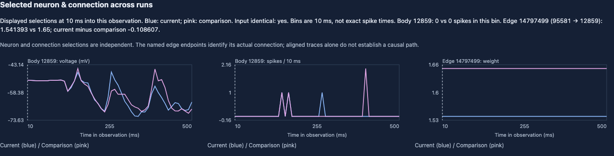

There is also a distinct gate effect. Restoring MBON07 and 10704 while keeping
11402 trained produced BUY/BUY/BUY; all other conditions held on the last
observation. The [27-observation gate audit](../reports/fly-market-restoration-gate-timing-02.json)
locates the extra spike in gate cell 10527 at the 1,110–1,120 ms neural-time bin,
110–120 ms into the third observation. The other gate cell, 555871, had no spike
there. This occurred with frozen weights and no reinforcement; the changed
starting memory was sufficient in this replay.

[Jump to the extra gate spike](http://127.0.0.1:8765/?run=marketrestore02-restore_MBON07_10704&step=2&bin=11&neuron=10527&compare=marketrestore02-restore_MBON07).
This pair differs only in restoring 10704. The selected plastic edge in the
screenshot is 38549 → 10704, not a direct edge into the gate cell. The UI labels
both endpoints because neuron and connection selections are independent. Spike
bin alignment is not evidence that this one edge caused the gate spike.

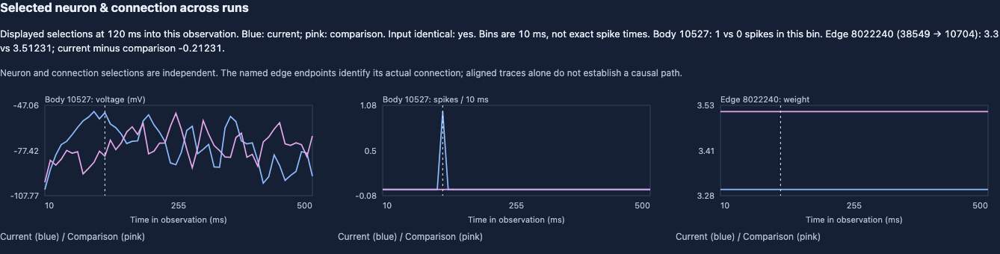

The assay recomputed no accounts, fills, or returns, so the extra BUY has no
measured profit/loss here. The sixth market test's 11402 benefit remains an
unselected test-only result. The seventh market comparison keeps its previously
registered five variants and selection rule. These nine diagnostic conditions
do not replace that registration or promote a policy.

All nine compact recordings are included under `marketrestore02-{variant}`.
To reproduce the gate audit from a downloaded cloud result, add
`--recordings runs/restoration02 --timing-out runs/restoration02/gates.json`
to the audit command above. It checks each recording's report, bin grid, gate
identities, and spike sums against the decoder. Estimated compute for this
assay was $0.0138; the worker ledger reserved $1.2765 against its unchanged $25
monthly cap afterward. These are internal estimates, not provider billing.

### Inspect stored connection memory

The connection panel now plots the recorded **u** and **w** variables separately
from the synaptic weight. `u` is the stored learning state; `w` is the filtered
efficacy deviation. The native rule writes the current weight as its pristine
weight multiplied by `1 + w`. The displayed weight already includes that factor;
it must not be multiplied by it again. These are model memory variables, not
optimizer gradients or evidence of profitable learning.

The [source manifest](../reports/fly-connection-memory-01.json) binds the included
examples to their original compact views and full NPZ recordings. No simulation
was rerun to create these examples, and their original reports, decisions,
inputs and weights were preserved. New cloud/local captures include the memory
columns automatically after deploying this code.

[Inspect learning within one connection](http://127.0.0.1:8765/?run=memory-detail-fall&step=1&bin=49&edge=4110853).
In this existing two-observation falling-price assay, edge 4110853
(18540 → 10704) ended with u = −0.007740 and w = −0.024077. The 0.016337 gap is
visible alongside the weight trajectory. The filter makes these states move at
different rates; it is not an unexplained second optimizer.

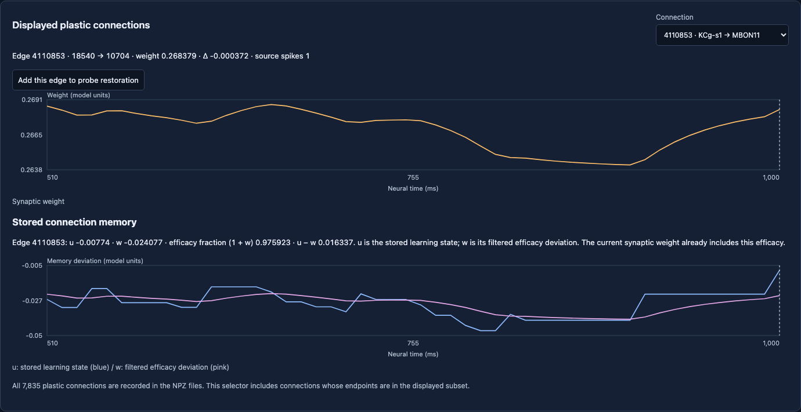

[Compare retained memory with pristine](http://127.0.0.1:8765/?run=memory-detail-market05&step=1&bin=49&edge=8524867&compare=memory-detail-pristine05).
This is the second test observation from study 05. Edge 8524867 (41787 → 11402)
has u = 0.056850 and w = 0.060633 in the trained control, versus zero in pristine.
Both are constant throughout frozen inference. Its weight is 8.166871 versus
pristine 7.7. The full graph still propagates activity, and the paired neuron
spikes differ even though the memory plots are flat.

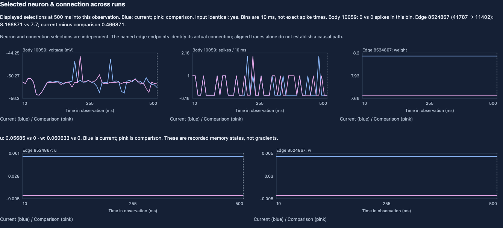

Only the second observation of these two market examples was enriched from
its full recording. Other observations explicitly report memory detail as
unavailable. Older views do the same; the interface never substitutes zero or
infers raw u/w from a rounded weight. The falling-price example contains both
observations. Enrichment provenance is visible in the configuration details.

To add memory detail to an old recording, write a **new** view from its original
full trace directory:

```sh
uv run python -m paperlab.fly_trace_memory \
  --view runs/original/view.json --recordings runs/original \
  --out runs/enriched/view.json
```

The command verifies neuron and edge identities, endpoints, time bins, full
network spike counts, displayed weights and memory norms before copying the
per-connection arrays. It refuses to overwrite the original view. Use
`--allow-partial` explicitly if only some original `step-*.npz` files are
available; the manifest lists included and missing observations. No model data
or compute is required beyond those saved files. Source NPZ files stay private
and ignored by Git; the bounded derived views are included for inspection.

The native regression test compares the new columns directly with captured
arrays and checks that recording/export preserves neural outputs. Browser
checks cover the moving u/w gap, nonzero frozen memory, pristine controls,
partial/legacy availability and mobile layout:

```sh
node scripts/check-fly-memory-view.cjs
```

As with the paired-trace check, set `FLY_VIEW_URL` and `CHROMIUM_PATH` when needed.
It uses the included recordings and blocks `/api/run` throughout.

## Inspect accumulated decoder counts

The **How the output counts accumulate** panel reconstructs the left DNp20,
right DNp20, and DNpe017 gate counts from the displayed neurons. Scrubbing the
observation moves the cursor through these recorded counts. Direction curves
normalize accumulated counts by the full 500 ms observation; they are not
instantaneous firing rates or early decisions. Endpoints must reconcile to the
recorded event. Missing identities, mismatched rates, or an unsupported time grid
produce an unavailable message instead of an inferred trace.

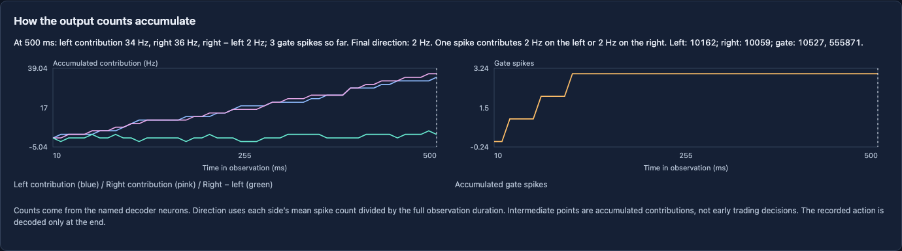

After starting the viewer, open
[the trained market06 decision](http://127.0.0.1:8765/?run=market06-pool1-trained_frozen&step=1&bin=49).
The final counts are **17 left / 18 right**, or **34 / 36 Hz**, with three gate
spikes. One spike on either DNp20 neuron contributes 2 Hz. Compare
`market06-pool1-restore_11402` at the same observation: the counts are reversed,
producing SELL at the same fixed threshold.

### Output-count sensitivity audit

Run this offline; it does not load the graph, simulate a network, or submit a
cloud job:

```sh
uv run python -m paperlab.fly_decoder_audit \
  --views examples/fly-debugger/market05-*/view.json \
          examples/fly-debugger/market06-*/view.json \
          examples/fly-debugger/marketrestore02-*/view.json \
  --out runs/decoder-sensitivity.json
```

The audit compiles the retained `Decoder.decode` method directly from its source
and reads the retained settings defaults: 500 ms and a 2 Hz threshold. It checks
all original left/right rates, differences, gate counts, and actions before
adding or removing one spike from each decoder neuron's final count. A zero count
cannot lose a spike. Source and input-view hashes are recorded. Historical reports
do not independently record the threshold, so reproducing their outputs under
the retained defaults is the stated basis for this calculation.

The [published audit](../reports/fly-decoder-sensitivity-01.json) contains all
69 observations from the fifth/sixth market tests and the nine-condition
restoration replay. **29** change action under at least one one-spike edit:
**10** via the direction neurons and **19** via the gate. Controls and inputs
repeat across recordings; this is a descriptive audit, not 69 independent samples
or an estimate of noise probability.

For the market06 trained BUY at 11:40 UTC, adding one left spike or removing one
right spike produces a tie and HOLD. The restored SELL has the corresponding
opposite sensitivity. In the restoration replay's extra final BUY, removing the
single gate spike gives HOLD. These observations distinguish direction-boundary
and gate-boundary mechanisms, but do not establish that such spike changes occur
naturally. No upstream causal path, fills, P&L, or alternative threshold is
simulated. A larger threshold could also discard useful decisions; this audit
is not a demonstrated trading improvement. The registered seventh market
comparison remains unchanged.

Browser regression check (requires Playwright and a running recording server):

```sh
FLY_VIEW_URL=http://127.0.0.1:8765 node scripts/check-fly-decoder-view.cjs
```

It verifies end rates, intermediate counts, neuron identity remapping, missing
outputs, inconsistent rates, unsupported time grids, clearing stale charts, and
mobile layout. It blocks model-job submissions.

## Seventh market replay result

The unchanged five-arm restoration experiment was registered before its new
11:50–12:35 UTC window finished. The collector snapshot contained observations
through 12:35:46 UTC before the plan was sealed. Training used 11:50–12:05,
development 12:05–12:20, and test 12:20–12:35. Each phase began with its own
$1,000 simulated account and the same two admitted pools.

| Variant | Training | Development | Test |
| --- | ---: | ---: | ---: |
| Pristine / frozen | $1,002.59 | $994.56 | $996.86 |
| Trained / frozen | $1,002.59 | $994.30 | $996.86 |
| Restore inputs to 10704 | $1,002.59 | $996.16 | $996.86 |
| Restore inputs to 11402 | $1,002.59 | $995.91 | $996.86 |
| Restore both MBON11 cells | $1,002.59 | $995.91 | $996.86 |

**No development gate passed, and no policy was promoted.** The sixth study's
unselected test advantage from restoring 11402 did not repeat. In development,
restoring 10704 reduced the loss relative to trained/frozen, but remained below
cash. These few observations do not validate or universally disprove restoration.

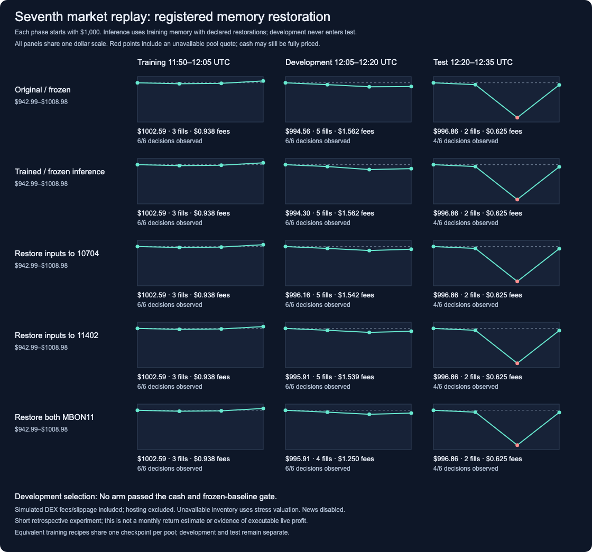

Training and development each had six observed decision slots; test had four
of six. At 12:30 both pools had quote records but failed the existing
`insufficient_two_sided_activity` rule: their five-minute volumes were $378.53
and $193.29, below the $1,000 minimum; the second also had only one buy versus
the minimum three on each side. The [coverage audit](../reports/fly-market-study-07-coverage.json)
reconciles the exclusions against the sealed SQLite snapshot, stored rejection
reasons, and eligibility code. No missing slot was replaced with a later quote.

The test ledger's drop to **$949.375** at 12:30 is the conservative zero valuation
of unavailable inventory. It is not an executed sale or realized loss. The next
eligible terminal marks restore valuation to **$996.857906**. Each variant has
two BUY fills, $0.625 total fees, and open inventory in both pools. The second
pool's observed SELL at 12:25 is rejected at the following unavailable slot;
it is not silently retried at the terminal quote. Hosting is excluded.

All five variants matched the pristine **whole-neuron spike-count hashes** on
all four observed test decisions: BUY then BUY for pool 0; BUY then SELL for
pool 1. This does not establish equality of precise spike timing, voltage, or
memory. Checkpoints still differ: training changed five weights for pool 0 and
3,022 for pool 1. Restoring both MBON11 cells restores pool 0's entire changed
memory, while learned MBON07 memory remains in pool 1. All inference checkpoints
passed the frozen-memory and target-restoration audit.

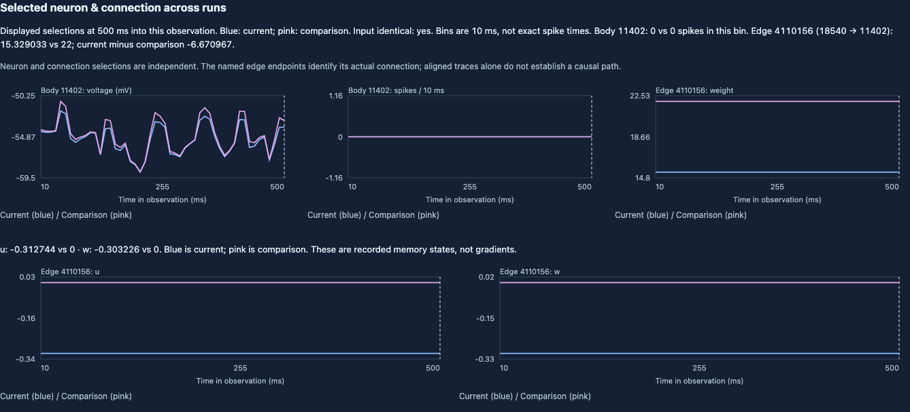

Open [the trained/pristine comparison](http://127.0.0.1:8765/?run=market07-pool1-trained_frozen&step=1&bin=49&neuron=11402&edge=4110156&compare=market07-pool1-pristine_frozen)
to see the retained weight and `u/w` differences. The selected edge differs by
6.670967 weight units while the displayed neuron's spike bins match. The
renderer distinguishes recorded memory from output activity; neither alone
establishes improved decisions. All ten included `market07-*` recordings were
checked in the browser, including excluded slots, output-count reconciliation,
paired memory, mobile layout, and disabled job submission during the check.

Repeat the recording browser check with
`FLY_VIEW_URL=http://127.0.0.1:8765 node scripts/check-fly-market07-view.cjs`
(Playwright required; `CHROMIUM_PATH` can select an installed browser).

Artifacts: [preregistration](../reports/fly-market-study-07-preregistration.json),
[sealed plan](../reports/fly-market-study-07-plan.json),
[decision ledger and selection](../reports/fly-market-study-07.json),
[checkpoint audit](../reports/fly-market-study-07-memory-audit.json), and
[changes by postsynaptic target](../reports/fly-market-study-07-memory-targets.json).
The executed source hashes, phase accounting, fills, fees, selection, and
memory were reconciled before publication. Estimated Modal compute for this
call was **$0.01750**, with worker monthly reserved compute **$1.32143 / $25**;
these are application estimates rather than the provider bill. Budget caps and
the scheduled paper policy were unchanged.

The next mechanism to isolate is activity carryover and gate dropout, separately
from learned memory. In the prior nine-condition replay the gate declined from
31 spikes to zero or one even with pristine memory. A controlled carryover/reset
comparison tests that explanation without selecting a replacement trading
policy from these test returns; see the [completed activity-reset diagnostic](#activity-reset-results).

## Isolate carried activity

The activity-reset diagnostic compares the same three fully observed market06
images with **pristine or trained memory**, crossed with four state treatments:
carry everything forward; reset all recorded dynamics; reset only the visual
filters (`luminance`, `r8_light`); or reset only intrinsic `adaptation`.

All eight conditions start their first observation with the same fresh dynamics.
Interventions happen only before observations two and three. The full reset also
restarts the native neural clock; the two partial resets preserve the clock and
every other recorded dynamic field. All synaptic weights and stored `u/w` remain
fixed throughout inference. This isolates a mechanism without changing the fixed
decoder or inventing fills or returns.

The [protocol](../reports/fly-market-activity-protocol-01.json) pins the reference
report and market plan. Both original carry controls and the reconstructed
training memory must reproduce before the changed conditions run. Every boundary
saves the actual before/after arrays; the offline audit compares each target
against pristine state and every other field against its prior value. It also
checks memory checkpoints, clock continuity, and the preceding observation's
whole-network spike counts.

```sh
uv run python -m paperlab.fly_market_activity pack \
  --protocol reports/fly-market-activity-protocol-01.json \
  --reference reports/fly-market-study-06.json \
  --plan reports/fly-market-study-06-plan.json \
  --out runs/activity-payload.json
uv run python -m paperlab.fly_market_activity cloud \
  --payload runs/activity-payload.json --out runs/activity-study
```

The cloud observer persists its call ID. If it times out while the job continues,
repeat the same command and output directory to observe that call. It never
submits a second job on an observation timeout. The diagnostic uses the existing
worker lease, a 420-second internal deadline, and the unchanged compute budget.
An uncertain submission is not retried automatically.

For a local prepared graph, use `run` instead of `cloud` and add
`--fly-data path/to/prepared/fly-data`. Audit downloaded boundary artifacts with:

```sh
uv run python -m paperlab.fly_market_activity_audit \
  --study runs/activity-study/summary.json --payload runs/activity-payload.json \
  --artifacts runs/activity-study/artifacts --out runs/activity-audit.json
```

The viewer's **Activity boundary before this observation** panel identifies the
reset, target fields, fields whose values changed, and the before/after neural
clock. This appears only on recordings that contain boundary metadata.

## Activity-reset results

All eight conditions completed on the registered market06 pool-1 inputs. Both
carry controls reproduced the reference actions, rates, gate counts, and
whole-neuron spike-count hashes. Reconstructed training memory matched its saved
reference. The offline audit checked **24 actual before/after boundary files**,
including all target fields, untouched fields, preserved weights/`u/w`, and clock
continuity. The first observation matched its carried-state control in every arm.

| Memory / activity treatment | Actions on images 1–3 | Gate spikes | Right − left Hz |
| --- | --- | --- | --- |
| Pristine / carry | BUY, BUY, HOLD | 31, 4, 0 | 8, 6, 10 |
| Trained / carry | BUY, BUY, HOLD | 31, 3, 0 | 8, 2, 4 |
| Pristine / full reset | BUY, BUY, BUY | 31, 23, 18 | 8, 12, 8 |
| Trained / full reset | BUY, BUY, BUY | 31, 23, 18 | 8, 12, 8 |
| Pristine / visual filters reset | BUY, SELL, HOLD | 31, 5, 0 | 8, −6, 8 |
| Trained / visual filters reset | BUY, BUY, HOLD | 31, 5, 0 | 8, 8, 10 |
| Pristine / adaptation reset | BUY, BUY, HOLD | 31, 4, 0 | 8, 4, 0 |
| Trained / adaptation reset | BUY, BUY, HOLD | 31, 3, 0 | 8, 6, 10 |

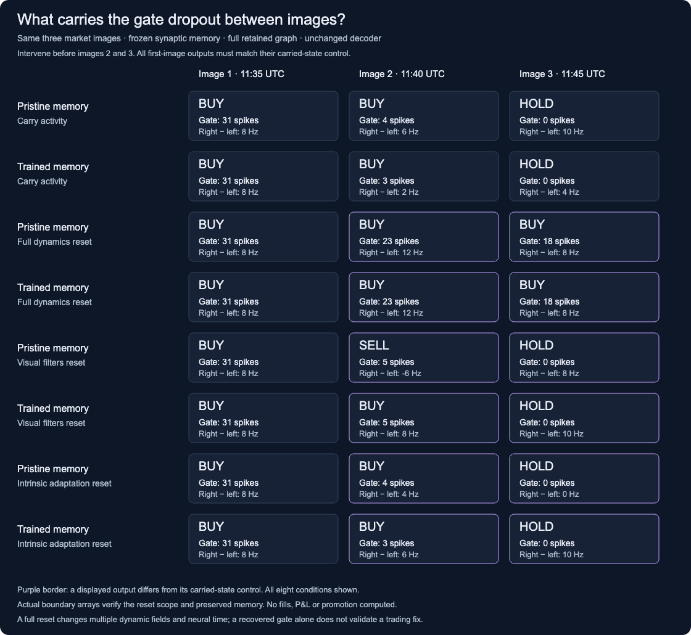

**A full dynamic-state reset is sufficient to recover gate activity in this
replay while keeping learned memory.** Before image three, it resets 21 recorded
dynamic fields and the neural clock. The resulting 18 gate spikes comprise 13
from body 10527 and five from body 555871, versus zero for both in the trained
carry control. Both gates first fire in zero-based bin 2, **20–30 ms into the
image**. This is bin-level timing, not an exact spike timestamp.

[Jump to the restored gate spike](http://127.0.0.1:8765/?run=activity01-trained_full&step=2&bin=2&neuron=10527&compare=activity01-trained_carry).
The reset recording's neural clock reads 30 ms there; the carried-state recording
reads 1,030 ms. Paired plots align by market observation and elapsed time in the
image, so these different absolute neural clocks are not conflated.

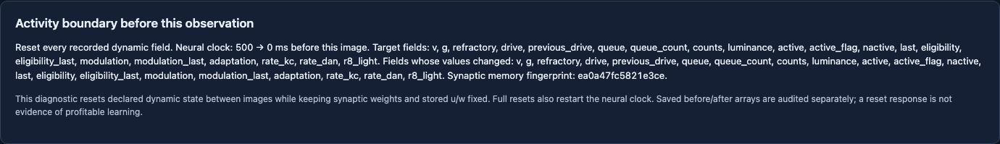

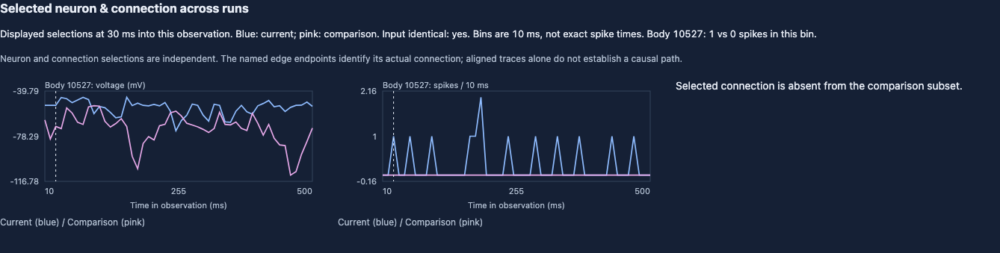

These active-neuron display subsets have no shared displayed plastic edge. The
paired viewer explicitly marks the selected connection unavailable in the other
subset. Preserved synaptic memory is verified by the full boundary checkpoints,
not inferred from a missing connection plot.

Neither narrower reset recovered the final gate. Clearing visual filters changed
the second pristine action to SELL but left the trained action BUY. Clearing
stored intrinsic adaptation changed some rates but kept the final HOLD. These
are conditional state effects within this implemented model. The adaptation
field accumulates on KC spikes; these partial interventions clear stored arrays
in the native lazy integrator, not a modeled biological treatment.

Full resets also made **all three whole-neuron spike-count hashes match between
pristine and trained memory**, even though their weights and stored `u/w` stayed
different. That does not establish identical voltages or exact spike timing.
It means recovering a gate can also remove the measured spike-count distinction
associated with learning on these short inputs. No account, fills, returns, or
policy promotion were computed, so this is not evidence that resetting improves
trading. The next useful isolation is which of the remaining dynamic fields, or
which interactions among fields, produce this effect without a blanket reset.

Artifacts: [protocol](../reports/fly-market-activity-protocol-01.json),
[all events and source hashes](../reports/fly-market-activity-study-01.json),
[boundary-array audit](../reports/fly-market-activity-audit-01.json), and the eight
included `activity01-*` recordings. The executed source was committed as
`f038d56` before submission. Estimated compute for the call was **$0.01650**,
with worker monthly reserved compute **$1.35153 / $25**. These are application
estimates rather than the provider bill. The scheduled paper policy was unchanged.

Regenerate the standalone figure from the published audit and event report:

```sh
uv run python -m paperlab.fly_activity_figure \
  --study reports/fly-market-activity-study-01.json \
  --audit reports/fly-market-activity-audit-01.json \
  --out runs/activity-results.svg
FLY_VIEW_URL=http://127.0.0.1:8765 node scripts/check-fly-activity-view.cjs
```

The browser check verifies all 24 boundary views, output counts, exact clocks,
reset fields, memory identity, aligned gate traces, mobile layout, and clearing
when a legacy recording is loaded. It blocks model-job submissions. The full
native reset/replay test and 246 unit/regression tests passed before deployment.

## Isolate voltage and synaptic input

The [second activity protocol](../reports/fly-market-activity-protocol-02.json)
registers twelve conditions on those same three market06 images. Four reproduce
the pristine/trained carry and full-reset controls. The remaining eight cross
pristine/trained memory with resetting only membrane voltage `v`, only the
synaptic-input state `g`, both globally, or both only at the two annotated gate
neurons (10527 and 555871). `g` is a native model state, not a calibrated physical
conductance measurement.

These partial interventions preserve neural time, all other fields and neuron
values, and all synaptic weights and stored `u/w`. They run only at native
boundaries where every neuron has been evolved to the current tick. Saved
before/after arrays and the full neuron identity map let the offline audit check
the exact two-cell scope independently. The viewer also shows the selected
neuron's actual boundary voltage and input state; these values describe the
moment before the image and stay fixed as the within-image cursor moves.

```sh
uv run python -m paperlab.fly_market_activity pack \
  --protocol reports/fly-market-activity-protocol-02.json \
  --reference reports/fly-market-study-06.json \
  --plan reports/fly-market-study-06-plan.json \
  --activity-reference reports/fly-market-activity-study-01.json \
  --out runs/activity-payload-02.json
uv run python -m paperlab.fly_market_activity cloud \
  --payload runs/activity-payload-02.json --out runs/activity-study-02
```

The previous study is pinned by its file hash and all four controls must reproduce
before narrower conditions run. This is a post hoc mechanism experiment on
already observed inputs. A reset-induced gate spike does not demonstrate a
better trading policy; any candidate needs a separate market evaluation.

## Voltage and synaptic-input results

All twelve conditions completed, with the four earlier controls reproduced.
The independent audit checked all 36 boundary checkpoints, including each
untouched array element, neuron identities, frozen synaptic memory and the
exact boundary values exported to the viewer. Source was registered and pushed
as `4af2774` before deployment and execution.

| Memory / reset | Actions on images 1–3 | Gate spikes | Right − left Hz |
| --- | --- | --- | --- |
| Pristine / carry | BUY, BUY, HOLD | 31, 4, 0 | 8, 6, 10 |
| Trained / carry | BUY, BUY, HOLD | 31, 3, 0 | 8, 2, 4 |
| Pristine / full | BUY, BUY, BUY | 31, 23, 18 | 8, 12, 8 |
| Trained / full | BUY, BUY, BUY | 31, 23, 18 | 8, 12, 8 |
| Pristine / voltage | BUY, BUY, BUY | 31, 12, 6 | 8, 4, 2 |
| Trained / voltage | BUY, BUY, BUY | 31, 12, 6 | 8, 4, 2 |
| Pristine / synaptic input | BUY, BUY, BUY | 31, 12, 5 | 8, 6, 8 |
| Trained / synaptic input | BUY, BUY, BUY | 31, 12, 5 | 8, 6, 14 |
| Pristine / voltage + input | BUY, BUY, HOLD | 31, 4, 1 | 8, 2, 0 |
| Trained / voltage + input | BUY, BUY, SELL | 31, 4, 1 | 8, 8, −2 |
| Pristine / gate voltage + input | BUY, SELL, BUY | 31, 4, 2 | 8, −2, 8 |
| Trained / gate voltage + input | BUY, BUY, HOLD | 31, 5, 0 | 8, 2, 8 |

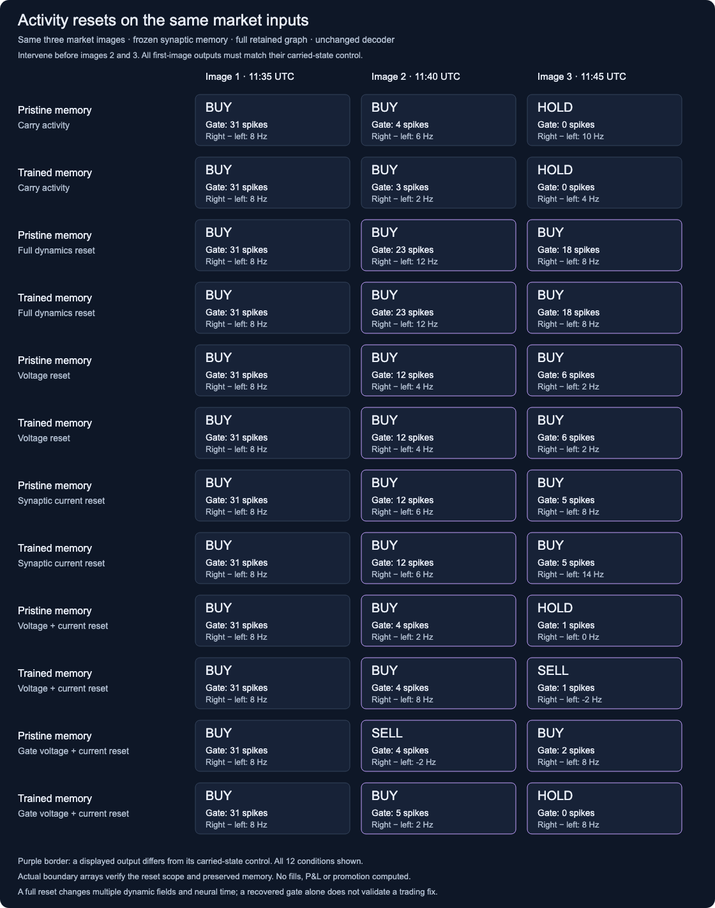

**Resetting just the two gate cells was insufficient for the trained model.**
Before image three, their voltages were −89.56 and −89.77 mV. The intervention
set both to their initial −52 mV and cleared their input state, yet neither fired
in the following 500 ms. The rest of the network was preserved; for example,
MBON11 body 11402 retained its −76.70 mV and −45.14 input state at that boundary.
The first reset also changed subsequent activity, so this is a two-boundary
intervention, not an isolated manipulation of image three alone.

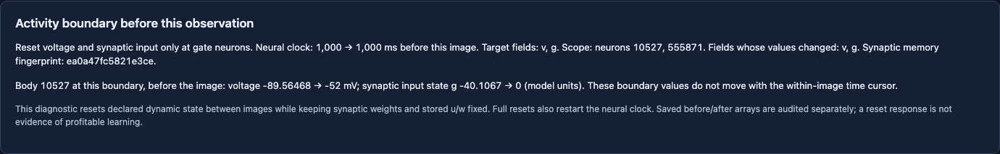

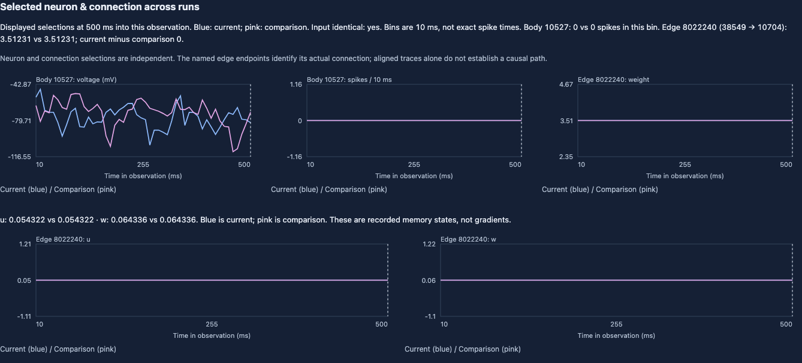

**Clearing the synaptic-input state globally recovered the gate while retaining
an observable learned-memory effect.** Image three had five gate spikes in both
memory conditions, but the right-minus-left rate was 14 Hz with trained memory
versus 8 Hz with pristine memory. Their full-network count records differed on
that image, and matched on the first two. In the trained run, body 10527 fired in
bins 2, 4 and 12; body 555871 fired in bins 3 and 4. The first recovered gate bin
spans 20–30 ms into the image. Voltage, neural time and every other dynamic field
were preserved at each input-only reset.

[Inspect recovered gate firing](http://127.0.0.1:8765/?run=activity02-trained_conductance&step=2&bin=2&neuron=10527&edge=10020213&compare=activity02-trained_carry).

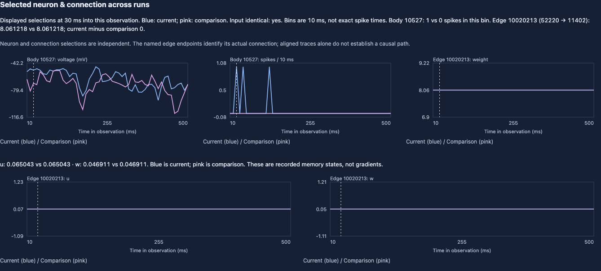

Global voltage-only resets recovered six final gate spikes but made the pristine
and trained full-network count records identical on all three images. Resetting
voltage and input together yielded a learned SELL versus an untrained HOLD, but
that SELL depends on one gate spike and the exact −2 Hz direction threshold.
These results show why more spikes or more reset fields cannot be assumed better.

No account, fills or P&L were computed here. Input-only reset is a candidate for
a separately registered market comparison, not a promoted strategy. Both
memory variants still emitted three BUYs on these inputs; an altered firing rate
alone does not establish useful trading information.

Artifacts: [protocol](../reports/fly-market-activity-protocol-02.json),
[complete study](../reports/fly-market-activity-study-02.json),
[boundary audit](../reports/fly-market-activity-audit-02.json), and twelve included
`activity02-*` recordings. The run's internal compute estimate was **$0.02768**;
worker monthly reserved compute was **$1.51574 / $25** at completion. Those
estimates exclude the separately capped collector and are not provider billing.

```sh
uv run python -m paperlab.fly_activity_figure \
  --study reports/fly-market-activity-study-02.json \
  --audit reports/fly-market-activity-audit-02.json \
  --out runs/activity-results-02.svg
FLY_VIEW_URL=http://127.0.0.1:8765 node scripts/check-fly-activity02-view.cjs
```

## Test input resets on a future market window

[Market study 08](../reports/fly-market-study-08-preregistration.json) was
registered before its 14:45–15:30 UTC window on September 12. Training,
development and test each cover fifteen minutes. The same two original pools
remain in the cohort, including missing or ineligible observations.

Four conditions cross pristine/trained frozen memory with carry/input-reset
inference. Training uses the unchanged activity behavior; identical recipes
share their saved training checkpoint. In reset inference, only `g` returns to
its initial values immediately before each eligible observation after the first.
Missing decision slots cause neither an observation nor a reset. Development and
test each start with fresh dynamics and the saved training memory.

Only `trained_input_reset` can qualify, and its development equity must strictly
beat cash and **all three controls**. Selection is written before test simulation.
The observer verifies the registered window, executed source, fees, fills,
training checkpoints, exact before/after state arrays and every displayed
boundary value. It also reconstructs each inference image from the sealed quotes
to verify that the recorded input matches. No automatic strategy deployment.

The deployed scheduled worker owns this study's once-only launch. After 15:30
UTC it waits until the actual SQLite snapshot reaches the endpoint, then uses
one existing worker invocation for the study instead of the ordinary baseline
cycle. It saves the owning call/input IDs and a durable claim **before** sealing
or running the brain. The image contains only the pinned registration and parent
plan. The saved snapshot, sealed plan and source hashes remain on the state
volume under `registered-market-08`.

The launch shares the worker's lease, 600-second reservation and $25 cap. Later
ticks resume normal paper trading. A failed, interrupted or uncertain study is
never retried automatically. Cloud collection and the launch do not require an
open laptop; the local visualization and artifact observer do.

Attach to the scheduled call and download/audit its results with:

```sh
uv run python -m paperlab.fly_market_cloud \
  --scheduled \
  --registration reports/fly-market-study-08-preregistration.json \
  --out runs/market08
```

This command cannot submit a worker. Before a durable pending receipt exists it
stops; after a timeout, repeat it with the same output directory to observe the
same call. Do not separately submit this registered study with `--plan`.
A late collector snapshot never substitutes future prices into
the sealed window. The sealer retains up to 512 chronological receipts per pool,
including at least the unchanged visual adapter's preceding 100 observations.
Unavailable inventory and indicative DEX costs retain the existing treatment.

The collector stalled during the beginning of this registered window: its
14:16:39 UTC lease survived a provider-confirmed timeout at 14:21:39, and later
calls skipped the occupied writer. Recovery checked for zero running inputs,
zero runners and zero backlog before removing that exact lease. Those missing
observations remain missing in study 08. New leases record the owning call and
input IDs. Collector containers are single-use, with a 360-second timeout and
matching worst-case reservation for the unchanged 240-second collection window;
the $15 collector cap and $25 worker cap remain unchanged. A hard timeout still
requires verified recovery; locks never expire merely because they are old.

Check the combined market timeline, observed outputs, selected-neuron boundary
values and matched control traces from the downloaded recordings with:

```sh
FLY_VIEW_URL=http://127.0.0.1:8765 FLY_INPUT_RECORDINGS=runs/market08 \
  node scripts/check-fly-market-input-view.cjs
```

The check supplies the saved JSON recordings to the real browser UI and blocks
all model submissions. Before market08 results were available, it passed against
a full-network synthetic integration fixture containing unavailable quote slots:
four recordings, sixteen timeline slots and eight observed reset boundaries.
Synthetic regression outcomes are not market evidence.
