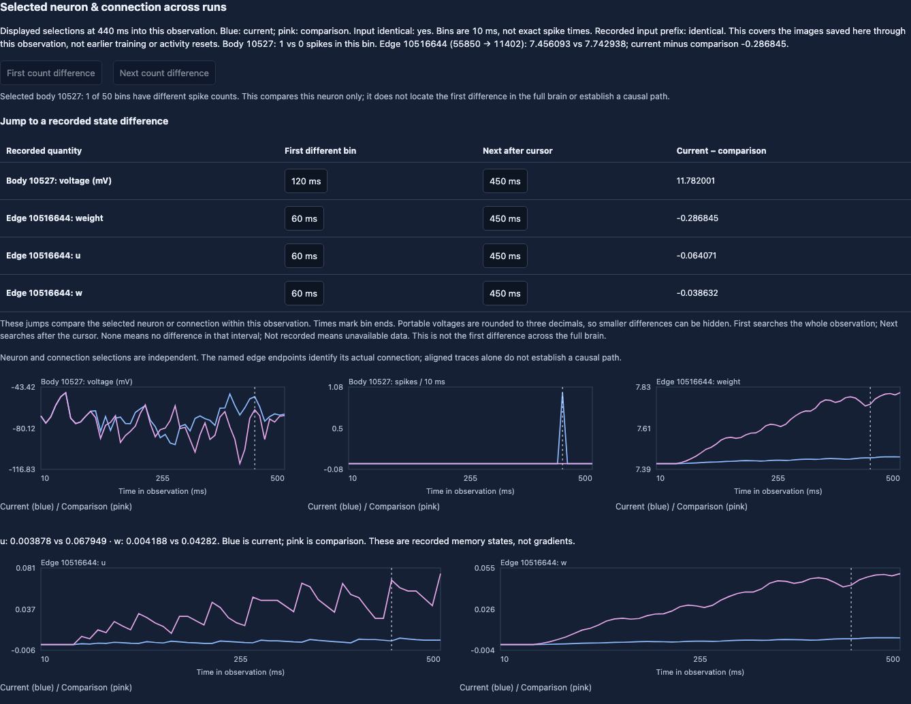

# Retain both traces and reduce update strength

**Completed and independently audited on September 13, 2026.** The original
call completed all five conditions: 15 observations and 750 bins. Its three
original controls reproduce exactly. The [execution record](../reports/fly-learning-scale-execution-01.json)
preserves the claim, audit, transfer and stopped temporary app. The conservative
compute estimate was $0.03514 against a $0.09759 reservation; the provider bill
has not been verified.

## Result

Lowering eta reduced later weight movement, but did not make the fixed decoder
less active. With recorded pulses, decisions changed from **BUY–HOLD–BUY to
BUY–BUY–BUY**. Without injected pulses, both rates produced BUY–HOLD–HOLD.

| Online condition | Image 1 update L2 | Image 2 update L2 | Image 3 update L2 |
| --- | ---: | ---: | ---: |
| Eta 0.001, recorded pulses | 0.2700 | 7.7658 | 8.4765 |
| Eta 0.0001, recorded pulses | 0.2329 | 0.7716 | 0.5103 |
| Eta 0.001, no injected pulses | 0.2700 | 5.3913 | 4.3675 |
| Eta 0.0001, no injected pulses | 0.2329 | 0.5250 | 0.3800 |

The frozen control has zero weight movement and BUY–HOLD–HOLD decisions. These
norms span all 7,835 plastic weights; they are not gradients or returns. The
original trained starting memory remains unchanged, so this experiment tests a
lower **online** rate rather than retraining that memory from scratch.


In image 2, both recorded-pulse runs have positive direction signals: +8 Hz at
the original rate and +10 Hz at the lower rate. Only the lower-rate run has a
gate spike, from body 10527 in the bin ending at 440 ms. That satisfies the fixed
decoder's gate and changes HOLD to BUY. It does not show that the extra trade
would have been useful.

The first image already differs in weights from the bin ending at 80 ms and in
sampled voltage from 130 ms, while its full-neuron spike-count bins still match.
In image 2, full-neuron counts first differ at 100 ms. These are recorded bin
ends, not exact event times or a demonstrated causal connection path.

## Open the audited recordings

The [audit](../reports/fly-learning-scale-audit-01.json) includes all conditions,
rule reconstructions, full-network comparisons and artifact identities. The
[portable archive](../reports/fly-learning-scale-views-01.zip) contains five
expanded views, five reports, the audit and saved-call receipt: 12 files,
compressed to 1.79 MB. It omits the 477 MB of raw artifacts; arbitrary full-neuron
lookup requires the separately retained arrays.

```sh
python3 -m zipfile -e reports/fly-learning-scale-views-01.zip runs/learning-scale-views
uv run python -m paperlab.debugger serve --out runs/learning-scale-views --port 8770
```

Inspect [the added gate spike in image 2](http://127.0.0.1:8770/?run=trained_low_eta_recorded_carry&compare=trained_online_recorded_carry&step=1&bin=43&neuron=10527&edge=10516644&pristine=1).
The selected neuron and connection are independent; edge 10516644 connects
55850 → 11402, not the selected gate neuron.



The [browser record](../reports/fly-learning-scale-browser-01.json) checks all
five views, 15 observations, 40 selected bins, displayed eta values, full-neuron
lookups and mobile layout. The extracted public archive receives the same
selected-curve checks, with explicit missing-array responses for full lookup.
No browser test submits a model run. Reproduce the chart from the published
audit without graph data, a credential or cloud compute:

```sh
uv run --extra plots python -m paperlab.fly_learning_scale_figure \
  --audit reports/fly-learning-scale-audit-01.json --out runs/learning-scale-figure
```

No policy is selected. The smaller update is verified; better trading is not.
The next evaluation needs fresh prospective data and fee-aware account outcomes,
including whether the extra decisions increase costly turnover. These three
historical images will not be relabeled as unseen performance data.

## Registered design

The [registered protocol](../reports/fly-learning-scale-protocol-01.json)
tests `eta = 0.0001` against the original `0.001`, retaining both KC and DAN
rate histories. The [memory reconstruction](fly-selective-traces.md#why-the-single-resets-move-weights-more)
motivates this choice: removing just one history leaves a large one-sided
earlier-image contribution. Reducing eta scales both terms together.

The full recurrent network can change its firing at the lower rate, so its
observed updates need not shrink by exactly tenfold. This was measured from
new native trajectories, with the previous curves retained as controls.
The first image may already differ; only the initial memory and dynamics are
required to match. Smaller updates do not by themselves establish better learning.

| Order | Learning | Injected pulses | Eta | Role |
| --- | --- | --- | ---: | --- |
| 1 | Online | Recorded | 0.001 | Original carry control |
| 2 | Online | None | 0.001 | Original carry control |
| 3 | Frozen | Recorded | 0.001, inactive | Original frozen control |
| 4 | Online | Recorded | 0.0001 | Lower-rate candidate |
| 5 | Online | None | 0.0001 | Lower-rate candidate |

Every condition uses the original trained memory, complete 166,700-neuron graph,
and same three historical images. Both rate histories carry between images;
there are no activity resets, new feedback calculations or accounts. The first
three conditions must reproduce every recorded count, sampled voltage, rate,
weight and `u/w` value before either candidate runs. Fifteen observations and
750 ten-millisecond bins are now captured and audited.

The independent auditor reconstructs the rule at each arm's declared eta,
checks boundary continuity and all full-graph weights, verifies the fixed
decoder and displayed curves, then compares both candidates with their matched
online controls. All original execution modules remain unchanged.

The [preflight record](../reports/fly-learning-scale-preflight-01.json) records
44 tests for eta propagation, frozen memory, wrong-rate rejection, protected
submission, bounded downloads and cloud budget limits. Nine retained original
control observations also reproduce through the new pure-rule auditor. These
are local validation results, with zero new neural propagation or cloud calls.

## One bounded cloud call

`scale_cloud.py` defines `fly-paper-scale-01`, with no schedule, one 2-CPU/8-GiB
non-preemptible container and a 360-second timeout. Capture has a 240-second
inner deadline. The worker shares the existing lease and $25 ledger, including
its 75% stop threshold. At 3× provider pricing and the existing 2× margin, the
maximum call reservation is **$0.0975912**. This is a conservative compute
estimate, not a provider invoice or a separate spending allowance.

Deployment and capture required the completed study 11 gate and previous audited
evidence. Inputs are installed in the image or transferred as the same exact
completed-study bundle. The worker persists a claim before constructing the
native brain; a failed or uncertain call cannot silently start again.

The original call is now complete. Reuse its saved output for receipt
verification; the persistent remote claim prevents another native capture.

```sh
PAPERLAB_FLY=1 PAPERLAB_UNIVERSE=1 \
  uv run --extra cloud modal deploy scale_cloud.py --env main

# Requires the retained parent payload and full recordings.
# Reuse this output for every later observation of the same call.
uv run python -m paperlab.fly_learning_scale_cloud \
  --payload runs/learning-scale-preflight-01/payload.json \
  --reference-recordings runs/credit-reset-01/cloud/artifacts \
  --completed-study runs/online-complete-audit-11 \
  --fly-data data/fly --out runs/learning-scale-01/cloud
```

The historical assay does not select a policy or report profit. Its inputs
cannot serve as fresh held-out performance data. Any candidate must subsequently
face a prospective comparison that includes fees, spread, slippage and hosting.
