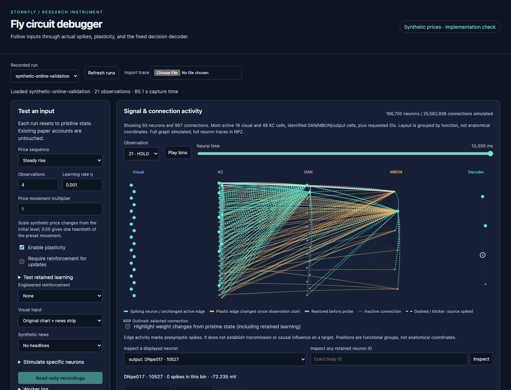
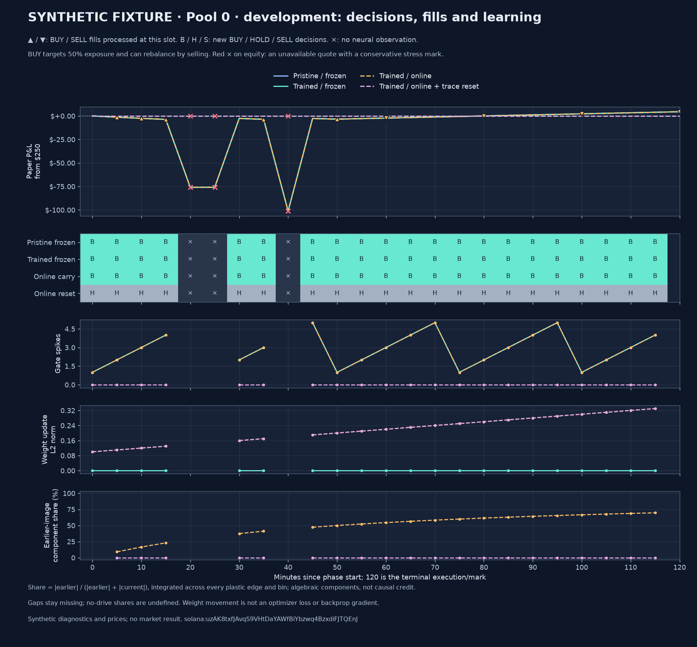

# Longer online learning comparison

The study 11 runner and offline auditor are implemented and tested, and the
once-only dispatcher is connected after the normal paper cycle. The
[registration](../reports/fly-market-study-11-preregistration.json), recorded
September 12, 2026 at 20:17:29 UTC, fixes development at **20:35–22:35 UTC** and
test at **22:35–00:35 UTC** (ending September 13). In Chicago these are
3:35–5:35 p.m. and 5:35–7:35 p.m. on September 12. The
[cloud arming check](../reports/fly-online-cloud-arming-11.json) verified that
the 20:25 worker committed the exact registration and execution-source hashes
at **20:25:47 UTC**, before development began. Its owning call
`fc-01M2BMPXVS3ZSQY2YVD4TN5RM1` completed with `paper_online_collecting`.
This proves prospective registration in the deployed worker; no study chunk
had run at that check, and no performance result is claimed.
The [validation record](../reports/fly-online-validation-01.json) retains the
native artifact/source hashes and the completed test scope.
The dispatcher retains owning Modal call/input IDs and persists development
selection before any test condition runs. Normal paper policies are unchanged.

The previous [trace-reset experiment](fly-debugger.md#learning-trace-reset-result)
showed that clearing only KC/DAN rate traces between images changes later online
updates and an action, while frozen spike counts remain unchanged. It did not
measure a profitable improvement. This follow-up extends the comparison from
three images to two hours of development and a separate two hours of test data.

## Registration description clarification

At **21:16:53 UTC on September 12**, a review found that the registration's
`hypothesis` field still contains study 10's neuron-stimulation description.
It is exactly the same sentence as in the parent registration. This is a
descriptive inconsistency in the original record and must remain visible when
reporting study 11 results.

The [dated clarification](../reports/fly-online-registration-note-11.json)
preserves that original sentence and the unchanged registration hash. Study 11's
pre-existing `arms`, `rationale`, `inference_protocol`, and `selection_rule`
explicitly define the online trace-reset comparison shown below. Those fields
match the cloud-pinned execution definitions; none of the four arms supplies
the recipient-current parameters used in study 10. The note was written after
collection began, before development ended and before any study 11 chunk was
computed. It is not a replacement or backdated registration, and changes no
candidate, window, cost, threshold, source file, or deployment.

## Fixed comparison

| Condition | Starting connection memory | Updates during each phase | Between observations |
| --- | --- | --- | --- |
| `pristine_frozen` | Native initial memory | Frozen | Carry activity |
| `trained_frozen` | Pinned paper-trained memory | Frozen | Carry activity |
| `trained_online_carry` | Same pinned paper memory | Online equity feedback | Carry activity |
| `trained_online_reset_rates` | Same pinned paper memory | Online equity feedback | Clear only `rate_kc` and `rate_dan` |

The definitions are in `paperlab/fly_online_protocol.py`. The timestamped
registration pins the completed mechanism report/audit, study 10 parent
plan/result, actual imported memory, and the future evaluation windows.

Each phase has **24 five-minute decision slots plus a terminal execution/mark**.
The two previously pinned pools, ALL and baton, retain their actual audited
paper memories. Each condition starts with two $250 accounts and $500 idle cash,
for $1,000 aggregate paper capital. Each pool, condition and phase starts with
fresh neural activity and its declared connection memory. Development accounts
and learned updates never become test initial state. This research comparison
is separate from the normal four-allocation paper portfolios.

All conditions receive the same sealed price history and causally available
news vectors. Each online condition computes its own feedback after executing
the preceding decision: equity change above $0.01 triggers reward, below
-$0.01 triggers aversive stimulation, otherwise no pulse. The existing 200 ms
pulse at current 20 and 500 ms neural observation remain unchanged. Online
plasticity remains enabled without a pulse. Missing quotes skip observation;
the first observation following an unpriced gap receives zero feedback.

The sole candidate is `trained_online_reset_rates`. Development selection
requires at least 18 of 24 observations **in each pool**, identical coverage
across conditions, and equity strictly higher than every control and cash plus
the declared hosting allocation. That allocation is $40/month prorated to two
hours on a 30-day month, or $0.111111 per $1,000 comparison. Fees, artificial
spread and slippage remain the existing adverse DEX scenario. Every test
condition is evaluated regardless of selection; no policy is promoted
automatically. Two pools and four hours cannot establish monthly profitability.

## Check coverage before the window closes

The [provisional coverage report](../reports/fly-online-coverage-11-01.json)
inspects a closed collector snapshot downloaded at **21:12:45 UTC**, with
coverage assessed through **21:10 UTC / 4:10 p.m. CDT**. It verifies raw receipt
identity, chronology, stored eligibility reasons, and the snapshot database's
integrity. The registration and execution-source hashes must match the cloud
arming evidence before the CLI produces a report.

| Pool | Eligible prior context | Usable development decision slots | Missing elapsed slots | Development slots still pending |
|---|---:|---:|---:|---:|
| ALL | 455 | 8 | 0 | 16 |
| baton | 434 | 8 | 0 | 16 |

All 24 test decisions were still pending in that snapshot. These are expected
neural-observation slots based on quotes, not completed brain captures or
successful trades. The 18-of-24 development coverage requirement had not yet
been met. Final coverage, news inputs, actions, returns and selection still
require the sealed four-hour window and its independent audits.

The checker uses the same quote selection and eligibility code as the
registered runner. It excludes the snapshot's open receipt minute and leaves
future slots unknown. Stale quotes, freshly received but ineligible pools,
repeated quotes and absent registered pools remain distinct. A synthetic gap
marker does not conceal the age of the last actual receipt. Terminal account
marks never count as neural observations. If observed plus remaining slots
falls below 18, the report marks that pool's coverage threshold unreachable;
it does not replace the pool, move the window, or change selection rules.

To inspect another snapshot, create a new output directory and download the
collector's published backup with authenticated Modal access:

```sh
uv run --extra cloud python - <<'PY'
from pathlib import Path
import modal
root = Path('runs/coverage-next')
root.mkdir(exist_ok=False)
volume = modal.Volume.from_name('fly-paper-lab-universe', environment_name='main')
with (root / 'universe.db').open('wb') as target:
    for block in volume.read_file('universe-snapshot.db'):
        target.write(block)
PY
uv run --extra cloud python -m paperlab.fly_online_coverage \
  --registration reports/fly-market-study-11-preregistration.json \
  --arming reports/fly-online-cloud-arming-11.json \
  --archive runs/coverage-next/universe.db \
  --out runs/coverage-next/coverage.json
```

The [validation record](../reports/fly-online-coverage-validation-01.json)
records seven passing tests for future/past separation, eligibility and gaps,
missing cohort members, terminal handling, registration/source drift and
preservation of earlier reports. Reproduce them with
`uv run --extra dev python -m pytest -q tests/test_fly_online_coverage.py`.

The [second snapshot](../reports/fly-online-coverage-11-02.json), assessed through
21:46 UTC on September 12, contains 15 usable development observations for ALL
and 14 for baton. Each still has nine pending development slots; all test slots
remain pending. This is provisional coverage, not a completed or selected model.

The [raw-receipt explanation](../reports/fly-online-coverage-note-11-02.json)
preserves baton's skipped 21:40 UTC decision. The last receipt was 73.36 seconds
old and had sufficient reported liquidity and volume, but only two buys in five
minutes, below the required three. It was an activity rejection, not a stale
receipt. The next eligible receipt arrived 25.13 seconds after the decision and
cannot be used to fill that earlier slot. The original pool, filters, window,
missing observation, and selection rule are unchanged. Both pools can still reach
the 18-observation minimum, but neither phase's final coverage is established.

At 22:06 UTC, a [subsequent snapshot](../reports/fly-online-coverage-milestone-11-01.json)
contained **19 usable development slots for ALL and 18 for baton**. Both have
accumulated the required minimum count. All previously assessed rows, including
baton's rejection, are unchanged. Each pool still has five pending development
decisions and 24 pending test decisions, so the phase coverage gate remains
pending. This establishes data availability only; it does not select a model or
replace the final sealed-input, news, native-state, and ledger audits.
The coverage check does not create a neural run, seal an experiment, audit news,
calculate a return, or select a policy.

The [development-window coverage record](../reports/fly-online-development-coverage-11.json)
uses a closed snapshot assessed through **22:39 UTC / 5:39 p.m. CDT on September
12**. The complete development time grid now meets the quote-observation
minimum for both pools:

| Pool | Usable development decisions | Missing decisions | Pending development decisions | Coverage minimum |
|---|---:|---:|---:|---|
| ALL | 24 of 24 | 0 | 0 | Met: at least 18 |
| baton | 23 of 24 | 1 | 0 | Met: at least 18 |

All 38 rows assessed in the earlier snapshot are unchanged, including baton's
21:40 UTC activity rejection. Both 22:35 UTC terminal marks have eligible quotes
and are excluded from the neural-observation counts. The same snapshot contains
one usable test decision for each pool; their other 23 test decisions remain
future or unknown at its endpoint. The observer confirms `test_collection`, with
zero of 16 chunks captured or audited. The four-hour window must still finish
before sealing, native evaluation, news/price auditing and model selection.

The [test-window coverage note](../reports/fly-online-test-coverage-note-11-01.json)
checks a later closed snapshot through **23:34 UTC / 6:34 p.m. CDT on September
12**. Each pool has eleven usable test decisions, one missing decision and twelve
pending slots. All 60 previously assessed rows remain unchanged. The shared
missing slot is 23:25 UTC: both selected receipts were fresh (82.24 seconds old),
but ALL reported only two sells and $424.30 five-minute volume, while baton
reported two buys and one sell. The unchanged filter requires at least three
buys, three sells and $1,000 five-minute volume.

Both next eligible receipts arrived at 23:25:15.53 UTC, after the decision. They
cannot replace the missed slot retroactively. This explains the recorded
activity rejection; it does not establish on-chain activity or attribute the
provider's reported values to the observed rate limits. Each pool can still
reach the eighteen-observation minimum with seven of its twelve pending slots,
but final test coverage, native evaluation and financial results remain pending.
The cohort, eligibility rules and deployed source remain unchanged.

The [next test-coverage milestone](../reports/fly-online-test-coverage-milestone-11-01.json)
uses a closed snapshot through **7:11 p.m. CDT on September 12 (00:11 UTC on
September 13)**. Both fixed pools have accumulated **18 usable test decisions**.
Each has two retained activity rejections and four pending decision slots; their
terminal marks also remain pending. All 80 rows assessed in the preceding
snapshot are unchanged.

ALL's test gaps are at 6:25 and 6:45 p.m. CDT; baton's are at 6:25 and 7:10 p.m.
The newer gaps come from reported five-minute volumes of $457.28 for ALL and
$869.18 for baton, below the unchanged $1,000 minimum. Both receipts were fresh
and had at least three buys and sells. Their next eligible receipts arrived
27.06 and 28.68 seconds after the respective decisions, so the gaps remain.

This reaches the minimum observation count in the downloaded snapshot, while
the final phase coverage gate remains pending. The window still ends at
7:35 p.m. CDT. Sealing, news and price audits, all sixteen native chunks and
their independent audits are still required; no learning or financial result
is inferred from the observation count.

The [complete-window coverage check](../reports/fly-online-window-coverage-11.json)
was downloaded at 7:37 p.m. CDT on September 12. Its closed archive extends
beyond the 7:35 p.m. endpoint. ALL has 24 development and 21 test observations;
baton has 23 and 22. All four coverage gates are met, the six missing decision
slots remain missing, and both test terminal quotes are eligible (49.01 seconds
old at the endpoint). All 98 previously assessed rows are unchanged. The third
ALL test gap was at 7:25 p.m.: its receipt was 50.32 seconds old, but reported
five-minute volume was $828.23, below the unchanged $1,000 minimum despite
13 buys and 25 sells. This quote check does not seal the worker's plan or audit
news, model activity, fills or returns. The 7:35 worker completed normally and
waited for the snapshot; the scheduled evaluation still needs its sealing
receipt and all sixteen independently audited chunks.

The 7:40 worker then [sealed the inputs](../reports/fly-online-sealed-inputs-11.json)
and began `development-pool0-pristine_frozen`. The independent input audit at
7:43 p.m. CDT reconstructed every retained price, all 49 timestamp-eligible news
vectors, and all 100 decision/terminal slots. Each pool retains 512 context rows;
three post-endpoint receipts per pool are excluded. All slot availability and
times match the preceding coverage check. This verifies the sealed inputs;
the sixteen native captures, their full recording audits and final financial
comparison remain separate requirements.

## Complete recordings and audit

There are 16 complete chunks: two pools × four conditions × two phases.
A chunk captures an entire two-hour phase in one invocation; it does not resume
partially saved neural dynamics. The runner refuses to overwrite an existing
output. Test chunks require all eight development summaries before loading
the graph. Before the first market window starts, the scheduled worker must
commit an arming receipt that pins the registration, runner/auditor modules,
native sources and deployed worker source. Missing that deadline stops this
registration; the worker does not silently move its windows.

Each scheduled call commits its normal paper cycle first. Research is deferred
if that cycle took over 90 seconds or insufficient call time remains. Sealing
and each chunk have durable claims before work begins; failed and uncertain
claims are never retried or skipped. Source or registration changes before
study completion stop research. Selection is committed with its own receipt
after all eight development chunks and before any test chunk. All sixteen
capture results still require independent audits before publication.

The existing single worker, 600-second reservation and $25 monthly worker cap
remain unchanged, as does the separate $15 collector cap. No GPU is added.
After the four-hour market window, sixteen worker slots take roughly another
80 minutes if every slot can run a chunk; missing data, long paper cycles or
provider interruptions can delay or stop execution. Full recordings remain on
the existing volume. Modal currently lists volume storage at $0.09/GiB-month
with 1 TiB/month included, separately from compute; account-wide consumption
determines any actual charge ([pricing, checked September 12, 2026](https://modal.com/pricing)).

For each eligible observation, retain all 50 native bins, all neuron counts and
voltages, every plastic weight and `u/w` update, before/after boundary arrays,
complete end dynamics, input pixels, and the paper ledger. The independent
auditor reconstructs the original visual model's fixed R8-to-aMe12 sign
corrections from locked graph data and annotations before checking whole-graph
weights. It then reconstructs the rate rule for every plastic connection and
bin, validates the fixed decoder, and replays fills and equity feedback.

Full float32 weights must match exactly. Reconstructed rate and `u/w` arrays
use relative tolerance 1e-11 and absolute tolerance 1e-12. Only the derived
float32 update norm receives the existing four-ULP reduction allowance.
End-state continuity checks cover reset targets, untouched state and clocks.
News and raw price audits retain all decision slots, disappeared pools and
late/unavailable observations.

The synthetic native validation recorded 21 eligible observations and three
missing decision slots, covering **1,050 bins × 7,835 plastic connections**.
The runner took approximately 90 seconds locally. This is a runtime measurement
for this fixture, not a cloud timing promise. Raw artifacts occupied about
766 MB; full experiment storage/transfer therefore needs to be accounted for
before scheduling. No recorder output is silently reduced to three images.

The browser check covers all 21 observations, 84 selected bins, all 24 decision
slots and the terminal mark, online/reset labels, frozen-control labels, a
recording larger than the former 15 MB import ceiling, and mobile overflow.
The import limit is now 64 MiB. Every model-submission request is blocked during
this check. Audited synthetic inputs receive an explicit implementation-check
badge; the screenshot below contains no real market performance claim.



## Check full-phase plots against the recordings

The [additional projection check](../reports/fly-online-view-projection-01.json)
re-audits the retained 21-observation synthetic validation run, then verifies
every original displayed connection and base chart against the graph and full
arrays. It checked **93 selected neurons, 967 connections and 1,050 bins**.
No incorrect plotted values were found. The earlier topology/chart checker
accepted only three-image mechanism views; its observation count is now explicit
and bounded to 1–24, while existing mechanism callers still default to three.

`paperlab.fly_online_projection` first repeats the independent ledger, news,
image, boundary, fixed-decoder and full plasticity audit. It then checks neuron
identity/group labels, every selected-subgraph edge including nonplastic ones,
all spike/voltage samples, population and whole-brain curves, weight and memory
curves, and cumulative neuron totals across the entire phase. Missing market
decisions do not become fabricated frames. An empty phase has no neural view
and is reported explicitly rather than marked as a verified plot.

The command writes a fresh `audit.json`, `report.json` and, when observations
exist, the expanded `view.json`. An optional `--view` must match the original
expanded view reconstructed by the fresh independent audit, including credit
and boundary panels. This entrypoint does not accept a manually reselected
subgraph. Earlier evidence is preserved; use a new output directory each time.

After the cloud observer has downloaded a complete chunk, run:

```sh
uv run --extra dev python -m paperlab.fly_online_projection \
  --root runs/online-cloud-11/chunks/development-pool0-trained_online_reset_rates \
  --fly-data data/fly \
  --out runs/online-projection-development-pool0-reset
```

This only reads retained recordings and reconstructs their results. It does not
construct a native brain, propagate new activity, submit a cloud call or select
a policy. The validation used synthetic prices and remains explicitly labeled;
it is not a study 11 market result. The live study's 56 pinned source files are
unchanged, and this additional check is a separate post-capture command.

The [regressions](../reports/fly-online-view-projection-validation-01.json) cover
1, 3, 21 and 24 observations, corruptions after the first three frames, wrong
cumulative totals and time grids, missing frames, inconsistent expanded panels,
and unobserved phases. The retained-data integration forbids construction of
`MemoryBrain` while checking all 21 observations. The browser check also passed
on the newly audited view, including all 84 selected bins, the large-file import
and mobile layout. Its import wait now checks the loaded filename: the previous
wait could accept dropdown options left over from the server-loaded recording
before the asynchronous file read finished. This corrected a test race; no
recorded action or application behavior was changed.

To reproduce the retained-data integration,
set the first path to the retained synthetic native-check chunk:

```sh
FLY_ONLINE_RECORDINGS="$PWD/runs/online-native-check-01/test_native_long_online_chunk_0/online" \
FLY_TRACE_DATA="$PWD/data/fly" \
  uv run --extra dev python -m pytest -q \
  tests/test_fly_online_projection.py::test_retained_full_phase_without_constructing_a_brain
```

## Run the implementation checks

From the repository root, with the full graph prepared using the
[existing setup instructions](fly-debugger.md):

```sh
FLY_TRACE_DATA="$PWD/data/fly" uv run --extra dev pytest -q \
  tests/test_fly_online.py::test_native_long_online_chunk_reconstructs_feedback_boundaries_and_every_bin \
  --basetemp=runs/online-native-check-02

# Re-audit retained recordings; this loads arrays but does not simulate a brain.
uv run python -m paperlab.fly_online_audit \
  --root runs/online-native-check-02/test_native_long_online_chunk_0/online \
  --fly-data data/fly --out runs/online-native-check-02/offline-audit

# Read-only viewer. It does not need the graph and cannot submit model work.
uv run python -m paperlab.debugger serve --out runs/online-native-check-02 --port 8767
```

In that viewer, select `offline-audit` or import its `view.json`. Pytest owns and
recreates its `--basetemp` directory; use a new directory when preserving an
earlier fixture. The audit CLI also refuses to overwrite existing output.

With Playwright/Chromium installed and that server running:

```sh
FLY_VIEW_URL=http://127.0.0.1:8767 \
FLY_ONLINE_VIEW=runs/online-native-check-02/offline-audit/view.json \
node scripts/check-fly-online-view.cjs
```

The browser check also reads the shipped frozen control at
`examples/fly-debugger/market10-pool0-trained_frozen/view.json`. It replaces only
browser read responses with fixtures, and aborts `/api/run`.

`python -m paperlab.fly_online_study --help` describes the complete-chunk CLI.
Use it only with a sealed study 11 plan and the matching memory/news archives.
The CLI does not create a registration or schedule a cloud job. Deployment uses
the already authorized app and all five feature flags:

```sh
PAPERLAB_SCHEDULE=1 PAPERLAB_FLY=1 PAPERLAB_UNIVERSE=1 \
PAPERLAB_PAPER_STUDY=1 PAPERLAB_ONLINE_STUDY=1 uv run --extra cloud modal deploy cloud.py
```

This requires the two verified private memory exports already described in
the checkpoint study setup. Keep the registration and pinned execution sources
unchanged until completion. The dispatcher writes receipts and snapshots below
`/state/registered-paper-11`; actual chunk artifacts live in
`chunks/<phase>-pool<index>-<arm>/artifacts`. An absent or timed-out observation
of a call does not authorize another submission. Fresh data, prospective cloud
receipts and complete comparison audits are required before reporting a result.

## Observe the scheduled experiment

The observer reads the existing volume and reattaches saved owning calls. It
does not invoke a worker, resume partial neural state, or submit model compute.
From a checkout matching the pinned execution sources, with Modal authenticated:

```sh
uv run --extra cloud python -m paperlab.fly_online_cloud \
  --registration reports/fly-market-study-11-preregistration.json \
  --out runs/online-cloud-11
```

Before the endpoint, this reports the registered collection phase. Afterward,
it verifies completed chunk summaries and the development-selection receipt.
An in-flight owning call is reported as pending, including when a completed
chunk is waiting for its outer worker to return. Repeat the same command to
observe it again. The last successful observation is saved in `progress.json`
with an observation timestamp; it is not a continuously refreshed status page.

Once chunks become available, download and independently audit their full
recordings using the prepared graph:

```sh
uv run --extra cloud python -m paperlab.fly_online_cloud \
  --registration reports/fly-market-study-11-preregistration.json \
  --out runs/online-cloud-11 --audit --fly-data data/fly

uv run python -m paperlab.debugger serve \
  --out runs/online-cloud-11/views --port 8767
```

Allow approximately 12–15 GB locally for the full recordings, based on the
native validation fixture; actual size depends on eligible observations. The
observer reuses verified downloads and links the full neuron recordings into
each view without duplicating their data. Repeating the audit command rechecks
every available chunk. To wait for all sixteen captures and perform the full
audit once, use the read-only watcher on macOS or Linux:

```sh
uv run --extra cloud python -m paperlab.fly_online_watch \
  --registration reports/fly-market-study-11-preregistration.json \
  --out runs/online-cloud-11 --fly-data data/fly --timeout 10800
```

The watcher follows existing call IDs, checks the same source pins and receipts,
and never submits work, clears a cloud lease or changes deployment. An operating
system lock prevents concurrent watchers using the same download directory.
`watch.json` records observation, audit, completion, timeout or failure; a local
observation timeout does not mean the cloud job failed. The timeout bounds the
waiting period, while an audit already started can finish. Run the same command
to resume after the previous watcher exits; completed downloads remain verified.
Transient connection errors stop the local observer with an explicit error;
inspect it and resume the same output rather than creating another cloud call.
This convenience wrapper does not replace the independent audit or its sixteen
required conditions. The [watcher validation](../reports/fly-online-watch-validation-01.json)
records 33 passing checks of simulated transport and the existing observer,
plus a live read-only call observation. These do not create new neural or trading
evidence.

These local inspection commands can exit while cloud
collection and scheduled evaluation continue with the laptop closed.

The raw price archive is audited before any neural recording is downloaded.
Each view is published only after its complete chunk audit passes. The final
`report.json` requires all sixteen independent audits, matching native builds
and fresh starting states, and development selection preceding every test
chunk. Partial audited views are useful for diagnostics; they are not a
completed comparison. The report retains every condition's development/test
equity and coverage and never promotes a policy automatically.

In the viewer, select `development-pool0-trained_online_reset_rates` and compare
it with `development-pool0-trained_online_carry`. Follow the learning-drive
plot, connection `u/w`, gate spikes and subsequent fills across observations;
repeat for pool 1 and the separate test phase. The reset clears KC/DAN **firing
rate traces**, not a learning-rate hyperparameter or stored connection memory.
Keep the pinned execution sources unchanged until capture and audits finish.
The original attempt subsequently failed; its explicit recovery amendment below
retains those sources and uses a separate cloud app and artifact namespace.

## Recover the news-audit failure

The original third condition, `development-pool0-trained_online_carry`, failed
before creating a native brain at 00:51 UTC on September 13 (September 12 CDT).
Its exact Modal call returned `ValueError: Sealed news differs from
timestamp-eligible archived revisions`. The
[failure record](../reports/fly-online-failure-11.json) preserves the owning call,
input, original receipt and cross-process reproduction. The original watcher
stopped; restarting that watcher cannot repair a terminal failed condition.

`News.features` accumulates float32 values by iterating a set of headline tokens.
Python hash randomization changes token order. For colliding hashed channels,
addition order changes the last few bits. Four of eight tested hash seeds differ
from the sealed vectors, by at most `5.960464477539063e-08`. Seed 0 exactly
reconstructs all 49 vectors. The raw news archive, price archive and sealed plan
hashes match. Exact validation exposed nondeterministic reconstruction, not a
different news archive. Its tolerance has not been widened.

Reproduce the process dependence without a model or cloud call:

```sh
uv run python scripts/check-news-hash-seeds.py \
  --plan runs/online-cloud-11/plan.json \
  --news runs/online-sealed-input-audit-11/news.db \
  --out runs/news-seed-check-new.json
```

The first two controls completed and passed independent ledger, input-image,
full-bin learning/state and plotted-series audits under `PYTHONHASHSEED=0`.
No model was constructed or propagated during these local audits.

| ALL development control | Decisions | Native bins | Ending equity from $250 |
|---|---:|---:|---:|
| Pristine, frozen | 24 | 1,200 | $205.278327 |
| Previously trained, frozen | 24 | 1,200 | $207.317808 |

These are partial development results including simulated trading costs,
excluding hosting. Both lose money; no development selection or test result
exists from this original attempt. The
[first](../reports/fly-online-control-first-11.json) and
[second](../reports/fly-online-control-second-11.json) projection records retain
the artifact and audit hashes. The [browser check](../reports/fly-online-controls-browser-11.json)
verified all 48 actions, 192 selected bins, 24 paired timestamps, large-file
import and mobile layout, with zero model submissions. In the running local
viewer, [inspect the first different action](http://127.0.0.1:8766/?run=online11-development-pool0-trained_frozen&compare=online11-development-pool0-pristine_frozen&step=11&bin=32&neuron=10527&pristine=1).
The complete private recordings are required to reproduce these views.

The [control timeline](assets/fly-online-controls-equity-11.svg) aligns paper
equity, inventory exposure and all decoder decisions. Its
[data record](../reports/fly-online-controls-figure-11.json) contains the plotted
values and source hashes. Regenerate it from the audited summaries:

```sh
uv run --extra plots python scripts/plot-fly-study-controls.py \
  --chunks runs/online-cloud-11/chunks --out runs/control-figure-new
```

The [recovery amendment](../reports/fly-online-recovery-protocol-11.json) retains
the original failed attempt and its two audited controls. A separate temporary
Modal app, `fly-paper-recovery-11`, starts fresh interpreters with
`PYTHONHASHSEED=0`, verifies all 56 original execution sources and the exact
sealed news vectors, then captures the remaining fourteen conditions in order.
It writes only to `registered-paper-11-recovery-01` and the shared budget ledger.
The main deployed paper-trading app and its original study receipts are unchanged.

Each recovery call uses the existing worker lease, two CPUs, 8 GiB, a 600-second
timeout, no platform retries, the same $25 monthly worker cap, and a separate
$0.80 maximum conservative compute reservation for the fourteen captures.
Its five-minute schedule is offset by two minutes; overlapping calls skip while
the shared lease is held. A failed or interrupted capture prevents progression.
Development selection uses the original rule and is saved after eight complete
development conditions, before any test capture. No account or learned state
flows from development into test.

This is an explicit recovery amendment, not an unmodified successful original
experiment. The fixed seed addresses this archive's reconstruction; it is not a
general replacement for a canonical token-order encoder in future experiments.
All recovered conditions still need full recording audits and separate
amendment provenance before a full comparison can be reported. Do not pass the
incomplete original attempt to the selective-trace study's completion gate.

Deployment from the pinned checkout requires the original private memory exports
and authenticated Modal access:

```sh
PAPERLAB_FLY=1 PAPERLAB_UNIVERSE=1 PAPERLAB_PAPER_STUDY=1 \
  PAPERLAB_ONLINE_STUDY=1 uv run --extra cloud modal deploy recovery_cloud.py
```

This deploys only the separate recovery app. Stop that temporary app after its
captures are complete. The normal main app remains deployed independently.

The first recovery deployment failed during import because `cloud.py` was not
packaged at an importable path. No recovery protocol or neural claim was created.
That app was stopped and its saved call confirmed terminal; the
[startup record](../reports/fly-online-recovery-startup-11.json) and
[initial protocol](../reports/fly-online-recovery-protocol-11-initial.json) remain
available. The corrected entrypoint explicitly packages its dependency and runs
an import smoke check during image build. A local isolated import test also
passes using only the declared Python files. The active amendment changes only
its packaging source pin and creation time; all original study inputs and
execution sources remain unchanged.
The [validation record](../reports/fly-online-recovery-validation-11.json) includes
14 passing dispatch/import tests and the successful Modal import-check build.
That check uses a Modal build function because the platform injects its SDK into
function containers; a plain image-shell command does not have that SDK.

## Compare the full financial and neural timelines

After the observer has written its fully audited `report.json`, export the
comparison and four per-pool/per-phase diagnostic figures:

```sh
uv run --extra plots python -m paperlab.fly_online_figure \
  --root runs/online-cloud-11 --out runs/online-cloud-11/figures
```

This reads existing evidence and runs no model. It requires all sixteen chunk
audits, verifies their file hashes against the report, reconstructs the saved
development choice, and reconciles each displayed slot with its ledger and
neural audit. It refuses to overwrite an existing figure directory.

`comparison.png` and `.svg` show both complete equity timelines, fees, fills,
observation coverage, and the fixed development decision. The four other
PNG/SVG pairs align per-pool equity with new actions, gate spikes, full-edge
weight-update norms, and the earlier-image share of integrated absolute
learning-drive components. Gaps remain missing in neural plots; a zero-drive
share is undefined rather than plotted as zero. Red crosses on equity mark
unavailable quotes and their conservative stress values.

Fill triangles are placed at the decision slot that processes the earlier
order, and the exported rows retain its exact decision and quote/fill times.
The fly's BUY means target 50% exposure; a price rise can therefore cause a
SELL fill while rebalancing to that target. An action label and a fill side
must not be interpreted as interchangeable.

`diagnostics.md` links each shared observation directly to the paired online
carry/reset debugger views on port 8767. Links use observed frame indices, so
a missing market slot cannot shift the selected neural observation. The
accompanying `figures.json` preserves all plotted rows, paired action changes,
equity differences, and source/report/figure hashes. The component share is
an algebraic description of recorded learning drive, not causal attribution
or a backprop gradient. Policy selection remains fixed before test.

The example below uses **synthetic prices and synthetic neural diagnostics**
with the actual paper ledger implementation. It verifies layout, missing-data
handling, rebalance fills, and links; its values are not native-model or market
results. The [figure validation record](../reports/fly-online-figure-validation-01.json)
keeps these checks separate from the earlier full-native validation.



Reproduce this fixture without downloading the graph or submitting cloud work:

```sh
uv run --extra dev --extra plots pytest -q tests/test_fly_online_figure.py \
  --basetemp=runs/online-figure-validation
```

The rendered files appear under
`runs/online-figure-validation/test_render_produces_all_five_0/figures`.
Use a fresh `--basetemp` directory to preserve previous validation evidence.
