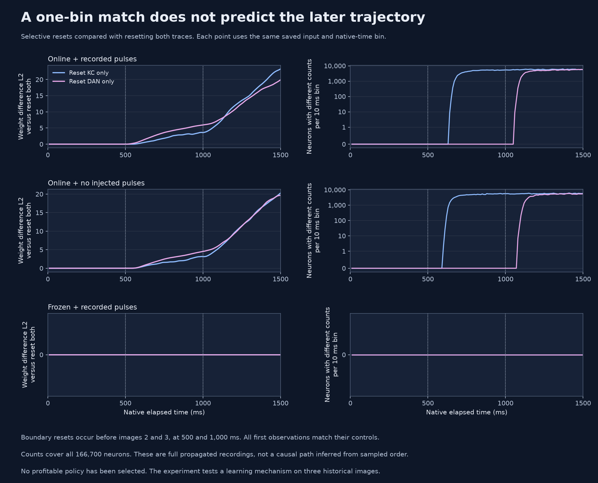
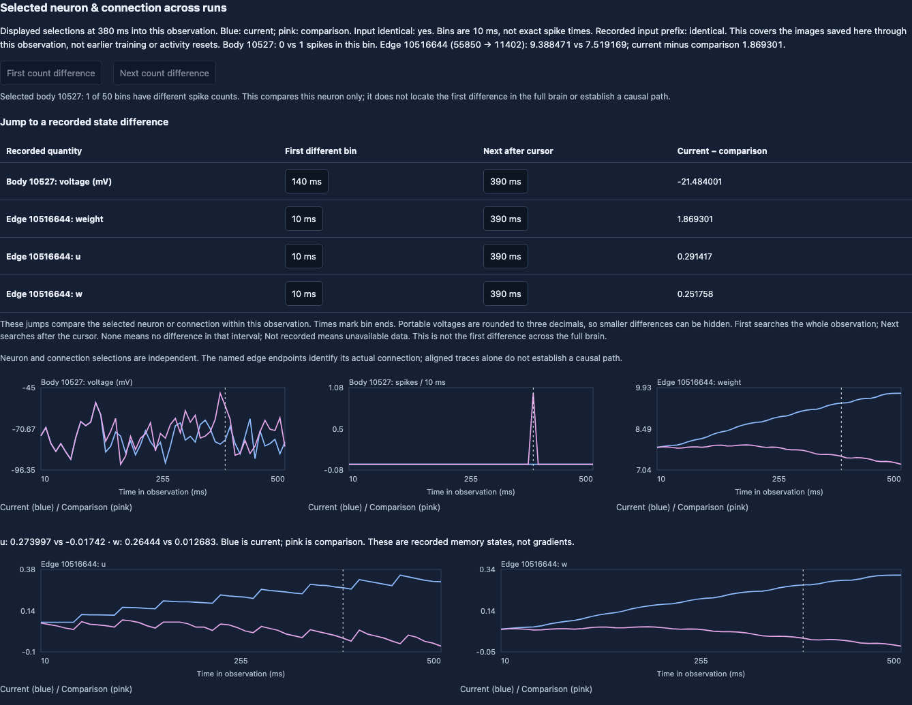

# Separate KC and dopamine trace resets

**Completed and independently audited on September 13, 2026.** All twelve
conditions finished in the original call `fc-01M2CFZMKK47PAV05S2QKSJ09D`:
36 observations, 1,800 bins, and all six original controls reproduced. The
[execution record](../reports/fly-selective-execution-01.json) preserves the
once-only claim, completed-study gate and terminal evidence. The temporary app
was stopped after audit; the scheduled paper lab remains deployed. This assay's
conservative compute estimate was $0.07512, against a $0.16089 reservation.
These are internal estimates, not a verified provider bill.

## What changed

With recorded reinforcement pulses, resetting either KC or DAN history removes
the extra BUY on the third image. However, neither reproduces the complete
both-reset trajectory, and each produces larger late weight movement:

| Boundary operation | Third decision | Gate spikes | Direction | Image 3 weight movement L2 |
| --- | --- | ---: | ---: | ---: |
| Carry both | BUY | 1 | +12 Hz | 8.4765 |
| Reset both | HOLD | 0 | +8 Hz | 3.3418 |
| Reset KC only | HOLD | 0 | +6 Hz | 19.6743 |
| Reset DAN only | HOLD | 0 | 0 Hz | 17.9639 |

These norms measure changes across 7,835 plastic weights during image 3, not
loss gradients. The same increased late movement occurs without injected pulses.
All frozen controls retain identical recorded counts, sampled voltages and
connection memory. Every condition is shown below, including unchanged decisions.


The KC-only and both-reset weights agree through the first four bins of image 2,
then first differ in the bin ending at 50 ms. Their sampled voltages first differ
at 70 ms and full-neuron counts at 140 ms. DAN-only versus carry has the same
first-difference times for that image. The first-bin reconstruction was correct,
but it did not predict the later recurrent trajectory. These are bin ends, not
exact spike times or proof that a particular edge caused the decision change.



Clearing one history leaves the other term in the learning rule. It changes both
subsequent activity and accumulated `u/w`; it is not a selective removal of
unhelpful credit. No memory saturation occurred in these recorded online bins.
The current evidence does **not** justify selecting either single-trace reset.
This historical assay recomputes no trades, feedback or accounts, so it provides
no financial ranking of the resets. Study 11's prospective both-reset candidate
also failed its development criterion. A smaller update is not itself evidence
of better learning; any next candidate needs a fresh cost-aware comparison.

## Inspect or reproduce the result

The [full audit](../reports/fly-selective-audit-01.json) contains every condition,
rule reconstruction, paired difference series and artifact hash. The
[figure record](../reports/fly-selective-figures-01.json) records the plotted data
and source hashes. Recreate both charts without graph data, credentials or a model:

```sh
uv run --extra plots python -m paperlab.fly_selective_trace_figure \
  --audit reports/fly-selective-audit-01.json --out runs/selective-figures
```

The [portable archive](../reports/fly-selective-views-01.zip) contains twelve
expanded views, their reports, the independent audit and saved-call receipt:
26 files compressed to 3.75 MB. The installed views exactly match the audited
local receipt. It omits the 1.13 GB of full arrays, which remain in the original
cloud volume and local `artifacts/` directory. The archive transports audited
evidence; it does not replace a new audit of those full recordings.

```sh
python3 -m zipfile -e reports/fly-selective-views-01.zip runs/selective-views
uv run python -m paperlab.debugger serve --out runs/selective-views --port 8768
```

After starting the server, inspect image 3 at the original carry gate spike:

- [KC-only versus carry](http://127.0.0.1:8768/?run=trained_online_recorded_reset_kc&compare=trained_online_recorded_carry&step=2&bin=37&neuron=10527&edge=10516644&pristine=1).
- [DAN-only versus carry](http://127.0.0.1:8768/?run=trained_online_recorded_reset_dan&compare=trained_online_recorded_carry&step=2&bin=37&neuron=10527&edge=10516644&pristine=1).
- [KC-only versus both reset, image 2](http://127.0.0.1:8768/?run=trained_online_recorded_reset_kc&compare=trained_online_recorded_reset_rates&step=1&bin=4&neuron=11402&edge=10516644&pristine=1).



Neuron 10527 and edge 10516644 (55850 → 11402) are independent selections. Their
aligned plots do not establish a causal path between that edge and the gate.
The browser checks covered all 12 views, 36 observations, 84 selected bins,
12 full-neuron lookups and mobile layout, with no script errors or model writes.
The separately extracted public archive is checked with explicit missing-array
responses for full-neuron lookup; its selected curves remain available.

Full local lookup uses the verified `step-*.npz` recordings in each view folder.
The original observer installed JSON views; verified hard links from `artifacts/`
make these arrays available locally without copying or constructing the network.
Neither read-only server has model execution enabled.

## Registered question

The [first-drive reconstruction](fly-debugger.md#why-a-quiet-source-connection-can-still-update)
found that earlier KC activity accounts for the first differing weight updates
while the connected KC neurons are silent. Replacing KC history in one recorded
bin reproduces the both-traces-reset weights; replacing DAN history does not.
That calculation holds firing fixed. It cannot tell us what separate resets do
to later firing, memory, or decisions.

The [new protocol](../reports/fly-selective-trace-protocol-01.json) tests that
question with the complete native graph: 166,700 neurons, 25,582,938 edges, and
7,835 plastic connections. It uses the same three historical market images and
initial trained memory as the completed credit-reset assay.

| Boundary before images 2 and 3 | KC trace | DAN trace | Role |
|---|---|---|---|
| Carry | Retained | Retained | Reproduce prior control |
| Reset both | Zeroed | Zeroed | Reproduce prior intervention |
| Reset KC only | Zeroed | Retained | New intervention |
| Reset DAN only | Retained | Zeroed | New intervention |

Each row is tested with learning plus recorded pulses, learning without injected
pulses, and frozen memory plus recorded pulses: **12 conditions, 36 observations,
and 1,800 recorded ten-millisecond bins**. All counts are now verified. All six prior
conditions must reproduce their complete count, sampled-voltage, weight, memory,
and rate recordings before either new intervention runs. Every first image starts
from identical dynamics. The frozen selective conditions must retain every
recorded count and voltage sample as well as unchanged connection memory.

The runner saves all boundary arrays and full-network recordings. Its independent
auditor reconstructs the plasticity rule and fixed decoder, checks continuity
between observations, and compares each new condition against both controls.
The output is installed in the paired debugger, including memory-drive curves
and first-difference navigation. Native execution, its independent audit and
browser verification of the new recordings are complete.

## What has been checked

The [preflight record](../reports/fly-selective-trace-preflight-01.json) verifies
all 84 parent artifacts, then applies all four operations to copies of six
recorded boundary states. All 24 checks preserve the clock, connection memory,
and full weight array; only the specified rate fields change. All 21 native
dynamic fields are checked. This is saved-array manipulation, with **zero new
neural observations and zero cloud submissions**.

The [validation record](../reports/fly-selective-trace-validation-01.json) also
covers tampered arrays with recomputed hashes, changes to untouched fields or
nonplastic weights, missing state, dtype changes, first-image behavior, and
refusal to execute before the actual study 11 has completed and been audited.
These checks do not prove that the new intervention improves learning.

## Check what the debugger draws

The [projection audit](../reports/fly-view-projection-01.json) checks the six
existing carry/both-reset views against verified graph data and their full
recordings: 18 observations and 900 bins. Every selected neuron, displayed
connection, and plotted series passed. This includes nonplastic connection
endpoints and baseline weights, every edge between selected neurons, population
and whole-brain spike curves, trace averages, changed-edge counts, and weight
distance from both the observation start and pristine memory. It also checks
per-neuron spike totals across the three observations.

The new selective auditor now requires these checks. Its earlier selected-memory
checks covered spikes and plastic edges but did not cover every aggregate curve
or nonplastic edge. This was a verification gap; the stronger checks found no
incorrect values in the six existing views. Float32 norm reductions receive a
four-ULP rounding allowance; underlying displayed samples must match exactly.

The [regression record](../reports/fly-view-projection-validation-01.json) includes
wrong-curve and wrong-connection fixtures that previously passed the narrower
memory-enrichment helper, plus tests for altered images and retimed spikes whose
whole-observation count totals remain equal. These are deliberate test mutations,
not observed model failures. The graph check loads data without constructing a
native simulator or changing the active cloud deployment.

```sh
uv run --extra dev python -m paperlab.fly_view_projection \
  --audit reports/fly-credit-reset-audit-01.json \
  --artifacts runs/credit-reset-01/cloud/artifacts \
  --fly-data data/fly \
  --out runs/view-projection-new

# Optional retained-data regression; requires the prepared graph and recordings.
FLY_CREDIT_RESET_RECORDINGS="$PWD/runs/credit-reset-01/cloud" \
FLY_TRACE_DATA="$PWD/data/fly" \
  uv run --extra dev python -m pytest -q tests/test_fly_view_projection.py
```

## Reproduce the preflight

This requires the previously downloaded credit-reset cloud artifacts and original
payload from the [parent assay workflow](fly-debugger.md). The artifacts are
private local recordings; a fresh clone does not contain them. This command does
not construct the native brain or submit a Modal call. Choose a new output path
each time; earlier evidence is never overwritten.

```sh
uv run --extra dev python -m paperlab.fly_selective_trace \
  --parent-payload runs/credit-reset-01/payload.json \
  --parent-audit reports/fly-credit-reset-audit-01.json \
  --reference-recordings runs/credit-reset-01/cloud/artifacts \
  --out runs/selective-trace-preflight-new

# Set this only when the retained recordings are present; otherwise that one
# data-dependent test skips explicitly. No test below propagates the graph.
FLY_CREDIT_RESET_RECORDINGS="$PWD/runs/credit-reset-01/cloud" \
  uv run --extra dev python -m pytest -q tests/test_fly_selective_trace.py
```

## Carry the completed study evidence

The local observer produces the study 11 audits, while the next native assay will
run in Modal. `paperlab.fly_study_evidence_bundle` provides that handoff. It copies
exactly 51 JSON files: the report, sealed plan and price audit, plus all 16 chunk
summaries, independent audits and completed-call receipts. The original bytes
and their SHA-256 hashes are preserved. Full recordings and the market database
stay with the original audit evidence; this package does not replace their audit.

Packing validates a private copy through the existing study completion gate.
Unpacking requires the bundle hash recorded at packing, validates that same gate
before creating the destination, and checks the installed evidence again. The
gate requires the actual study 11 registration, all completed audits and an ended
window; synthetic fixtures cannot pass. A completed negative result can pass
this handoff, since it authorizes a later mechanism test, not a policy promotion.

**The actual study 11 completion bundle passed its gate on September 13, 2026.**
All sixteen recording audits are complete, with 360 observations and 18,000 bins.
The [result and evidence archive](fly-online-comparison.md#final-audited-result)
preserve the failed development outcome and both disclosed amendments. The
51-file native-assay bundle has report SHA-256
`e707f1b783d19a790e11cd635a04ecf716cb33539bfdb4fe1c6ee2a4bb9efdba` and
bundle SHA-256 `c81d685e587e258f8702102aa6da702c3b7f5c7ea6112349f47d48ecf769fbc8`.
These commands perform local file operations and do not upload, deploy or submit
a Modal job:

```sh
uv run --extra dev python -m paperlab.fly_study_evidence_bundle pack \
  --study runs/online-complete-audit-11 \
  --out runs/study-11-completed-evidence.json

# Retain the bundle_sha256 printed above as the expected transfer identity.
uv run --extra dev python -m paperlab.fly_study_evidence_bundle unpack \
  --bundle runs/study-11-completed-evidence.json \
  --sha256 '<bundle_sha256 printed by pack>' \
  --out runs/study-11-restored-evidence
```

Both commands refuse existing outputs. The file allowlist rejects extra paths,
missing files and duplicate JSON keys; source files and directories cannot be
symlinks. Limits are 32 MiB per decoded file, 128 MiB total decoded evidence and
192 MiB for the bundle. If final evidence exceeds a limit, transport stops; it
does not omit or truncate any audit.

The transport regression uses explicitly synthetic study fixtures with only the
release decision mocked. It still checks all 16 chunk ledgers and audit/receipt
relationships, compares all 51 restored files byte for byte, and rejects altered
hashes, rehashed incomplete reports, path injection and existing destinations.
Separate tests retain the production gate and confirm that synthetic evidence
cannot be packed or unpacked. No native model is constructed.

```sh
uv run --extra dev python -m pytest -q tests/test_fly_study_evidence_bundle.py
```

## Completed cloud bridge

`paperlab.fly_selective_trace_cloud` now prepares the completed-study bundle,
submits through a separate unscheduled worker, resumes its saved call, downloads the full
recordings, runs the independent auditor and writes all twelve comparison views.
**The worker completed its one call and has been stopped.** Activation followed
study 11 capture and all independent audits. None of that study's 56 pinned
execution files changed while preparing this bridge; its two amendments and
unsuccessful receipts remain preserved.

The local receipt distinguishes preparation from paid submission. An interrupted
bundle upload can resume using the same content hash. Before submitting, the
client checks the worker lease, running inputs and backlog, and the assay's
existing remote claim. It records `submitting` before the RPC; a lost response
at that point cannot cause a second submission. Later invocations with a saved
call ID only observe that call. A 50-second observation timeout leaves the call
pending, rather than restarting it.

The worker adapter validates the same bundle and request source hashes,
checks the original 84 parent artifacts, and commits a persistent claim before
constructing the native model. That claim is shared across output run IDs and
remains after a failure or timeout. All 175 output files, including twelve sets
of three full recordings, are hashed before transport. Downloads resume at the
file level and check both existing and newly downloaded bytes. Expanded views
are installed only after the independent recording audit passes. These checks
do not replace the audit or prove improved trading performance.

The bridge now uses the study recording downloader's bounded asynchronous reads:
four files at a time, a 90-second deadline per attempt, and at most three attempts
for a timed-out read. A failed transfer closes its other active reads before
returning. Verified files remain reusable; partial or corrupt files cannot become
installed recordings. `download.json` records transfer timing and read retries,
and is included in the completed local receipt's hashes. These are artifact-read
retries on an already completed call; they never submit another model run.
The [download regression record](../reports/fly-selective-download-validation-01.json)
covers 39 passing checks, including cancellation, partial-file recovery, retained
call ownership, and rejection of incomplete study evidence.

The transport tests use a labeled synthetic study fixture, with only its release
decision mocked while the actual study evidence consistency checks still run.
Neural capture and transport responses are simulated in bridge tests; separate
tests retain the production release gate and reject incomplete and synthetic
studies before native execution or submission. No test starts a cloud call.
The [validation record](../reports/fly-selective-cloud-bridge-validation-01.json)
records the earlier 83 passing checks across the bridge and related modules, with
one optional retained-recording check skipped. The subsequent native and browser
checks are recorded in the completed execution record.

```sh
uv run --extra dev python -m pytest -q \
  tests/test_fly_selective_trace_cloud.py \
  tests/test_fly_selective_trace.py tests/test_fly_study_evidence_bundle.py
```

## Cloud execution and saved-call recovery

The completed-study gate passed before deploying `selective_cloud.py`. It
defines `fly-paper-selective-01` with no schedule, one
2-CPU/8-GiB container, a 600-second timeout and a non-preemptible allocation.
It uses the original `worker` lease and $25 budget ledger; the main trader and
$15 collector configuration stay unchanged. The 420-second inner assay bound
and persistent once-only claim remain in force. Its image packages both required
validation reports and checks execution-source availability during the build.

This allocation follows the provider preemption observed during study 11 and
Modal's [non-preemptible CPU pricing](https://modal.com/docs/guide/preemption). It
budgets the 3× CPU/RAM price with the existing 2× margin: at most **$0.1608936**
reserved for the 610-second allowance, then settled using measured duration.
The original 36-observation protocol and its completed-study gate are unchanged.
This is a compute estimate; the provider invoice remains authoritative. The
[worker validation record](../reports/fly-selective-worker-validation-01.json)
covers resource limits, reservation before capture, failed-claim retention and
refusal to reserve again for an already claimed assay. No deployment or native
submission occurred in those tests. The subsequent deployment completed its
real build import/source-availability check before the single native submission.

```sh
# Only after the actual complete study has passed its recording audits:
PAPERLAB_FLY=1 PAPERLAB_UNIVERSE=1 \
  uv run --extra cloud modal deploy selective_cloud.py --env main
```

The single allowed submission has completed. The command below uses the saved
output and checks its completed receipt; a new output directory must not be used
to retry this already claimed assay:

```sh
uv run python -m paperlab.fly_selective_trace_cloud \
  --payload runs/selective-trace-preflight-01/payload.json \
  --reference-recordings runs/credit-reset-01/cloud/artifacts \
  --completed-study runs/online-complete-audit-11 \
  --fly-data data/fly --out runs/selective-trace-01/cloud
```

The command packs and verifies the study evidence itself; no manual bundle
upload is needed. Successful downloads remain in `artifacts/`, the independent
audit in `audit.json`, and each named condition receives `view.json`, `report.json`
and `remote.json` for the debugger. A partial native run remains incomplete and
must not silently restart.

This remains a historical mechanism test. It does not recompute account feedback,
fills or profit, and a changed BUY/HOLD is not evidence of a better trade. Any
promising mechanism needs a subsequent cost-aware prospective comparison.
