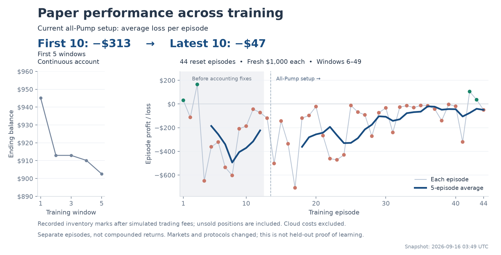

# Training performance snapshot

The snapshot contains all 49 completed recurring Solana online windows through
`solana-online-20260916-025831`. It does not combine separate synthetic or group
replay experiments with the live online series.

The first five windows carried an existing account forward. Their ending equity
is shown separately. The following 44 episodes each opened with $1,000 cash and
no positions; every opening was checked. Each main-chart point is that episode's
recorded ending equity minus $1,000, after simulated trading fees. Unsold inventory
is valued using the recorded marks, not necessarily an executable sale. Cloud
costs are excluded. The episodes are not compounded.

The current all-Pump quote protocol begins at reset episode 14. Its first ten
episodes average **-$312.90**; its latest ten average **-$46.53**. The smoothed
line is a trailing five-episode mean, restarted at each quote-protocol boundary.
The first twelve reset episodes predate the accounting/reward audit and are shaded.

Four of 44 reset episodes have positive recorded marks; two predate the audit.
Recent losses are smaller on average, but training periods have different market
conditions and changing policies. This is not an independent evaluation or proof
that learning caused the change. The fixed-checkpoint prospective comparisons
remain the evaluation gate.

The episode count and sum of recorded episode P&L reconcile to the scheduler's
retained totals. That sum is an accounting cross-check, not a continuous-account
return. No model or cloud job was changed to create this chart.

Reproduce with `python scripts/plot_training_performance.py`. The compact source
JSON retains run IDs, timestamps, account modes, protocol versions, end balances,
fees, inventory values and learning counters from the cloud completion records.
